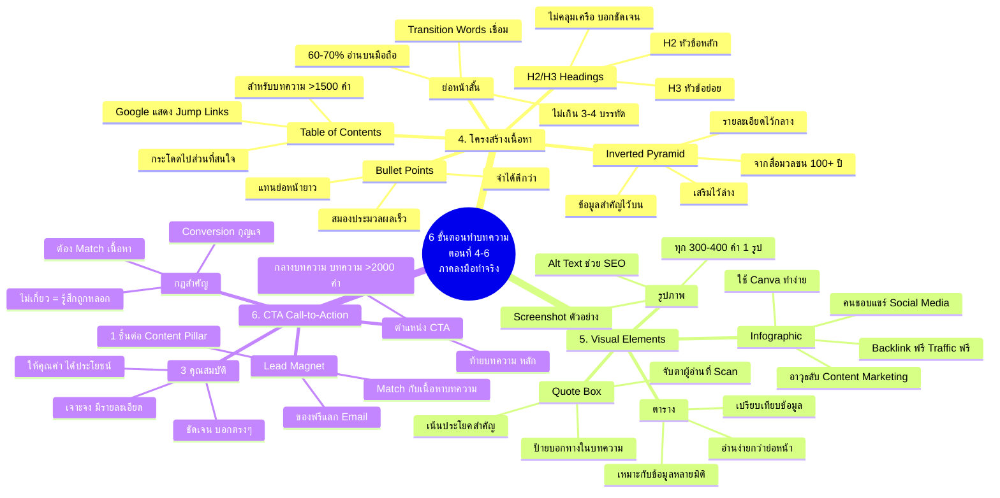
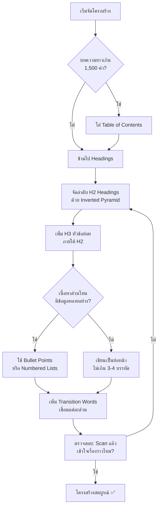
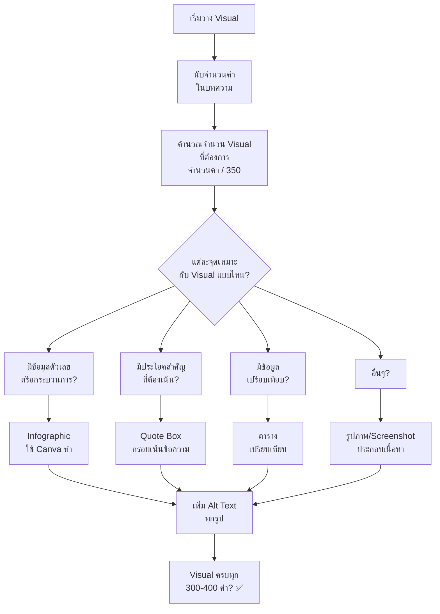
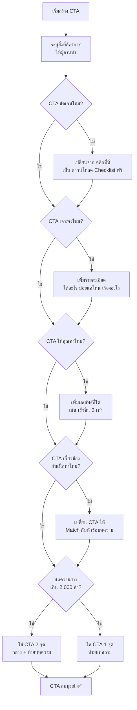

# 6 ขั้นตอนทำบทความ ตอนที่ 4-6 — CMKTG-009 Mind Map
> **Format:** Mind Map (Mermaid)
> **Source:** SWP3 Ch28 Content Marketing Mastery ตอนที่ 9
> **Production:** PinkCastle Academy | จูล่ง CTO
> **Date:** 2026-02-18 | **Duration:** 0:13:37

---

## Part 1: Text-based Mind Map

```
                      6 ขั้นตอนทำบทความ ตอนที่ 4-6
                          ภาคลงมือทำจริง
                            (CMKTG-009)
                                |
          ┌─────────────────────┼─────────────────────┐
          |                     |                     |
   [4.โครงสร้างเนื้อหา]   [5.Visual Elements]    [6.CTA]
      (โครงกระดูก)            (เนื้อหนัง)          (หัวใจ)
          |                     |                     |
    ┌─────┼─────┐         ┌────┼────┐          ┌─────┼─────┐
    |     |     |         |    |    |          |     |     |
  H2/H3 Bullet Inverted รูปภาพ Info- Quote  ชัดเจน เจาะจง ให้
  Head-  Points Pyramid ทุก300 graphic Box        คุณค่า
  ings         + TOC   -400คำ                     |
                                              Match กับ
                                              เนื้อหา
```

---

## Part 2: Mermaid Mind Map



---

## Part 3: Flowchart — กระบวนการจัดโครงสร้างเนื้อหา



---

## Part 4: Flowchart — กระบวนการวาง Visual Elements



---

## Part 5: Flowchart — กระบวนการสร้าง CTA ที่ดี



---

## Part 6: Comparison — 3 ขั้นตอนหลัง เปรียบเทียบ

| มิติ | ขั้นตอนที่ 4: โครงสร้าง | ขั้นตอนที่ 5: Visual | ขั้นตอนที่ 6: CTA |
|------|----------------------|-------------------|-----------------|
| **เปรียบเหมือน** | โครงกระดูก | เนื้อหนัง | หัวใจ |
| **หน้าที่หลัก** | จัดระเบียบให้อ่านง่าย | ทำให้น่าอ่านและจดจำ | สร้างผลลัพธ์ธุรกิจ |
| **ปัญหาถ้าขาด** | กำแพงตัวหนังสือ Bounce สูง | Boring ไม่มีคนแชร์ | เสียโอกาสทางธุรกิจ |
| **องค์ประกอบหลัก** | H2/H3, Bullet, Inverted Pyramid, TOC | รูปภาพ, Infographic, Quote Box, ตาราง | ชัดเจน, เจาะจง, ให้คุณค่า, Match เนื้อหา |
| **กฎสำคัญ** | ย่อหน้า 3-4 บรรทัด | Visual ทุก 300-400 คำ | CTA ต้อง Match กับเนื้อหา |
| **เครื่องมือ** | Heading Structure, Outline | Canva, Screenshot Tools | Lead Magnet, Email Opt-in |
| **ผลต่อ SEO** | Google เข้าใจโครงสร้าง + Jump Links | Alt Text ช่วย Image SEO | ลด Bounce Rate |
| **ผลต่อ Conversion** | เพิ่ม Time on Page | เพิ่ม Social Shares | เพิ่ม Conversion Rate |
| **ระดับยาก** | ปานกลาง | ปานกลาง | สูง (ต้อง Match) |
| **ทำก่อนอะไร** | วาง Outline ก่อนเขียน | กำหนดจุด Visual ใน Outline | สร้าง Lead Magnet ต่อ Pillar |

---

## Part 7: สรุปภาพรวม

```
╔═══════════════════════════════════════════════════════╗
║         6 ขั้นตอนทำบทความ — Framework ครบวงจร        ║
╠═══════════════════════════════════════════════════════╣
║                                                       ║
║  ภาคเตรียมตัว (ขั้นตอน 1-3)                          ║
║  ┌──────────┐ ┌──────────┐ ┌──────────┐              ║
║  │1.Research│→│2.Headline│→│3.Opening │              ║
║  │& Keyword │ │ที่ดึงดูด │ │  Hook    │              ║
║  └──────────┘ └──────────┘ └──────────┘              ║
║       ↓              ↓            ↓                   ║
║  ภาคลงมือทำจริง (ขั้นตอน 4-6) ← CMKTG-009           ║
║  ┌──────────┐ ┌──────────┐ ┌──────────┐              ║
║  │4.โครงสร้าง│→│5.Visual  │→│6.CTA    │              ║
║  │ เนื้อหา  │ │Elements │ │ที่ Action│              ║
║  │โครงกระดูก│ │เนื้อหนัง│ │ หัวใจ   │              ║
║  └──────────┘ └──────────┘ └──────────┘              ║
║       |              |            |                   ║
║   H2/H3          รูปภาพ       ชัดเจน                 ║
║   Bullet Points  Infographic  เจาะจง                 ║
║   Inverted       Quote Box    ให้คุณค่า              ║
║   Pyramid        ตาราง        Match เนื้อหา          ║
║   TOC            Alt Text     Lead Magnet            ║
║                                                       ║
║  ผลลัพธ์: บทความคุณภาพสม่ำเสมอ ไม่ต้องรอพรสวรรค์   ║
╚═══════════════════════════════════════════════════════╝
```

**Key Takeaways:**
- **ขั้นตอนที่ 4** โครงสร้างเนื้อหา = รองรับพฤติกรรม Scanning ด้วย H2/H3, Bullet Points, Inverted Pyramid, TOC
- **ขั้นตอนที่ 5** Visual Elements = ทุก 300-400 คำมี Visual 1 ชิ้น (รูปภาพ, Infographic, Quote Box, ตาราง)
- **ขั้นตอนที่ 6** CTA = ชัดเจน เจาะจง ให้คุณค่า และต้อง Match กับเนื้อหาเสมอ
- **3 ขั้นตอนหลังรวมกัน** = โครงกระดูก + เนื้อหนัง + หัวใจ = บทความที่สมบูรณ์

---

*Mind map sections: 7 | Mermaid diagrams: 4 | Level: Beginner-Intermediate*

---

> ทบทวนต่อ: **CMKTG-010** — ตรวจการบ้าน
> Series: SWP3 Ch28 Content Marketing Mastery
> PinkCastle Academy © 2026
