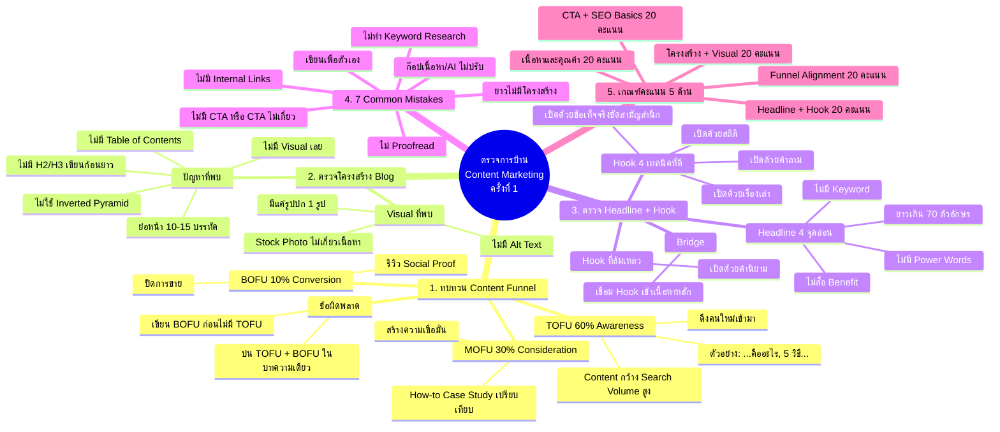
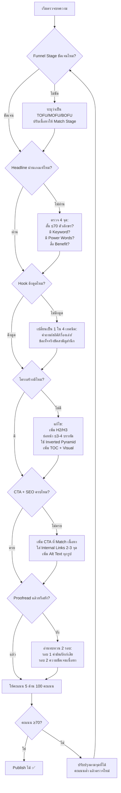
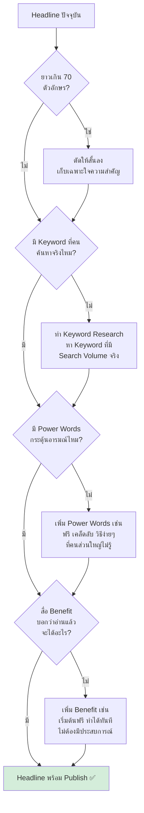
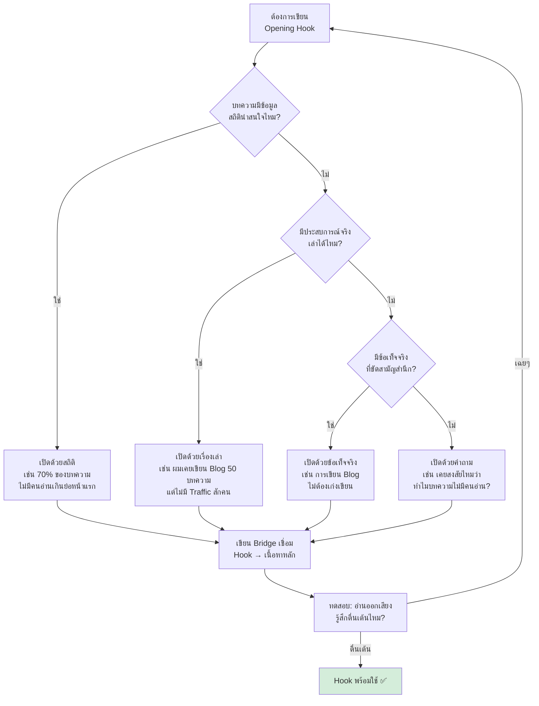

# ตรวจการบ้าน (ครั้งที่ 1) — CMKTG-010 Mind Map
> **Format:** Mind Map (Mermaid)
> **Source:** SWP3 Ch28 Content Marketing Mastery ตอนที่ 10
> **Production:** PinkCastle Academy | จูล่ง CTO
> **Date:** 2026-02-18 | **Duration:** 0:32:52

---

## Part 1: Text-based Mind Map

```
                     ตรวจการบ้าน Content Marketing (ครั้งที่ 1)
                              Checkpoint CMKTG-010
                                      |
          ┌──────────────┬────────────┼────────────┬──────────────┐
          |              |            |            |              |
   [1.ทบทวน Funnel]  [2.ตรวจ Blog] [3.ตรวจ      [4.Common     [5.เกณฑ์
    TOFU/MOFU/BOFU    โครงสร้าง     Headline      Mistakes      คะแนน]
          |          + Visual       + Hook]        7 ข้อ]       5 ด้าน
    ┌─────┼─────┐        |            |            |           100 คะแนน
    |     |     |   ┌────┼────┐  ┌────┼────┐  ┌───┼───┐
  TOFU  MOFU  BOFU H2/H3 Visual Headline Hook เขียนเพื่อ  ไม่
  60%   30%   10%  ย่อหน้า Alt   4จุด   4เทค ตัวเอง   Research
                   Inverted Text  อ่อน  นิค  ไม่มีCTA  ก๊อป
                   Pyramid TOC                ไม่Proof  ไม่มี
                                              read     Links
```

---

## Part 2: Mermaid Mind Map



---

## Part 3: Flowchart — กระบวนการตรวจการบ้านบทความ



---

## Part 4: Flowchart — กระบวนการแก้ไข Headline



---

## Part 5: Flowchart — กระบวนการเลือก Hook ที่เหมาะสม



---

## Part 6: Comparison — เปรียบเทียบ 5 ด้านของเกณฑ์คะแนน

| มิติ | Funnel Alignment | Headline + Hook | โครงสร้าง + Visual | เนื้อหาและคุณค่า | CTA + SEO Basics |
|------|-----------------|----------------|-------------------|-----------------|-----------------|
| **คะแนนเต็ม** | 20 | 20 | 20 | 20 | 20 |
| **สิ่งที่ตรวจ** | ชัดว่า TOFU/MOFU/BOFU เนื้อหา Match | Keyword, Power Words, Benefit, Hook ดึงดูด | H2/H3, ย่อหน้า, Inverted Pyramid, TOC, Visual | ถูกต้อง มีประโยชน์ มีตัวอย่าง | CTA Match เนื้อหา, Internal Links, Alt Text |
| **ปัญหาที่พบบ่อย** | ไม่ระบุ Stage ปน Funnel หลาย Stage | ยาวเกิน, ไม่มี Keyword, เปิดด้วยคำนิยาม | เรียงความ ย่อหน้ายาว ไม่มี Visual | เขียนเพื่อตัวเอง ก๊อปเนื้อหา | ไม่มี CTA, ไม่มี Internal Links |
| **ผลถ้าได้คะแนนต่ำ** | Content ไม่ตรงกลุ่มเป้าหมาย | CTR ต่ำ คนไม่คลิก ไม่อ่านต่อ | Bounce Rate สูง Time on Page ต่ำ | ไม่มีคนกลับมาอ่านซ้ำ | เสียโอกาสทางธุรกิจ SEO อ่อน |
| **วิธีแก้หลัก** | วางแผน Content Calendar ตามสัดส่วน | ใช้ Formula: Power Word + Keyword + Benefit | เปลี่ยนจาก "เรียงความ" เป็น "บทความออนไลน์" | ถาม "ผู้อ่านอยากรู้อะไร?" | สร้าง Lead Magnet ต่อ Content Pillar |
| **เครื่องมือ** | Content Calendar + Funnel Map | Headline Analyzer + Keyword Tool | Checklist ก่อน Publish | Peer Review + Proofread | CTA Template + Link Audit |
| **ระดับยาก** | ปานกลาง | สูง | ปานกลาง | สูง | ปานกลาง-สูง |
| **ทำก่อนอะไร** | วางแผนก่อนเขียน | เขียน 3 แบบแล้วเลือก | วาง Outline ก่อน | Research ก่อน | สร้าง Lead Magnet ก่อน |

---

## Part 7: สรุปภาพรวม

```
╔═══════════════════════════════════════════════════════════╗
║     ตรวจการบ้าน Content Marketing ครั้งที่ 1              ║
║     Checkpoint: 9 ตอนที่เรียนมา → ลงมือทำ → ตรวจ        ║
╠═══════════════════════════════════════════════════════════╣
║                                                           ║
║  1. ทบทวน Content Funnel                                 ║
║  ┌──────────────────────────────────────────┐             ║
║  │ TOFU 60% → MOFU 30% → BOFU 10%         │             ║
║  │ ห้ามปน Stage  |  ห้ามเขียน BOFU ก่อน    │             ║
║  └──────────────────────────────────────────┘             ║
║                                                           ║
║  2. ตรวจโครงสร้าง Blog                                   ║
║  ┌──────────────────────────────────────────┐             ║
║  │ H2/H3 ✓ | ย่อหน้า 3-4 บรรทัด ✓         │             ║
║  │ Inverted Pyramid ✓ | TOC ✓ | Visual ✓   │             ║
║  └──────────────────────────────────────────┘             ║
║                                                           ║
║  3. ตรวจ Headline + Hook                                 ║
║  ┌──────────────────────────────────────────┐             ║
║  │ Headline: สั้น + Keyword + Power + Benefit│             ║
║  │ Hook: คำถาม/สถิติ/เรื่องเล่า/ข้อเท็จจริง│             ║
║  │ + Bridge เชื่อมเข้าเนื้อหาหลัก          │             ║
║  └──────────────────────────────────────────┘             ║
║                                                           ║
║  4. 7 Common Mistakes                                    ║
║  ┌──────────────────────────────────────────┐             ║
║  │ เขียนเพื่อตัวเอง | ไม่ Research          │             ║
║  │ ไม่มี CTA | ยาวไม่มีโครงสร้าง           │             ║
║  │ ไม่ Proofread | ก๊อป | ไม่มี Links       │             ║
║  └──────────────────────────────────────────┘             ║
║                                                           ║
║  5. เกณฑ์คะแนน 100 คะแนน                                ║
║  ┌──────┐ ┌──────┐ ┌──────┐ ┌──────┐ ┌──────┐           ║
║  │Funnel│ │Head- │ │โครง- │ │เนื้อ-│ │CTA + │           ║
║  │ 20   │ │line  │ │สร้าง │ │หาและ │ │SEO   │           ║
║  │      │ │+Hook │ │+Vis- │ │คุณค่า│ │Basic │           ║
║  │      │ │ 20   │ │ual 20│ │ 20   │ │ 20   │           ║
║  └──────┘ └──────┘ └──────┘ └──────┘ └──────┘           ║
║                                                           ║
║  Feedback: เข้าใจทฤษฎีดี → ลงมือทำไม่ครบ                ║
║  แก้ด้วย: Pre-Publish Checklist + อ่านบนมือถือ           ║
║          + ให้คนอื่นอ่าน + เขียนบ่อยๆ                   ║
╚═══════════════════════════════════════════════════════════╝
```

**Key Takeaways:**
- **ทบทวน Funnel** ก่อนเขียนทุกชิ้น — TOFU 60% เป็นฐานสำคัญที่สุด
- **โครงสร้างบทความ** ต้องเป็นแบบ "บทความออนไลน์" ไม่ใช่ "เรียงความ" — H2/H3 + ย่อหน้าสั้น + Visual
- **Headline Formula** = Power Word + Keyword + Benefit ไม่เกิน 70 ตัวอักษร
- **Hook ที่ดี** = คำถาม / สถิติ / เรื่องเล่า / ข้อเท็จจริงขัดสามัญสำนึก + Bridge เชื่อมเข้าเนื้อหา
- **7 Common Mistakes** ที่ต้องกำจัด — ใช้ Checklist ตรวจทุกข้อก่อน Publish
- **เกณฑ์คะแนน 5 ด้าน 100 คะแนน** = เครื่องมือประเมินตัวเองที่ใช้ได้จริง

---

*Mind map sections: 7 | Mermaid diagrams: 4 | Level: Beginner-Intermediate*

---

> ทบทวนต่อ: **CMKTG-011** — ปรับแต่ง Template Single Blog Post
> Series: SWP3 Ch28 Content Marketing Mastery
> PinkCastle Academy © 2026
