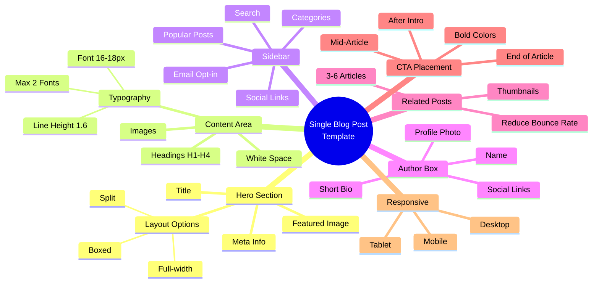

# ปรับแต่ง Template Single Blog Post — CMKTG-011
> Format: Mind Map (Text + Mermaid)
> Source: SWP3 Ch28 Content Marketing Mastery ตอนที่ 11
> Production: PinkCastle Academy | จูล่ง CTO
> Date: 2026-02-17

---

## Text Mind Map

```
Single Blog Post Template (CMKTG-011)
├── 1. Hero Section
│   ├── Title (ชื่อเรื่อง)
│   ├── Featured Image (รูปภาพหลัก 1200x630px+)
│   ├── Meta Info (วันที่, ผู้เขียน, หมวดหมู่)
│   └── Layout Options
│       ├── Full-width (รูปเต็มจอ)
│       ├── Boxed (มีขอบ)
│       └── Split (แบ่งครึ่ง)
├── 2. Content Area
│   ├── Typography
│   │   ├── Font Size: 16-18px
│   │   ├── Line Height: 1.6-1.8
│   │   └── Font Families: ไม่เกิน 2 ตระกูล
│   ├── Heading Hierarchy (H1-H4)
│   ├── Image Placement
│   └── White Space (ช่องว่าง)
├── 3. Sidebar
│   ├── Search Widget (ค้นหา)
│   ├── Categories (หมวดหมู่)
│   ├── Popular Posts (บทความยอดนิยม)
│   ├── Email Opt-in Form (สมัครอีเมล)
│   └── Social Media Links
├── 4. Author Box
│   ├── Profile Photo (รูปจริง)
│   ├── Author Name
│   ├── Short Bio (ประวัติย่อ)
│   └── Social Links
├── 5. Related Posts
│   ├── 3-6 บทความที่เกี่ยวข้อง
│   ├── Thumbnail Images
│   ├── Post Titles
│   └── ผลต่อ SEO (ลด Bounce Rate)
├── 6. CTA Placement
│   ├── ตำแหน่งที่ 1: หลังย่อหน้าแรก
│   ├── ตำแหน่งที่ 2: กลางบทความ
│   ├── ตำแหน่งที่ 3: ท้ายบทความ
│   └── ออกแบบ: สีโดดเด่น + ข้อความชัด
└── 7. Responsive Design
    ├── Desktop Preview
    ├── Tablet Preview
    └── Mobile Preview
```

## Mermaid Diagram



---
*Node count: 42 nodes | 7 main branches*
