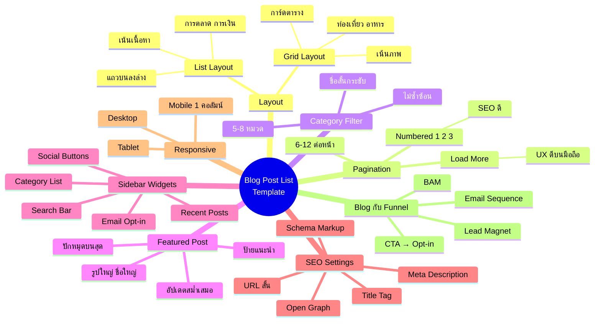
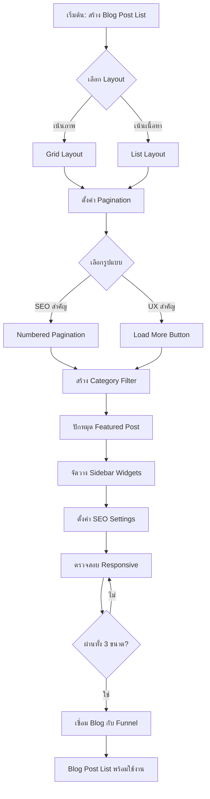
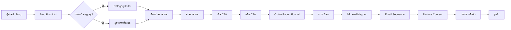
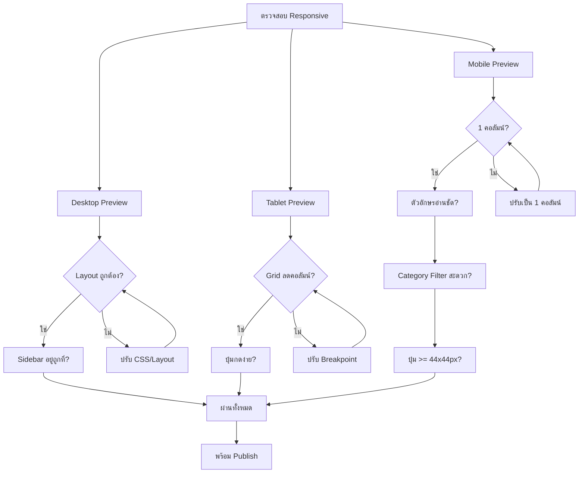

# ปรับแต่ง Template Blog Post List — CMKTG-012 Mind Map
> Format: Mind Map (Text + Mermaid + Flowcharts)
> Source: SWP3 Ch28 Content Marketing Mastery ตอนที่ 12
> Production: PinkCastle Academy | จูล่ง CTO
> Date: 2026-02-18 | Duration: 0:25:37

---

## Part 1: Text Mind Map

```
Blog Post List Template (CMKTG-012)
├── 1. Layout
│   ├── Grid Layout
│   │   ├── การ์ดเรียงเป็นตาราง
│   │   ├── เน้นภาพเป็นหลัก
│   │   └── เหมาะกับ: ท่องเที่ยว, อาหาร, ออกแบบ
│   ├── List Layout
│   │   ├── แถวจากบนลงล่าง
│   │   ├── รูปซ้าย + เนื้อหาขวา
│   │   └── เหมาะกับ: การตลาด, การเงิน, เทคนิค
│   └── เลือกตามประเภทเนื้อหา + กลุ่มเป้าหมาย
├── 2. Pagination
│   ├── Numbered (1, 2, 3...)
│   │   ├── SEO ดีกว่า
│   │   └── ต้องรีโหลดหน้า
│   ├── Load More Button
│   │   ├── UX ดีกว่าบนมือถือ
│   │   └── ไม่ต้องรีโหลดหน้า
│   └── แนะนำ 6-12 บทความต่อหน้า
├── 3. Category Filter
│   ├── จำกัด 5-8 หมวดหมู่
│   ├── ชื่อสั้นกระชับ
│   ├── ไม่ซ้ำซ้อน
│   └── ผูกบทความทุกชิ้นเข้าหมวด
├── 4. Featured Post
│   ├── ปักหมุดด้านบนสุด
│   ├── รูปภาพใหญ่กว่าปกติ
│   ├── ชื่อเรื่องตัวใหญ่กว่า
│   ├── ป้าย "แนะนำ" กำกับ
│   └── อัปเดตสม่ำเสมอ
├── 5. Sidebar Widgets
│   ├── Search Bar (ค้นหา)
│   ├── Email Opt-in Form (เก็บ Lead)
│   ├── Category List (หมวดหมู่)
│   ├── Recent Posts (บทความล่าสุด)
│   ├── Social Follow Buttons (ติดตาม)
│   └── กฎ: จำกัด 3-5 Widget
├── 6. SEO Settings
│   ├── Title Tag
│   ├── Meta Description
│   ├── URL (สั้น สื่อความหมาย)
│   ├── Open Graph Image (1200x630px)
│   └── Schema Markup (Blog Posting)
├── 7. Responsive Design
│   ├── Desktop (Layout เต็มรูปแบบ)
│   ├── Tablet (Grid ลดคอลัมน์)
│   └── Mobile (1 คอลัมน์, ปุ่ม 44x44px)
└── 8. Blog ↔ Funnel Connection
    ├── CTA ในบทความ → Opt-in Page
    ├── Lead Magnet อัตโนมัติ
    ├── Email Sequence ต่อเนื่อง
    └── BAM (Behavioral Adaptive Marketing)
```

---

## Part 2: Mermaid Mind Map



---

## Part 3: Flowchart — กระบวนการปรับแต่ง Template



---

## Part 4: Flowchart — เส้นทาง ผู้อ่าน → ลูกค้า



---

## Part 5: Flowchart — Responsive Design Decision



---

## Part 6: Comparison — Grid vs List vs Hybrid

| ด้าน | Grid Layout | List Layout | Hybrid (ผสม) |
|------|-------------|-------------|--------------|
| **รูปแบบ** | การ์ดเรียงตาราง | แถวจากบนลงล่าง | Featured=Grid, รายการ=List |
| **จุดเน้น** | ภาพเป็นหลัก | เนื้อหาเป็นหลัก | ทั้งภาพและเนื้อหา |
| **จำนวนที่เห็นพร้อมกัน** | มาก (6-9 ต่อจอ) | น้อย (3-4 ต่อจอ) | ปานกลาง |
| **ข้อดี** | สวยงาม ดูทันสมัย | อ่าน Preview ได้ชัด | ยืดหยุ่น ใช้ข้อดีทั้งสอง |
| **ข้อเสีย** | เห็น Excerpt น้อย | ดูหนาแน่นกว่า | ซับซ้อนกว่าในการออกแบบ |
| **Responsive** | ลดคอลัมน์บนมือถือ | ปรับขนาดรูป | ต้องดูแลทั้ง 2 แบบ |
| **เหมาะกับ** | ท่องเที่ยว, อาหาร, Portfolio | การตลาด, เทคนิค, ข่าว | บล็อกที่มีเนื้อหาหลากหลาย |
| **SEO Impact** | เท่ากัน | เท่ากัน | เท่ากัน |

---

## Part 7: Summary

### สรุป Blog Post List Template — 7 องค์ประกอบ + 1 เทคนิค

```
┌──────────────────────────────────────────────────────┐
│           BLOG POST LIST TEMPLATE                     │
│                                                       │
│  [1] Layout         → Grid หรือ List ตามเนื้อหา      │
│  [2] Pagination     → 6-12 ต่อหน้า + Load More       │
│  [3] Category       → 5-8 หมวด สั้น ชัด ไม่ซ้ำ       │
│  [4] Featured Post  → ปักหมุด + ออกแบบโดดเด่น         │
│  [5] Sidebar        → 3-5 Widget จัดตามสำคัญ          │
│  [6] SEO            → Title, Meta, URL, Schema        │
│  [7] Responsive     → Desktop + Tablet + Mobile       │
│  [+] Blog→Funnel   → CTA + Opt-in + Email + BAM     │
│                                                       │
│  เป้าหมาย:                                            │
│  ดึงดูด → นำทาง → เก็บ Lead → เปลี่ยนเป็นลูกค้า      │
└──────────────────────────────────────────────────────┘
```

**ตัวเลขสำคัญ:**
- ผู้ใช้ 60-70% เข้าเว็บผ่านมือถือ → Responsive จำเป็น
- Pagination 6-12 บทความต่อหน้า → โหลดเร็ว UX ดี
- Category 5-8 หมวด → พอดีไม่สับสน
- Sidebar 3-5 Widget → ช่วยนำทางไม่รกตา
- Blog→Funnel Conversion 3-5% → ดีกว่าไม่มี CTA (ต่ำกว่า 1%)

---
*Node count: 58 nodes | 8 main branches | 3 flowcharts | 1 comparison table*

---

> ทบทวนต่อ: **CMKTG-013** — สร้างบทความ ด้วย Content Builder ตอน 1
> Series: SWP3 Ch28 Content Marketing Mastery
> PinkCastle Academy © 2026
