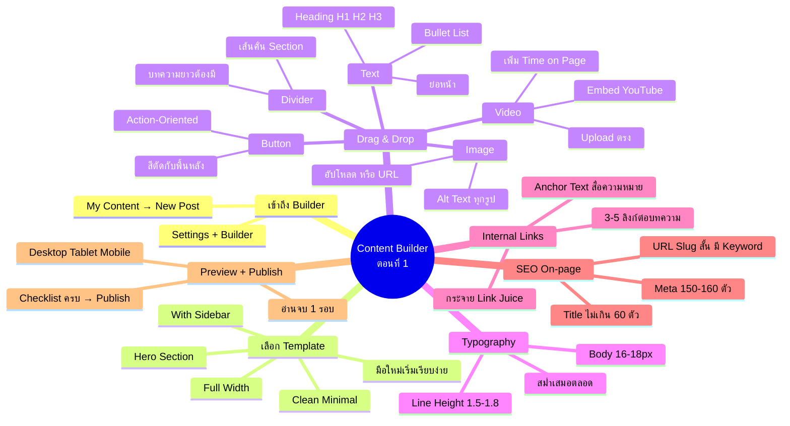
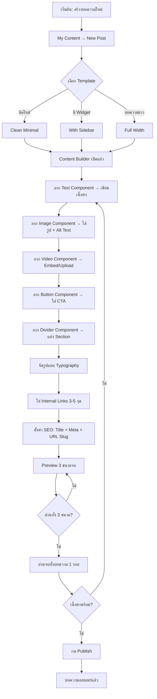
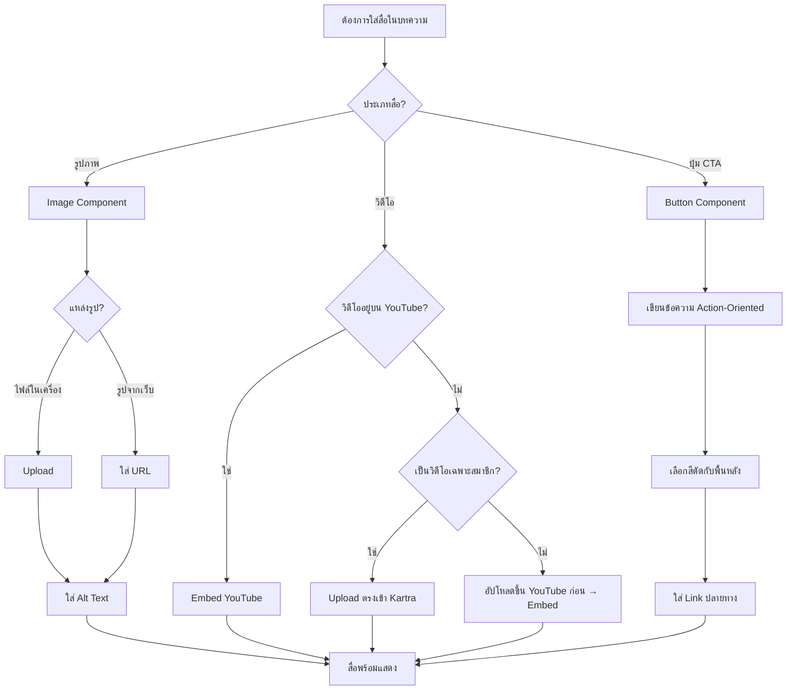
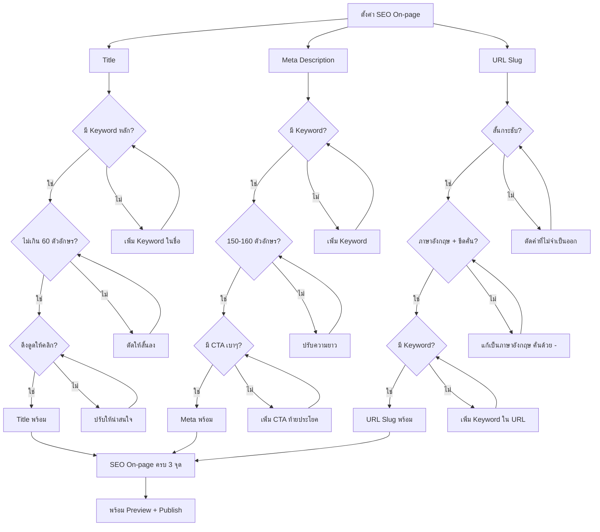

# สร้างบทความ ด้วย Content Builder ตอนที่ 1 — CMKTG-013 Mind Map
> Format: Mind Map (Text + Mermaid + Flowcharts)
> Source: SWP3 Ch28 Content Marketing Mastery ตอนที่ 13
> Production: PinkCastle Academy | จูล่ง CTO
> Date: 2026-02-18 | Duration: 0:33:55

---

## Part 1: Text Mind Map

```
Content Builder ตอนที่ 1 (CMKTG-013)
├── 1. เข้าถึง Content Builder
│   ├── Kartra Dashboard → My Content → New Post
│   ├── 2 ส่วนหลัก: Settings + Content Builder
│   ├── Settings: ชื่อ, หมวดหมู่, แท็ก, Featured Image
│   └── Content Builder: พื้นที่สร้างเนื้อหาจริง
├── 2. เลือก Template
│   ├── Clean Minimal (แนะนำสำหรับมือใหม่)
│   ├── With Sidebar
│   ├── Full Width
│   ├── Hero Section
│   └── เคล็ดลับ: เริ่มเรียบง่าย แล้วค่อยเพิ่ม Component
├── 3. Drag & Drop Components
│   ├── Text Component
│   │   ├── Heading H1, H2, H3, H4
│   │   ├── ย่อหน้า (Paragraph)
│   │   ├── Bullet Point / Numbered List
│   │   └── H1 มีแค่ 1 ตัว (Heading Hierarchy)
│   ├── Image Component
│   │   ├── อัปโหลดจากเครื่อง หรือ URL
│   │   └── ใส่ Alt Text ทุกรูป (SEO + Accessibility)
│   ├── Video Component
│   │   ├── Embed YouTube/Vimeo (ประหยัด Storage)
│   │   ├── Upload ตรง (วิดีโอเฉพาะสมาชิก)
│   │   └── เพิ่ม Time on Page
│   ├── Button Component
│   │   ├── ข้อความ Action-Oriented
│   │   ├── สีตัดกับพื้นหลัง
│   │   └── Link: สมัคร/ดาวน์โหลด/บทความอื่น
│   └── Divider Component
│       ├── เส้นคั่นแบ่ง Section
│       └── บทความยาวต้องมี ไม่งั้นอ่านยาก
├── 4. Typography
│   ├── Body Text: 16-18px
│   ├── Line Height: 1.5-1.8 เท่า
│   ├── Font Style สม่ำเสมอ
│   └── กฎทอง: ความสม่ำเสมอตลอดบทความ
├── 5. Internal Links
│   ├── เชื่อมไปยังบทความอื่นในบล็อก
│   ├── ข้อดี 1: ผู้อ่านค้นพบเนื้อหา
│   ├── ข้อดี 2: เพิ่ม Pages per Session
│   ├── ข้อดี 3: กระจาย Link Juice (SEO)
│   ├── Anchor Text ต้องสื่อความหมาย
│   └── แนะนำ 3-5 ลิงก์ต่อบทความ
├── 6. SEO On-page
│   ├── Title
│   │   ├── ไม่เกิน 60 ตัวอักษร
│   │   ├── มี Keyword หลัก
│   │   └── ดึงดูดให้คลิก
│   ├── Meta Description
│   │   ├── 150-160 ตัวอักษร
│   │   ├── มี Keyword + CTA เบาๆ
│   │   └── อธิบายว่าบทความเกี่ยวกับอะไร
│   └── URL Slug
│       ├── สั้น ภาษาอังกฤษ
│       ├── คั่นด้วยขีด (-)
│       ├── มี Keyword หลัก
│       └── ห้ามเปลี่ยนหลัง Publish
└── 7. Preview + Publish
    ├── Preview 3 ขนาดจอ (Desktop, Tablet, Mobile)
    ├── ตรวจ: รูปภาพ, ลิงก์, ปุ่ม, Typography
    ├── อ่านจบทั้งบทความอย่างน้อย 1 รอบ
    └── ตรวจ Checklist ครบ → กด Publish
```

---

## Part 2: Mermaid Mind Map



---

## Part 3: Flowchart — ขั้นตอนสร้างบทความ



---

## Part 4: Flowchart — เลือกวิธี Embed สื่อ



---

## Part 5: Flowchart — SEO On-page Checklist



---

## Part 6: Comparison — 5 Components หลัก

| ด้าน | Text | Image | Video | Button | Divider |
|------|------|-------|-------|--------|---------|
| **หน้าที่หลัก** | เขียนเนื้อหาทั้งหมด | รูปภาพประกอบ | วิดีโอประกอบ | ปุ่ม CTA นำทาง | เส้นคั่นแบ่ง Section |
| **ความจำเป็น** | ขาดไม่ได้ | สำคัญมาก | สำคัญ | สำคัญ | จำเป็นสำหรับบทความยาว |
| **ช่วย SEO** | Heading Hierarchy | Alt Text | Time on Page | ไม่โดยตรง | ไม่โดยตรง |
| **ช่วย UX** | อ่านง่าย จัดระเบียบ | ดึงดูดสายตา | เข้าใจเนื้อหาง่าย | นำทาง Action ชัดเจน | แบ่งส่วนอ่านไม่เหนื่อย |
| **ความถี่ใช้** | ทุกบทความ | ทุกบทความ | เมื่อมีวิดีโอ | เมื่อมี CTA | บทความยาว |
| **เคล็ดลับ** | H1 มีแค่ 1 ตัว | Alt Text ทุกรูป | Embed YouTube ถ้ามี | ข้อความ Action-Oriented | ใช้แบ่งระหว่างหัวข้อ |
| **วิธี Drag & Drop** | ลากจาก Panel → วาง → พิมพ์ | ลาก → วาง → อัปโหลด/URL | ลาก → วาง → Embed/Upload | ลาก → วาง → ตั้งค่า | ลาก → วาง → เสร็จ |

---

## Part 7: Summary

### สรุป Content Builder ตอนที่ 1 — 7 ขั้นตอนสร้างบทความ

```
┌──────────────────────────────────────────────────────┐
│        CONTENT BUILDER WORKFLOW                        │
│                                                        │
│  [1] เข้าถึง      → My Content → New Post             │
│  [2] Template     → เลือกแบบเรียบง่ายก่อน              │
│  [3] Components   → Text, Image, Video, Button, Divider│
│  [4] Typography   → 16-18px, Line Height 1.5-1.8      │
│  [5] Links        → Internal Links 3-5 จุด             │
│  [6] SEO          → Title + Meta + URL Slug            │
│  [7] Publish      → Preview 3 จอ → อ่าน 1 รอบ → Publish│
│                                                        │
│  จำง่าย — 5 Components: T-I-V-B-D                      │
│  Text, Image, Video, Button, Divider                   │
│                                                        │
│  เป้าหมาย:                                              │
│  บทความดี + Typography ดี + SEO ดี = คุณภาพครบ         │
└──────────────────────────────────────────────────────┘
```

**ตัวเลขสำคัญ:**
- Components หลัก **5** ตัว: Text, Image, Video, Button, Divider
- Body Text **16-18px** / Line Height **1.5-1.8** เท่า
- Internal Links **3-5** ลิงก์ต่อบทความ
- SEO Title ไม่เกิน **60** ตัวอักษร
- Meta Description **150-160** ตัวอักษร
- Preview **3** ขนาดจอก่อน Publish
- H1 มีแค่ **1** ตัวต่อบทความ

---
*Node count: 62 nodes | 7 main branches | 3 flowcharts | 1 comparison table*

---

> ทบทวนต่อ: **CMKTG-014** — ตรวจการบ้าน (ครั้งที่ 2)
> Series: SWP3 Ch28 Content Marketing Mastery
> PinkCastle Academy © 2026
