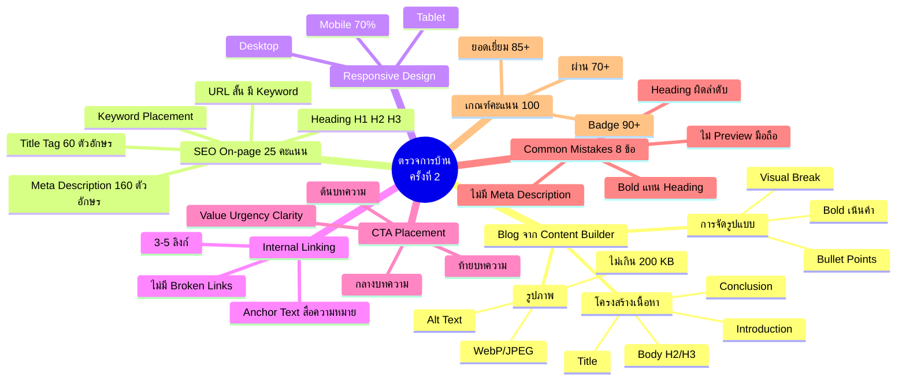
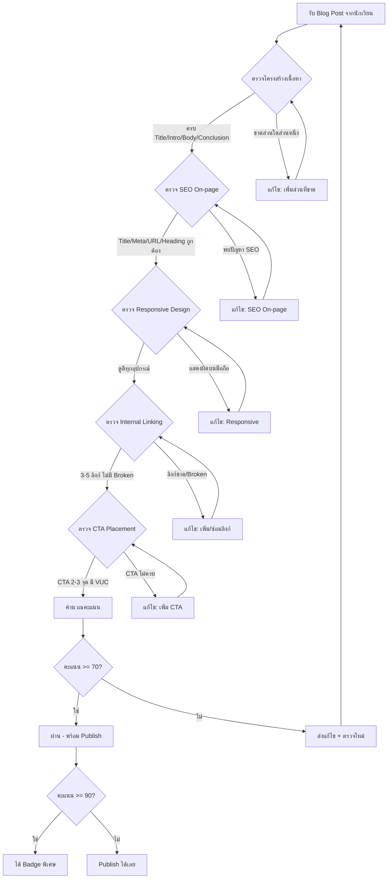
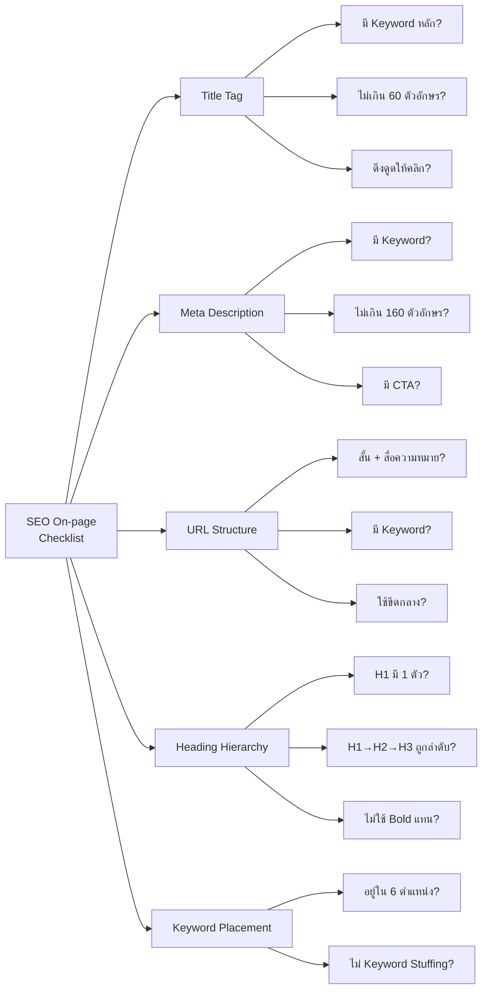
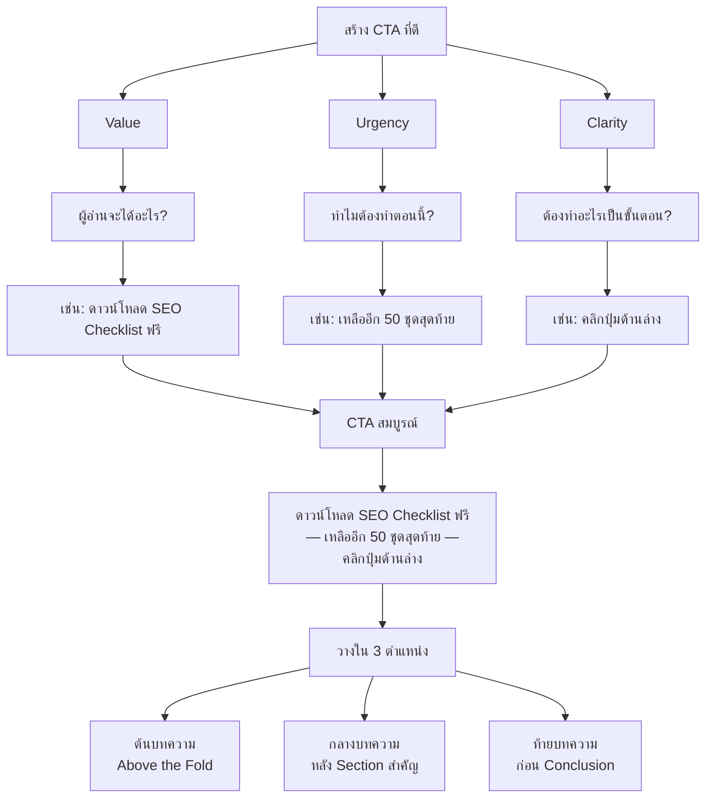

# ตรวจการบ้าน (ครั้งที่ 2) — CMKTG-014 Mind Map
> Format: Mind Map (Text + Mermaid + Flowcharts)
> Source: SWP3 Ch28 Content Marketing Mastery ตอนที่ 14
> Production: PinkCastle Academy | จูล่ง CTO
> Date: 2026-02-18 | Duration: 1:03:28

---

## Part 1: Text Mind Map

```
ตรวจการบ้าน ครั้งที่ 2 (CMKTG-014)
├── 1. ตรวจ Blog จาก Content Builder
│   ├── โครงสร้างเนื้อหา
│   │   ├── Title — ดึงดูด มี Keyword
│   │   ├── Introduction — บอกเนื้อหา + ประโยชน์
│   │   ├── Body — แบ่ง Section ด้วย H2/H3
│   │   └── Conclusion — สรุป + ทิศทาง
│   ├── การจัดรูปแบบ
│   │   ├── Visual Break ทุก 3-4 บรรทัด
│   │   ├── Bullet Points / Numbered List
│   │   ├── Bold เน้นคำสำคัญ
│   │   └── รูปภาพแบ่ง Section
│   └── รูปภาพ
│       ├── Alt Text ทุกรูป
│       ├── Caption อธิบาย
│       ├── ขนาดไม่เกิน 200 KB
│       └── รูปแบบ WebP / JPEG
├── 2. ตรวจ SEO On-page (25 คะแนน)
│   ├── Title Tag
│   │   ├── มี Keyword หลัก
│   │   └── ไม่เกิน 60 ตัวอักษร
│   ├── Meta Description
│   │   ├── มี Keyword + สรุปเนื้อหา
│   │   ├── ไม่เกิน 160 ตัวอักษร
│   │   └── มี CTA เล็กๆ
│   ├── URL Structure
│   │   ├── สั้น สื่อความหมาย
│   │   ├── มี Keyword
│   │   └── ใช้ขีดกลาง (-) คั่นคำ
│   ├── Heading Hierarchy
│   │   ├── H1 (1 ตัวเท่านั้น)
│   │   ├── H2 (หัวข้อหลัก)
│   │   ├── H3 (หัวข้อย่อย)
│   │   └── ห้ามใช้ Bold แทน Heading!
│   └── Keyword Placement
│       ├── Title, Meta, URL, H1
│       ├── Paragraph แรก, H2
│       └── ห้าม Keyword Stuffing
├── 3. ตรวจ Responsive Design (15 คะแนน)
│   ├── ตรวจ 3 ขนาดหน้าจอ
│   │   ├── Desktop
│   │   ├── Tablet
│   │   └── Mobile (70% ผู้ใช้)
│   └── Checklist
│       ├── ตัวอักษรอ่านง่าย
│       ├── รูปภาพไม่ล้นจอ
│       ├── ปุ่ม/ลิงก์กดง่าย
│       ├── ตารางแสดงถูกต้อง
│       └── Video ปรับขนาดตามจอ
├── 4. ตรวจ Internal Linking (15 คะแนน)
│   ├── ประโยชน์ 3 ข้อ
│   │   ├── เพิ่ม Time on Site
│   │   ├── Google เข้าใจโครงสร้าง
│   │   └── กระจาย Link Juice
│   ├── กฎ
│   │   ├── 3-5 ลิงก์ต่อบทความ
│   │   ├── Anchor Text สื่อความหมาย
│   │   └── ลิงก์สองทาง (ใหม่↔เก่า)
│   └── ข้อควรระวัง
│       ├── Broken Links (404)
│       └── คลิกทดสอบทุกลิงก์
├── 5. ตรวจ CTA Placement (15 คะแนน)
│   ├── 3 ตำแหน่ง
│   │   ├── ต้นบทความ (Above the Fold)
│   │   ├── กลางบทความ (หลัง Section สำคัญ)
│   │   └── ท้ายบทความ (ก่อน Conclusion)
│   └── สูตร CTA ที่ดี
│       ├── Value — ได้อะไร
│       ├── Urgency — ทำไมตอนนี้
│       └── Clarity — ทำอะไร
├── 6. Common Mistakes (8 ข้อ)
│   ├── ไม่มี Meta Description
│   ├── Heading ผิดลำดับ
│   ├── รูปไม่มี Alt Text
│   ├── ไม่ Preview มือถือ
│   ├── ไม่มี Internal Links
│   ├── CTA จุดเดียว
│   ├── URL ยาวเกินไป
│   └── ไม่มี Conclusion
├── 7. เกณฑ์ให้คะแนน (100 คะแนน)
│   ├── โครงสร้าง: 20
│   ├── SEO: 25
│   ├── Responsive: 15
│   ├── Links: 15
│   ├── CTA: 15
│   ├── Format: 10
│   └── ผ่าน 70 | เก่ง 85 | Badge 90+
└── 8. Checklist ก่อน Publish (10 ข้อ)
    ├── ใช้เวลา 15-20 นาที
    └── ลดข้อผิดพลาด 90%
```

---

## Part 2: Mermaid Mind Map



---

## Part 3: Flowchart — กระบวนการตรวจการบ้าน



---

## Part 4: Flowchart — SEO On-page Checklist



---

## Part 5: Flowchart — CTA Formula (Value + Urgency + Clarity)



---

## Part 6: Comparison — ก่อน vs หลังตรวจการบ้าน

| ด้าน | ก่อนตรวจ (ปัญหาที่พบ) | หลังแก้ไข (มาตรฐานที่ถูกต้อง) |
|------|----------------------|------------------------------|
| **โครงสร้าง** | ไม่มี Intro/Conclusion จบแบบลอยๆ | Title → Intro → Body (H2/H3) → Conclusion ครบ |
| **SEO Title** | ไม่มี Keyword ยาวเกินไป | มี Keyword หลัก ไม่เกิน 60 ตัวอักษร |
| **Meta Description** | ว่างเปล่า | มี Keyword + สรุปเนื้อหา + CTA ไม่เกิน 160 ตัวอักษร |
| **URL** | ยาว มีรหัสตัวเลข | สั้น สื่อความหมาย มี Keyword |
| **Heading** | ใช้ Bold แทน H2/H3, ข้ามลำดับ | H1→H2→H3 ถูกลำดับ ไม่ข้าม |
| **รูปภาพ** | 5 MB ไม่มี Alt Text | ไม่เกิน 200 KB + Alt Text + Caption |
| **Responsive** | ไม่เคย Preview มือถือ | ตรวจ 3 ขนาด (Desktop/Tablet/Mobile) |
| **Internal Links** | ไม่มีเลย | 3-5 ลิงก์ Anchor Text สื่อความหมาย |
| **CTA** | จุดเดียวตอนท้าย ปุ่ม "Submit" | 3 จุด (ต้น/กลาง/ท้าย) ด้วย Value+Urgency+Clarity |
| **SEO Score** | 40-50/100 | 80-95/100 |
| **Bounce Rate** | 70%+ | 40-50% |
| **Conversion** | 0.5% | 2-4% |

---

## Part 7: Summary — สรุปภาพรวม

```
ตรวจการบ้าน ครั้งที่ 2 — สรุป 5 ประเด็นหลัก

1. SEO On-page คือจุดตกคะแนนมากที่สุด
   → ตรวจ Title, Meta, URL, Heading, Keywords ทุกครั้ง
   → ห้ามใช้ Bold แทน Heading!

2. 70% ของผู้ใช้อยู่บนมือถือ
   → Preview บน Desktop + Tablet + Mobile ก่อน Publish

3. Internal Linking เป็นเทคนิคที่ถูกมองข้าม
   → 3-5 ลิงก์ต่อบทความ, Anchor Text สื่อความหมาย
   → ลิงก์สองทาง + ตรวจ Broken Links

4. CTA ต้องวาง 3 จุด ด้วยสูตร VUC
   → Value + Urgency + Clarity
   → ต้น กลาง ท้ายบทความ

5. Checklist 10 ข้อ = 15-20 นาที = ลดข้อผิดพลาด 90%
   → อย่าเร่ง Publish — ทำให้ดีก่อน
   → บทความที่ดีสร้าง Traffic ไปอีกนาน

เกณฑ์คะแนน: 100 คะแนน
   ผ่าน: 70+ | ยอดเยี่ยม: 85+ | Badge: 90+
```

---
*7 parts: Text Mind Map + Mermaid Mind Map + 3 Flowcharts + Comparison Table + Summary*

---

> ทบทวนต่อ: **CMKTG-015** — สร้างบทความ ด้วย Content Builder ตอนที่ 2
> Series: SWP3 Ch28 Content Marketing Mastery
> PinkCastle Academy © 2026
