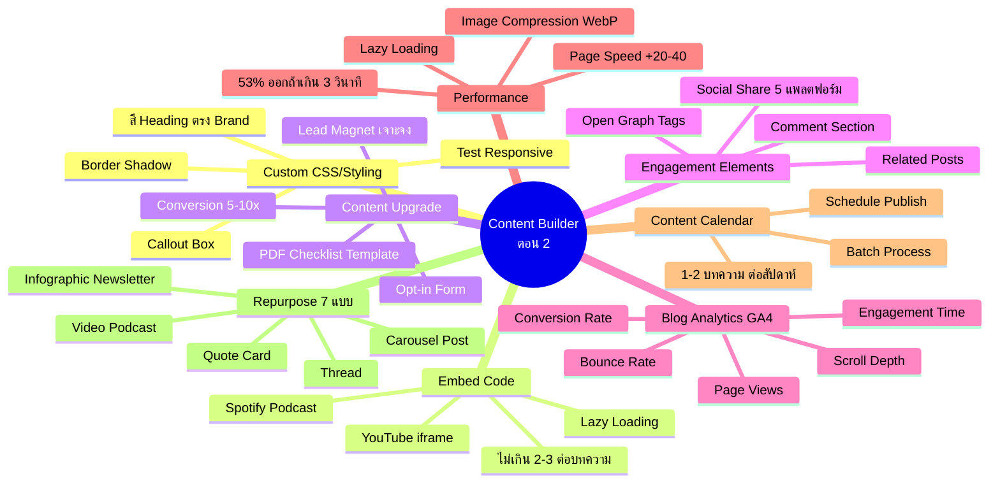
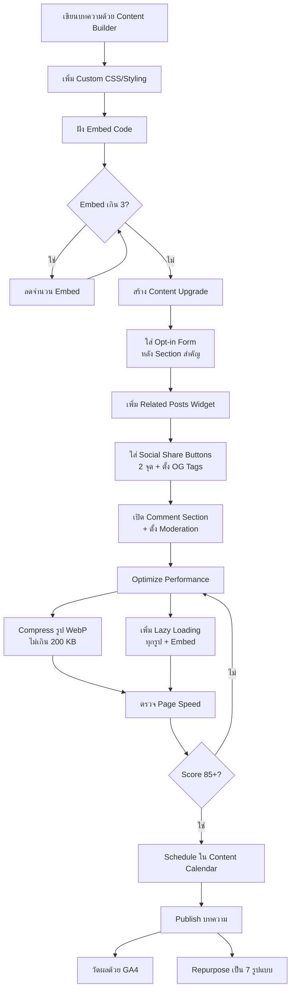
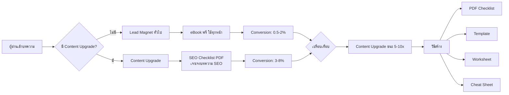
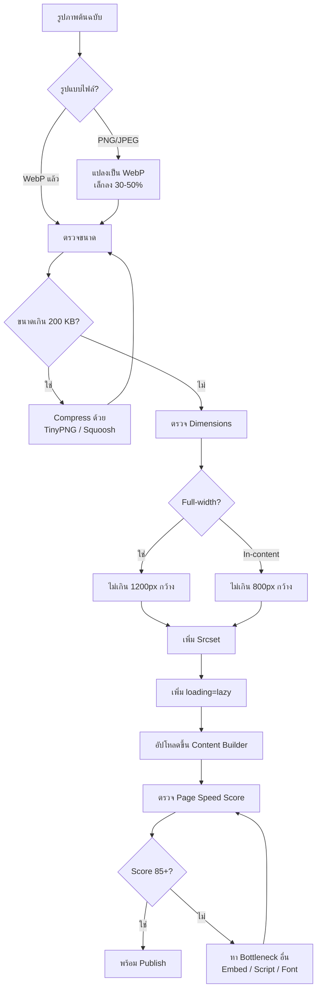

# สร้างบทความ ด้วย Content Builder ตอนที่ 2 — CMKTG-015 Mind Map
> Format: Mind Map (Text + Mermaid + Flowcharts)
> Source: SWP3 Ch28 Content Marketing Mastery ตอนที่ 15
> Production: PinkCastle Academy | จูล่ง CTO
> Date: 2026-02-18 | Duration: 0:26:27

---

## Part 1: Text Mind Map

```
Content Builder ตอน 2 — Advanced Techniques (CMKTG-015)
├── 1. Custom CSS/Styling
│   ├── เปลี่ยนสี Heading ตรง Brand
│   ├── เพิ่ม Border / Shadow
│   ├── สร้าง Callout Box
│   ├── ปรับ Font ให้เข้า Brand Identity
│   └── ข้อควรระวัง: Test Responsive + Media Query
├── 2. Embed Code (YouTube/Podcast)
│   ├── YouTube iframe (Responsive 16:9)
│   ├── Spotify / Apple Podcasts Player
│   ├── Google Maps / Social Posts
│   ├── ไม่เกิน 2-3 Embed ต่อบทความ
│   └── ใช้ Lazy Loading ทุก Embed
├── 3. Content Upgrade (Lead Magnet ในบทความ)
│   ├── PDF Checklist / Template / Worksheet
│   ├── เจาะจงแต่ละบทความ
│   ├── Conversion สูงกว่า Lead Magnet ทั่วไป 5-10x
│   ├── Opt-in Form ฝังในบทความ
│   └── วางหลัง Section ที่น่าสนใจที่สุด
├── 4. Related Posts Widget
│   ├── Manual — เลือกเอง (แม่นยำที่สุด)
│   ├── Auto — ดึงจาก Category/Tag
│   ├── Hybrid — ผสมทั้งสองแบบ
│   └── ลด Bounce Rate + เพิ่ม Time on Site
├── 5. Social Share Buttons
│   ├── 5 แพลตฟอร์ม
│   │   ├── Facebook
│   │   ├── LINE
│   │   ├── Twitter/X
│   │   ├── LinkedIn
│   │   └── Copy Link
│   ├── 2 ตำแหน่ง: ใต้ Title + ก่อน Related Posts
│   └── ตั้ง Open Graph Tags (og:title, og:description, og:image)
├── 6. Comment Section
│   ├── Disqus / Native Comment
│   ├── สร้าง Community
│   ├── เพิ่มเนื้อหา ดี SEO
│   └── ตั้ง Moderation ป้องกัน Spam
├── 7. Blog Analytics (GA4 Integration)
│   ├── 5 ตัวเลขที่ต้องดู
│   │   ├── Page Views
│   │   ├── Average Engagement Time
│   │   ├── Bounce Rate
│   │   ├── Scroll Depth
│   │   └── Conversion Rate
│   └── วิธีเชื่อม
│       ├── สร้าง GA4 Property
│       ├── ติดตั้งผ่าน GTM
│       ├── ตั้ง Custom Events
│       └── สร้าง Dashboard (GA4/Looker Studio)
├── 8. Image Compression
│   ├── WebP (เล็กกว่า PNG/JPEG 30-50%)
│   ├── เครื่องมือ: TinyPNG / Squoosh / ShortPixel
│   ├── ขนาด: 1200px (Full-width) / 800px (In-content)
│   └── Srcset ให้ Browser เลือกขนาด
├── 9. Lazy Loading
│   ├── โหลดรูป/Embed เมื่อ Scroll มาถึง
│   ├── loading="lazy" ในแท็ก 
│   ├── ใช้ Plugin CMS อัตโนมัติ
│   └── Page Speed เพิ่ม 20-40 คะแนน
├── 10. Content Calendar Integration
│   ├── Publish สม่ำเสมอ 1-2 บทความ/สัปดาห์
│   ├── Batch Process: เขียนหลายบทความในวันเดียว
│   ├── Schedule Publish ตามวันที่กำหนด
│   └── เครื่องมือ: Notion / Trello / Pink Castle
└── 11. Repurpose Blog เป็น Social Media Content
    ├── 7 รูปแบบ
    │   ├── Carousel Post (IG/FB)
    │   ├── Quote Card (IG/FB/X)
    │   ├── Thread (X)
    │   ├── Podcast Episode (Spotify/Apple)
    │   ├── Short Video (Reels/TikTok)
    │   ├── Infographic (Pinterest/LinkedIn)
    │   └── Newsletter (Email)
    ├── หลักการ: สร้างครั้งเดียว แจกจ่ายหลายที่
    └── 1 บทความ = 10-15 ชิ้นคอนเทนต์
```

---

## Part 2: Mermaid Mind Map



---

## Part 3: Flowchart — กระบวนการสร้างบทความขั้นสูง



---

## Part 4: Flowchart — Content Upgrade vs Lead Magnet



---

## Part 5: Flowchart — Performance Optimization Pipeline



---

## Part 6: Comparison — ก่อน vs หลังใช้ Advanced Techniques

| ด้าน | ก่อนใช้ Advanced Techniques | หลังใช้ Advanced Techniques |
|------|---------------------------|---------------------------|
| **Styling** | ใช้ Style พื้นฐานเหมือนทุกคน | Custom CSS ตรง Brand โดดเด่น |
| **Media** | แค่ข้อความ + รูปภาพ | Embed YouTube/Podcast + Interactive |
| **Lead Generation** | ไม่มี หรือ Lead Magnet ทั่วไป (Conv 0.5%) | Content Upgrade เจาะจง (Conv 3-8%) |
| **Engagement** | ไม่มี Related Posts/Comment | Related Posts + Comment + Social Share |
| **Analytics** | ไม่รู้ว่าบทความไหนดี | GA4 วัดผล 5 ตัวเลข Real-time |
| **Page Speed** | Score 50-60/100 โหลดช้า | Score 85-95/100 WebP + Lazy Loading |
| **Image Size** | 500 KB - 5 MB ต่อรูป | ไม่เกิน 200 KB (WebP) |
| **Publishing** | Publish เมื่อนึกได้ ไม่สม่ำเสมอ | Content Calendar 1-2 บทความ/สัปดาห์ |
| **Content Output** | 1 บทความ = 1 ชิ้น | 1 บทความ = 10-15 ชิ้น (Repurpose) |
| **Social Shares** | 2-5 ต่อบทความ | 20-50 ต่อบทความ (OG Tags + Share Buttons) |
| **Email Signups** | 0.5% | 3-8% (Content Upgrade) |
| **Bounce Rate** | 65-70% | 35-45% |

---

## Part 7: Summary — สรุปภาพรวม

```
Content Builder ตอน 2 — สรุป 5 ประเด็นหลัก

1. Content Upgrade เป็น Game Changer
   → Lead Magnet เจาะจงแต่ละบทความ
   → Conversion สูงกว่า Lead Magnet ทั่วไป 5-10 เท่า
   → สร้าง PDF/Checklist/Template วางหลัง Section สำคัญ

2. Performance = ปัจจัยชี้เป็นชี้ตาย
   → โหลดเกิน 3 วินาที เสียผู้อ่าน 53%
   → Image Compression: WebP เล็กกว่า 30-50%
   → Lazy Loading: Page Speed เพิ่ม 20-40 คะแนน

3. GA4 Analytics คือตาที่สามของ Content Creator
   → 5 ตัวเลข: Page Views, Engagement Time, Bounce Rate,
     Scroll Depth, Conversion Rate
   → ติดตั้งผ่าน GTM + Custom Events

4. Engagement Elements ทำงานร่วมกัน
   → Related Posts ลด Bounce Rate
   → Social Share + OG Tags เพิ่มการแชร์
   → Comment Section สร้าง Community

5. Repurpose = สร้างครั้งเดียว แจกจ่ายหลายที่
   → 1 บทความ = 10-15 ชิ้นคอนเทนต์
   → 7 รูปแบบ: Carousel, Quote Card, Thread,
     Podcast, Video, Infographic, Newsletter
   → ประหยัดเวลามหาศาล

จบ Ch28 Content Marketing Mastery — ทั้งหมด 15 ตอน
```

---
*7 parts: Text Mind Map + Mermaid Mind Map + 3 Flowcharts + Comparison Table + Summary*

---

> จบ Ch28 Content Marketing Mastery — ทั้งหมด 15 ตอน
> Series: SWP3 Ch28 Content Marketing Mastery
> PinkCastle Academy © 2026
