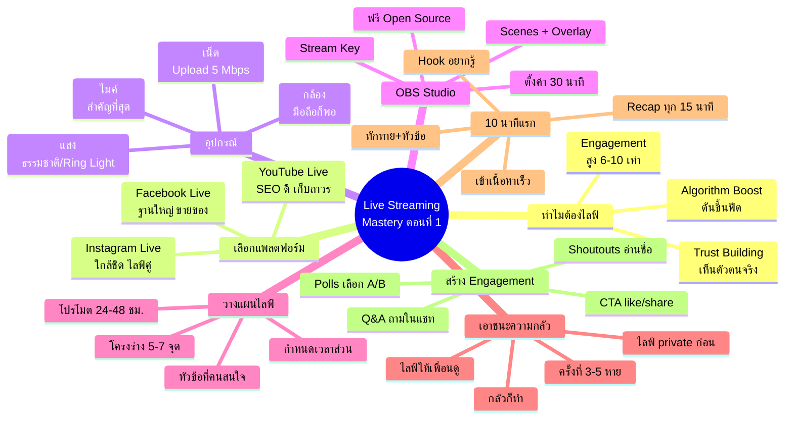

# Live Streaming Mastery ตอนที่ 1 — LIVE-001
> **Format:** Mind Map (Text Structure + Mermaid)
> **Source:** SWP3 Ch29 Live Streaming Mastery ตอนที่ 1
> **Production:** PinkCastle Academy | จูล่ง CTO
> **Date:** 2026-02-17

---

## Mind Map — โครงสร้างข้อความ (Text Structure)

```
Live Streaming Mastery ตอนที่ 1
│
├── 1. ทำไมต้องไลฟ์ (Why Go Live)
│   ├── Algorithm Boost
│   │   ├── ทุกแพลตฟอร์มดันไลฟ์ขึ้นฟีด
│   │   └── Push notification อัตโนมัติ
│   ├── Engagement Rate สูง 6-10 เท่า
│   │   ├── ปฏิสัมพันธ์เรียลไทม์
│   │   └── คอมเมนต์ แชท สองทาง
│   └── Trust Building
│       ├── คอนเทนต์แก้ไขไม่ได้
│       ├── เห็นตัวตนจริง
│       └── ไลฟ์ 1 ครั้ง = โพสต์ปกติ 10-20 ครั้ง
│
├── 2. เลือกแพลตฟอร์ม (Platform Selection)
│   ├── Facebook Live
│   │   ├── ฐานผู้ใช้ไทยใหญ่ที่สุด
│   │   ├── รองรับไลฟ์ยาว
│   │   └── เหมาะขายของ สร้างชุมชน
│   ├── YouTube Live
│   │   ├── SEO ดี ค้นหาเจอภายหลัง
│   │   ├── วิดีโอเก็บถาวรบน channel
│   │   └── เหมาะ workshop สัมมนา
│   └── Instagram Live
│       ├── ใกล้ชิด ไลฟ์คู่ง่าย
│       ├── เหมาะ Q&A behind the scenes
│       └── คอนเทนต์สั้น 30-60 นาที
│
├── 3. อุปกรณ์ (Equipment Setup)
│   ├── ไมค์ (สำคัญที่สุด)
│   │   ├── ไมค์หนีบปกเสื้อ
│   │   └── คนทนเสียงไม่ดีไม่ได้
│   ├── กล้อง
│   │   ├── มือถือ + ขาตั้ง
│   │   └── เว็บแคม / mirrorless
│   ├── แสง
│   │   ├── แสงธรรมชาติ หน้าหน้าต่าง
│   │   └── Ring Light 300-500 บาท
│   ├── อินเทอร์เน็ต
│   │   ├── Upload >= 5 Mbps
│   │   └── LAN สายดีกว่า Wi-Fi
│   └── งบเริ่มต้น < 2,000 บาท
│
├── 4. OBS Studio พื้นฐาน
│   ├── ซอฟต์แวร์ฟรี Open Source
│   ├── ตั้งค่าครั้งแรก 30 นาที
│   ├── สร้าง Scenes
│   │   ├── หน้าเปิด
│   │   ├── หน้าเนื้อหา
│   │   └── หน้าปิด
│   ├── Audio Input → ไมค์
│   ├── Resolution → 1920x1080
│   └── เชื่อมแพลตฟอร์มผ่าน Stream Key
│
├── 5. วางแผนไลฟ์ (Planning)
│   ├── เลือกหัวข้อ
│   │   └── ใช้คำถามที่คนถามบ่อย
│   ├── เขียนโครงร่าง 5-7 ประเด็น
│   │   └── Bullet points เตือนความจำ
│   ├── กำหนดเวลาแต่ละส่วน
│   │   ├── เปิดรายการ 5 นาที
│   │   ├── เนื้อหาหลัก 30 นาที
│   │   ├── ถามตอบ 15 นาที
│   │   └── ปิดรายการ 5 นาที
│   └── โปรโมตล่วงหน้า 24-48 ชม.
│
├── 6. เอาชนะความกลัวกล้อง
│   ├── ขั้นที่ 1: ไลฟ์ private ดูเอง
│   ├── ขั้นที่ 2: ไลฟ์ให้เพื่อน 2-3 คน
│   ├── ขั้นที่ 3: ไลฟ์สาธารณะครั้งแรก
│   ├── ขั้นที่ 4: ไลฟ์ต่อเนื่อง 3-5 ครั้ง
│   ├── หลัก: "กลัวก็ทำ"
│   └── Focus ที่คุณค่าต่อคนดู ไม่ใช่ตัวเอง
│
├── 7. กลยุทธ์ 10 นาทีแรก (First 10 Minutes)
│   ├── นาที 1-2: ทักทาย บอกหัวข้อ
│   ├── นาที 3-5: Hook สร้างความอยากรู้
│   ├── นาที 6-10: เข้าเนื้อหาเลย
│   └── ทุก 10-15 นาที: Recap สำหรับคนเข้าทีหลัง
│
└── 8. สร้าง Engagement
    ├── Q&A ถามคำถามในแชท
    ├── Polls ให้เลือก A หรือ B
    ├── Shoutouts อ่านชื่อคนดู
    ├── Call to Action กด like/share
    └── ตอบคอมเมนต์เรียลไทม์
```

---

## Mind Map — Mermaid Diagram



---

## Mind Map — Mermaid Flowchart (แบบทางเลือก)

```mermaid
graph TB
    CENTER["Live Streaming<br/>Mastery ตอนที่ 1<br/>SWP3 Ch29"]

    CENTER --> WHY["ทำไมต้องไลฟ์"]
    WHY --> WHY1["Algorithm Boost<br/>ดันขึ้นฟีดอัตโนมัติ"]
    WHY --> WHY2["Engagement<br/>สูงกว่า 6-10 เท่า"]
    WHY --> WHY3["Trust Building<br/>ไลฟ์ 1 = โพสต์ 10-20"]

    CENTER --> PLAT["เลือกแพลตฟอร์ม"]
    PLAT --> PLAT1["Facebook Live<br/>คนไทย ขายของ"]
    PLAT --> PLAT2["YouTube Live<br/>SEO เก็บถาวร"]
    PLAT --> PLAT3["Instagram Live<br/>ใกล้ชิด Q&A"]

    CENTER --> EQUIP["อุปกรณ์<br/>งบ < 2,000 บาท"]
    EQUIP --> EQ1["ไมค์ = สำคัญสุด"]
    EQUIP --> EQ2["กล้อง = มือถือก็พอ"]
    EQUIP --> EQ3["แสง + เน็ต 5 Mbps"]

    CENTER --> OBS["OBS Studio<br/>ฟรี ตั้งค่า 30 นาที"]
    OBS --> OBS1["Scenes + Overlay"]
    OBS --> OBS2["Stream Key"]

    CENTER --> PLAN["วางแผนไลฟ์"]
    PLAN --> PL1["หัวข้อ + โครงร่าง"]
    PLAN --> PL2["เวลา + โปรโมต"]

    CENTER --> FEAR["เอาชนะความกลัว"]
    FEAR --> F1["Private → เพื่อน → สาธารณะ"]
    FEAR --> F2["กลัวก็ทำ<br/>ครั้งที่ 3-5 หาย"]

    CENTER --> FIRST["10 นาทีแรก<br/>= ทองคำ"]
    FIRST --> FI1["Hook + ทักทาย"]
    FIRST --> FI2["เข้าเนื้อหาเร็ว"]

    CENTER --> ENG["สร้าง Engagement"]
    ENG --> EN1["Q&A + Polls"]
    ENG --> EN2["Shoutouts + CTA"]

    style CENTER fill:#FF69B4,stroke:#FF1493,color:#fff,stroke-width:3px
    style WHY fill:#FFB6C1,stroke:#FF69B4
    style PLAT fill:#FFB6C1,stroke:#FF69B4
    style EQUIP fill:#FFB6C1,stroke:#FF69B4
    style OBS fill:#FFB6C1,stroke:#FF69B4
    style PLAN fill:#FFB6C1,stroke:#FF69B4
    style FEAR fill:#FF6B6B,stroke:#FF1493,color:#fff
    style FIRST fill:#FFD700,stroke:#FFA500,color:#000
    style ENG fill:#FFB6C1,stroke:#FF69B4
```



---

## สรุปโครงสร้าง Mind Map

| กิ่งหลัก | จำนวนกิ่งย่อย | ประเด็นสำคัญ |
|---------|-------------|-------------|
| ทำไมต้องไลฟ์ | 3 | Algorithm boost + engagement 6-10x + trust |
| เลือกแพลตฟอร์ม | 3 | FB (ขายของ) / YT (SEO) / IG (ใกล้ชิด) |
| อุปกรณ์ | 5 | ไมค์สำคัญสุด งบ < 2,000 |
| OBS Studio | 4 | ฟรี ตั้งค่า 30 นาที |
| วางแผนไลฟ์ | 4 | หัวข้อ โครงร่าง เวลา โปรโมต |
| เอาชนะความกลัว | 6 | 4 ขั้นตอน กลัวก็ทำ focus คุณค่า |
| 10 นาทีแรก | 4 | Hook เร็ว เข้าเนื้อหา recap loop |
| สร้าง Engagement | 5 | Q&A Polls Shoutouts CTA ตอบคอมเมนต์ |

**จำนวน node ทั้งหมด:** 57 nodes (8 กิ่งหลัก + 49 กิ่งย่อย)

---

> **หมายเหตุ:** Mermaid mindmap สามารถ render ได้ใน GitHub, Notion (embed), VS Code (Mermaid Preview extension)
> Flowchart แบบทางเลือกใช้ได้ในกรณีที่ platform ไม่รองรับ mindmap syntax
