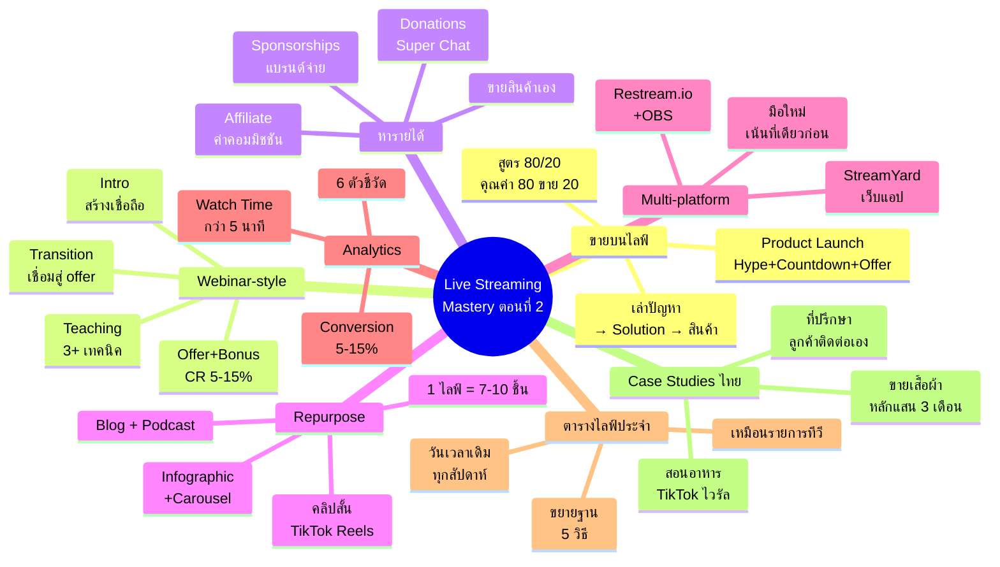

# Live Streaming Mastery ตอนที่ 2 — LIVE-002
> **Format:** Mind Map (Text Structure + Mermaid)
> **Source:** SWP3 Ch29 Live Streaming Mastery ตอนที่ 2
> **Production:** PinkCastle Academy | จูล่ง CTO
> **Date:** 2026-02-17

---

## Mind Map — โครงสร้างข้อความ (Text Structure)

```
Live Streaming Mastery ตอนที่ 2
│
├── 1. ขายบนไลฟ์ (Selling on Live)
│   ├── สูตร 80/20
│   │   ├── ให้คุณค่า 80% (48 นาที/ชม.)
│   │   └── ขาย 20% (12 นาที/ชม.)
│   ├── เทคนิคขาย
│   │   ├── เล่าปัญหา → แสดง solution → สินค้าช่วยได้
│   │   └── ขายโดยไม่ให้รู้สึกว่าขาย
│   └── Product Launch
│       ├── สร้าง hype 1 สัปดาห์ก่อน
│       ├── Countdown 3 วันก่อน
│       └── Limited offer เฉพาะคนดูไลฟ์
│
├── 2. Webinar-style Lives
│   ├── Introduction (10 นาที)
│   │   └── สร้างความน่าเชื่อถือ
│   ├── Teaching (30-40 นาที)
│   │   └── สอนอย่างน้อย 3 เทคนิค
│   ├── Transition (5 นาที)
│   │   └── เชื่อมสู่การนำเสนอ
│   ├── Offer (15-20 นาที)
│   │   └── สินค้า + bonus
│   └── Conversion Rate: 5-15%
│       └── สูงกว่า Landing Page 3-5 เท่า
│
├── 3. ช่องทางหารายได้ (Monetization)
│   ├── ขายสินค้า/บริการตัวเอง
│   ├── Donations / Super Chat
│   │   ├── YouTube Super Chat
│   │   └── Facebook Stars
│   ├── Sponsorships
│   │   └── แบรนด์จ่ายให้พูดถึง
│   └── Affiliate Links
│       └── แนะนำสินค้าคนอื่น ได้ค่าคอมฯ
│
├── 4. Repurposing Content (Content Multiplication)
│   ├── ไลฟ์ 1 ครั้ง = 7-10 ชิ้น
│   ├── คลิปสั้น 1-3 นาที
│   │   └── TikTok Reels Shorts
│   ├── บทความ Blog
│   ├── Podcast (ตัดเฉพาะเสียง)
│   ├── Infographic (quote สำคัญ)
│   ├── Carousel Post (key points)
│   └── Email Newsletter
│
├── 5. Multi-platform Streaming
│   ├── เครื่องมือ
│   │   ├── Restream.io (ผ่าน OBS)
│   │   └── StreamYard (เว็บแอป ง่าย)
│   ├── ข้อดี
│   │   └── ขยาย reach หลายแพลตฟอร์มพร้อมกัน
│   └── ข้อควรระวัง
│       ├── Engagement กระจาย
│       ├── เน็ตต้องแรงกว่า
│       └── มือใหม่เน้นที่เดียวก่อน
│
├── 6. Analytics & Metrics (6 ตัวชี้วัด)
│   ├── Peak Concurrent Viewers
│   ├── Average Watch Time (> 5 นาที)
│   ├── Engagement Rate (> 5%)
│   ├── Replay Views
│   ├── Conversion Rate (5-15%)
│   └── Follower Growth
│
├── 7. สร้างตารางไลฟ์ + ขยายฐาน
│   ├── ตารางประจำ
│   │   ├── เหมือนรายการทีวี
│   │   ├── วันเวลาเดิมทุกสัปดาห์
│   │   └── เริ่มสัปดาห์ละ 1 ครั้ง
│   └── ขยายฐานคนดู 5 วิธี
│       ├── Cross-promote
│       ├── Collaborate
│       ├── Consistency
│       ├── Tease ครั้งหน้า
│       └── ใช้ Replay
│
└── 8. Case Studies นักไลฟ์ไทย
    ├── เคส 1: ขายเสื้อผ้า FB Live
    │   └── 3 เดือน → หลักแสน/เดือน
    ├── เคส 2: สอนทำอาหาร
    │   └── Repurpose → TikTok ไวรัล → ขายคอร์ส
    ├── เคส 3: ที่ปรึกษาธุรกิจ
    │   └── Webinar สัปดาห์ละครั้ง → ลูกค้าติดต่อเอง
    └── ปัจจัยร่วม
        └── สม่ำเสมอ + คุณค่า + repurpose + > 50 ครั้ง
```

---

## Mind Map — Mermaid Diagram



---

## Mind Map — Mermaid Flowchart (แบบทางเลือก)

```mermaid
graph TB
    CENTER["Live Streaming<br/>Mastery ตอนที่ 2<br/>SWP3 Ch29"]

    CENTER --> SELL["ขายบนไลฟ์<br/>สูตร 80/20"]
    SELL --> S1["คุณค่า 80%<br/>ขาย 20%"]
    SELL --> S2["Product Launch<br/>Hype → Countdown → Offer"]
    SELL --> S3["เล่าปัญหา →<br/>Solution → สินค้า"]

    CENTER --> WEB["Webinar-style<br/>CR 5-15%"]
    WEB --> W1["Intro → Teaching"]
    WEB --> W2["Transition → Offer"]
    WEB --> W3["สูงกว่า LP<br/>ปกติ 3-5 เท่า"]

    CENTER --> MON["หารายได้<br/>หลายช่องทาง"]
    MON --> M1["ขายสินค้าเอง"]
    MON --> M2["Donations<br/>Super Chat"]
    MON --> M3["Sponsorships<br/>+ Affiliate"]

    CENTER --> REP["Repurpose<br/>1 ไลฟ์ = 7-10 ชิ้น"]
    REP --> R1["คลิปสั้น<br/>TikTok Reels Shorts"]
    REP --> R2["Blog + Podcast<br/>+ Newsletter"]
    REP --> R3["Infographic<br/>+ Carousel"]

    CENTER --> MULTI["Multi-platform<br/>Streaming"]
    MULTI --> MP1["Restream.io<br/>+ StreamYard"]
    MULTI --> MP2["มือใหม่<br/>เน้นที่เดียวก่อน"]

    CENTER --> ANA["Analytics<br/>6 ตัวชี้วัด"]
    ANA --> A1["Views + Watch Time"]
    ANA --> A2["Engagement<br/>+ Conversion"]

    CENTER --> SCHED["ตารางไลฟ์ประจำ"]
    SCHED --> SC1["เหมือนรายการทีวี"]
    SCHED --> SC2["ขยายฐาน 5 วิธี"]

    CENTER --> CASE["Case Studies ไทย"]
    CASE --> C1["ขายเสื้อผ้า<br/>หลักแสน/3 เดือน"]
    CASE --> C2["สอนอาหาร<br/>TikTok ไวรัล"]
    CASE --> C3["ที่ปรึกษา<br/>ลูกค้าติดต่อเอง"]

    style CENTER fill:#FF69B4,stroke:#FF1493,color:#fff,stroke-width:3px
    style SELL fill:#FFD700,stroke:#FFA500,color:#000
    style WEB fill:#FFD700,stroke:#FFA500,color:#000
    style MON fill:#FFB6C1,stroke:#FF69B4
    style REP fill:#FF6B6B,stroke:#FF1493,color:#fff
    style MULTI fill:#FFB6C1,stroke:#FF69B4
    style ANA fill:#FFB6C1,stroke:#FF69B4
    style SCHED fill:#FFB6C1,stroke:#FF69B4
    style CASE fill:#FFB6C1,stroke:#FF69B4
```



---

## สรุปโครงสร้าง Mind Map

| กิ่งหลัก | จำนวนกิ่งย่อย | ประเด็นสำคัญ |
|---------|-------------|-------------|
| ขายบนไลฟ์ | 6 | สูตร 80/20 + product launch + soft sell |
| Webinar-style | 5 | 4 ส่วน + CR 5-15% สูงกว่า LP 3-5 เท่า |
| ช่องทางหารายได้ | 4 | ขายเอง donation sponsorship affiliate |
| Repurposing | 7 | 1 ไลฟ์ = 7-10 ชิ้น คลิป blog podcast |
| Multi-platform | 3 | Restream + StreamYard มือใหม่เน้นที่เดียว |
| Analytics | 6 | 6 ตัวชี้วัด จดบันทึกทุกครั้ง |
| ตารางไลฟ์ประจำ | 7 | เหมือนรายการทีวี + ขยายฐาน 5 วิธี |
| Case Studies | 4 | 3 เคสไทย ปัจจัยร่วม สม่ำเสมอ > 50 ครั้ง |

**จำนวน node ทั้งหมด:** 58 nodes (8 กิ่งหลัก + 50 กิ่งย่อย)

---

> **หมายเหตุ:** Mermaid mindmap สามารถ render ได้ใน GitHub, Notion (embed), VS Code (Mermaid Preview extension)
> Flowchart แบบทางเลือกใช้ได้ในกรณีที่ platform ไม่รองรับ mindmap syntax
