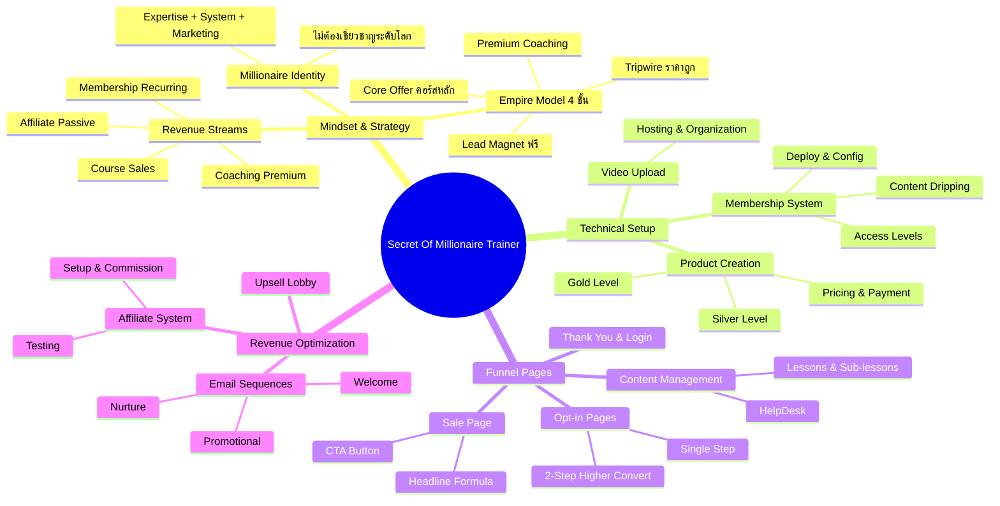
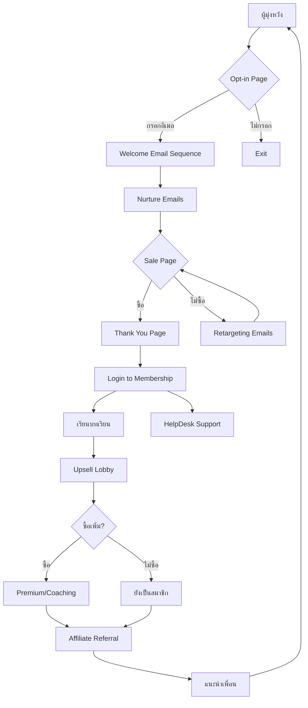

# The Secret Of Millionaire Trainer — ภาพรวมทั้งบท — SOMT-000 Mind Map
> **Format:** Mind Map (Text Tree + Mermaid)
> **Source:** SWP3 Ch30 The Secret Of Millionaire Trainer — Overview
> **Production:** PinkCastle Academy | จูล่ง CTO
> **Date:** 2026-02-18 | **Duration:** 21:15:54 (ทั้งบท)

---

## Part 1: Text Tree Mind Map

```
The Secret Of Millionaire Trainer (SOMT-000 Overview)
├── 📌 Central Concept
│   └── Blueprint สร้างอาณาจักรคอร์สออนไลน์ที่สร้างรายได้ระดับล้าน
│
├── 🧠 กลุ่ม 1: Mindset & Strategy (ตอน 1-3, 9:17:33 ชม.)
│   ├── Millionaire Trainer Identity
│   │   ├── ไม่ต้องเป็นผู้เชี่ยวชาญระดับโลก
│   │   ├── แค่รู้มากกว่า 2-3 ก้าว
│   │   └── สูตร: Expertise + System + Marketing
│   ├── Revenue Streams
│   │   ├── One-time Course Sales
│   │   ├── Recurring Membership
│   │   ├── Premium Coaching
│   │   ├── Upsell/Cross-sell
│   │   └── Affiliate Commission
│   └── Empire Model (4 ชั้น)
│       ├── ชั้น 1: Lead Magnet (ฟรี)
│       ├── ชั้น 2: Tripwire (ราคาถูก)
│       ├── ชั้น 3: Core Offer (คอร์สหลัก)
│       └── ชั้น 4: Premium Offer (Coaching)
│
├── ⚙️ กลุ่ม 2: Technical Setup & Products (ตอน 4-9, 4:30:17 ชม.)
│   ├── Membership System
│   │   ├── Deploy ระบบ
│   │   ├── ตั้งค่า Configuration
│   │   ├── Content Dripping
│   │   └── Access Level Management
│   ├── Product Creation
│   │   ├── Gold Level (Full Access)
│   │   ├── Silver Level (Limited Access)
│   │   ├── Pricing Strategy
│   │   └── Payment Integration
│   └── Video Upload
│       ├── Video Hosting
│       ├── Content Organization
│       └── User Experience
│
├── 📄 กลุ่ม 3: Funnel Pages & Content (ตอน 10-17, 4:39:30 ชม.)
│   ├── Opt-in Pages
│   │   ├── Single Step Opt-in
│   │   ├── 2-Step Opt-in (Conversion สูงกว่า)
│   │   └── Micro-Commitment Psychology
│   ├── Sales & Conversion Pages
│   │   ├── Sale Page (Headline, Bullets, CTA)
│   │   ├── Thank You Page (Next Steps + Upsell)
│   │   └── Login Page
│   ├── Content Management
│   │   ├── ใส่บทเรียนหลัก
│   │   ├── ใส่บทเรียนย่อย
│   │   ├── Access Rules & Drip Schedule
│   │   └── Progress Tracking
│   └── HelpDesk System
│       ├── FAQ
│       ├── Ticket System
│       └── Knowledge Base
│
└── 💰 กลุ่ม 4: Revenue Optimization (ตอน 18-22, 2:48:28 ชม.)
    ├── Upsell Strategy
    │   ├── Upsell Lobby List
    │   ├── Product Showcase หลัง Login
    │   └── Increase Average Order Value
    ├── Email Automation
    │   ├── Welcome Sequence
    │   ├── Nurture Sequence
    │   └── Promotional Sequence
    └── Affiliate System
        ├── ตั้งค่าระบบ Affiliate
        ├── สร้างหน้า Affiliate
        ├── Commission Structure (20-50%)
        └── ทดสอบระบบ End-to-End
```

---

## Part 2: Mermaid Mind Map



---

## Part 3: Mermaid Flowchart (Customer Journey)



---

## Part 4: Summary Statistics

| Metric | Value |
|--------|-------|
| Total Nodes | 52 |
| Primary Branches | 4 |
| Average Sub-nodes per Branch | 13 |
| Key Concepts | Membership, Funnel, Upsell, Affiliate |
| Platform | Kartra |
| Revenue Model | Hybrid (One-time + Recurring + Passive) |

---

*Mind Map nodes: 52 | Focus: Complete Course Business Blueprint*
