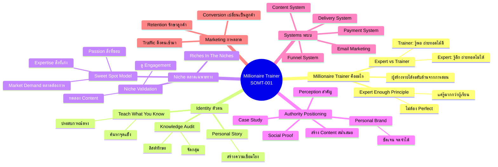
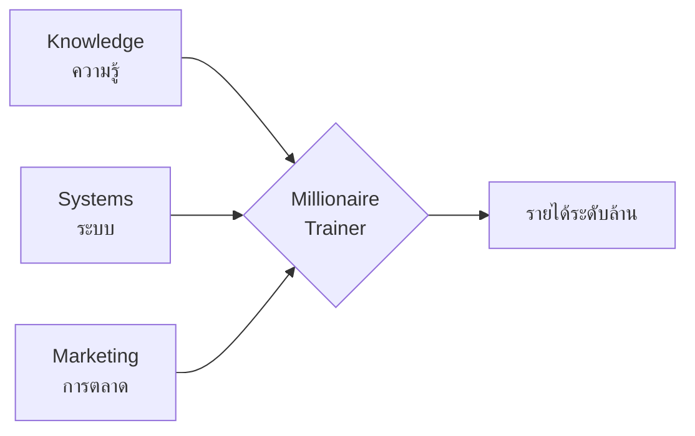

# Millionaire Trainer Identity & Mindset — SOMT-001
> **Format:** Mind Map
> **Source:** SWP3 Ch30 The Secret Of Millionaire Trainer ตอนที่ 1
> **Production:** PinkCastle Academy | จูล่ง CTO
> **Date:** 2026-02-18

---

## Text Tree Mind Map

```
Secret Of Millionaire Trainer ตอนที่ 1
│
├── 1. Millionaire Trainer คืออะไร?
│   ├── นิยาม: ผู้สร้างรายได้ระดับล้านจากการเป็น Trainer
│   ├── ไม่ใช่แค่สอนเก่ง — ต้องมีระบบครบ
│   ├── Expert vs Trainer
│   │   ├── Expert: รู้ลึก แต่ถ่ายทอดไม่ได้
│   │   ├── Trainer: รู้เพียงพอ + ถ่ายทอดได้ดี
│   │   └── Trainer สร้างรายได้ได้มากกว่า
│   └── "Expert Enough" Principle
│       ├── ไม่ต้อง Perfect
│       ├── แค่รู้มากกว่าคนที่จะสอน
│       └── เดินมา 10 ก้าว → สอนคนก้าวแรกได้
│
├── 2. Identity — ตัวตนของ Trainer
│   ├── Teach What You Know (สอนในสิ่งที่รู้)
│   │   ├── ถามตัวเอง: อะไรที่ฉันรู้ดีกว่าคนอื่น?
│   │   ├── ประสบการณ์ตรง = จุดแข็ง
│   │   └── ไม่ต้องเป็นอันดับ 1 ของโลก
│   ├── Knowledge Audit
│   │   ├── ลิสต์ทักษะทั้งหมด
│   │   ├── จัดกลุ่มตามหมวดหมู่
│   │   └── ระบุจุดแข็งที่โดดเด่น
│   └── Personal Story
│       ├── เรื่องราวส่วนตัวสร้างความเชื่อมโยง
│       └── "ฉันเคยเป็นเหมือนคุณ" = พลังขาย
│
├── 3. Niche — ตลาดเฉพาะทาง
│   ├── "The Riches Are In The Niches"
│   ├── ยิ่งเจาะจง → ยิ่งมีพลัง
│   ├── Sweet Spot Model
│   │   ├── สิ่งที่คุณรู้/เก่ง (Expertise)
│   │   ├── สิ่งที่คุณชอบ/หลงใหล (Passion)
│   │   └── สิ่งที่ตลาดต้องการ (Market Demand)
│   ├── ตัวอย่าง Niche ที่ดี
│   │   ├── "การตลาดออนไลน์สำหรับร้านอาหาร" ✓
│   │   ├── "สอน Excel สำหรับ HR" ✓
│   │   └── "สอนการตลาด" ✗ (กว้างเกินไป)
│   └── Niche Validation
│       ├── ทดลองสร้าง Content ฟรี
│       ├── ดู Engagement
│       └── ถาม Community
│
├── 4. Authority Positioning — วางตำแหน่งผู้เชี่ยวชาญ
│   ├── Perception vs Reality
│   │   ├── คนซื้อจากคนที่เชื่อถือ
│   │   └── ภาพลักษณ์สำคัญเท่ากับความจริง
│   ├── วิธีสร้าง Authority
│   │   ├── Content คุณภาพสูง สม่ำเสมอ
│   │   ├── Social Proof (รีวิว, Testimonials)
│   │   ├── Case Study / ผลลัพธ์จริง
│   │   └── พูดบนเวที / จัด Workshop
│   ├── Personal Brand
│   │   ├── ตัวตนชัดเจน จดจำได้
│   │   ├── "ฉันช่วยใคร ทำอะไร ให้ผลลัพธ์อะไร"
│   │   └── ต้องสม่ำเสมอในทุก Platform
│   └── Platform เลือก 1 ทำให้ดี
│       ├── YouTube
│       ├── Facebook
│       ├── TikTok
│       └── Blog/Podcast
│
├── 5. Systems — ระบบที่ต้องมี
│   ├── Content System (ระบบสร้างเนื้อหา)
│   ├── Funnel System (ระบบดึงดูด→ปิดการขาย)
│   ├── Email Marketing (ระบบ nurture ลูกค้า)
│   ├── Payment System (ระบบรับเงิน)
│   └── Delivery System (ระบบส่งมอบคอร์ส)
│
└── 6. Marketing — การตลาดที่จำเป็น
    ├── Traffic (ดึงคนเข้ามา)
    │   ├── Organic (SEO, Social Media)
    │   └── Paid (Ads, Affiliates)
    ├── Conversion (เปลี่ยนเป็นลูกค้า)
    │   ├── Landing Page
    │   ├── Sales Page
    │   └── Webinar
    └── Retention (รักษาลูกค้า)
        ├── Email Follow-up
        ├── Community
        └── Upsell / Cross-sell
```

---

## Mermaid Mind Map



---

## Core Formula



---

*สิ้นสุด Mind Map — SOMT-001*
