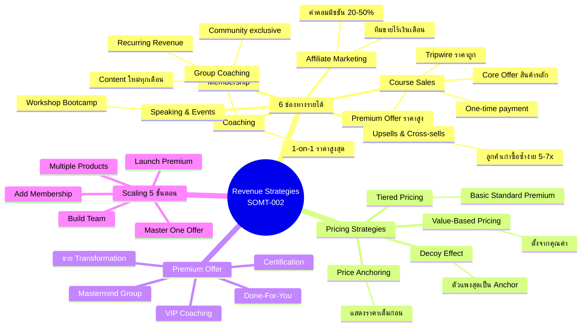
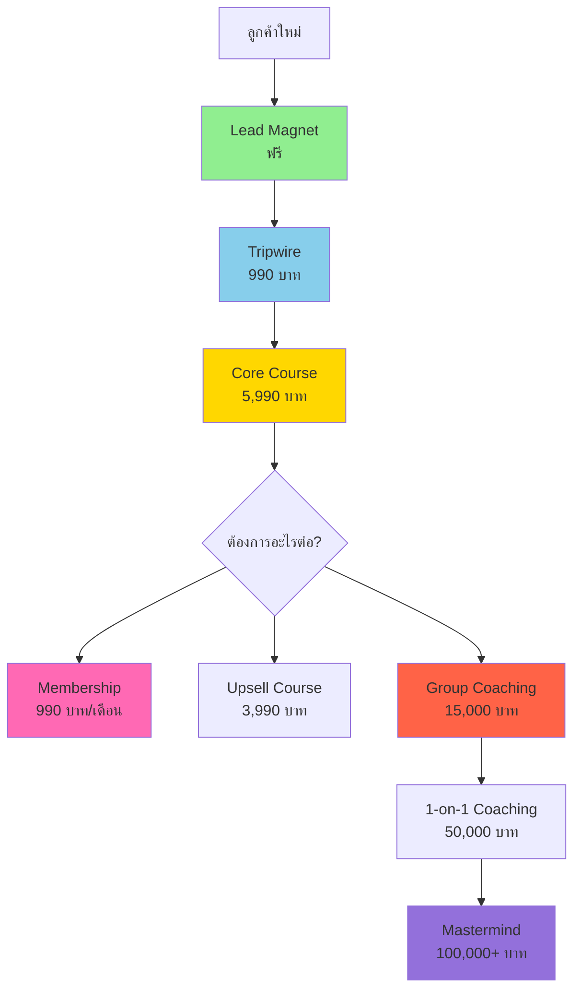

# Revenue Strategies สำหรับ Course Creator — SOMT-002
> **Format:** Mind Map
> **Source:** SWP3 Ch30 The Secret Of Millionaire Trainer ตอนที่ 2
> **Production:** PinkCastle Academy | จูล่ง CTO
> **Date:** 2026-02-18

---

## Text Tree Mind Map

```
Revenue Strategies สำหรับ Course Creator
│
├── 1. ปัญหา: Single Point of Failure
│   ├── พึ่งพารายได้จากแหล่งเดียว
│   ├── ขายไม่ออก = รายได้เป็นศูนย์
│   └── ต้องสร้าง "ระบบนิเวศ" หลายช่องทาง
│
├── 2. ช่องทางรายได้ 6 ประเภท
│   ├── Course Sales (ขายคอร์ส)
│   │   ├── One-time payment
│   │   ├── ทำครั้งเดียว ขายซ้ำได้ไม่จำกัด
│   │   ├── Tripwire (ราคาถูก ดึงลูกค้าเข้า)
│   │   ├── Core Offer (สินค้าหลัก)
│   │   └── Premium Offer (ราคาสูง)
│   ├── Membership (สมาชิกรายเดือน)
│   │   ├── Recurring Revenue = ทรงพลังที่สุด
│   │   ├── 500 คน x 990 บาท = 495,000/เดือน
│   │   ├── Content ใหม่ทุกเดือน
│   │   ├── Community exclusive
│   │   └── Live Q&A session
│   ├── Coaching (โค้ชชิ่ง)
│   │   ├── 1-on-1 Coaching (ราคาสูงสุด)
│   │   ├── Group Coaching (Win-Win)
│   │   ├── หลักหมื่น-หลักแสน/คน
│   │   └── ความใส่ใจเฉพาะตัว
│   ├── Upsells & Cross-sells
│   │   ├── Upsell: เสนอสินค้าเพิ่มหลังซื้อ
│   │   │   ├── Workbook / Template
│   │   │   └── คอร์สขั้นสูง
│   │   ├── Cross-sell: สินค้าต่างหมวด
│   │   └── ลูกค้าเก่าซื้อซ้ำง่ายกว่า 5-7 เท่า
│   ├── Affiliate Marketing
│   │   ├── แนะนำเครื่องมือคนอื่น → ค่าคอมมิชชัน
│   │   ├── สร้าง Affiliate Program ของตัวเอง
│   │   └── ค่าคอมมิชชัน 20-50%
│   └── Speaking & Events
│       ├── รับเชิญพูดบนเวที
│       ├── จัด Workshop / Bootcamp
│       └── ค่าตัวหลักหมื่น-หลักแสน
│
├── 3. กลยุทธ์ตั้งราคา
│   ├── Value-Based Pricing
│   │   ├── ตั้งจากคุณค่า ไม่ใช่ต้นทุน
│   │   └── ROI ของลูกค้า = เกณฑ์ตั้งราคา
│   ├── Price Anchoring
│   │   ├── แสดงราคาเต็มก่อน
│   │   └── "ปกติ 19,900 วันนี้ 9,900"
│   ├── Tiered Pricing
│   │   ├── Basic / Standard / Premium
│   │   └── คนส่วนใหญ่เลือกตัวกลาง
│   └── Decoy Effect
│       ├── ตัวแพงสุดเป็น Anchor
│       └── ทำให้ตัวกลางดูคุ้ม
│
├── 4. Premium Offer
│   ├── ประเภท
│   │   ├── Mastermind Group
│   │   ├── Done-For-You Service
│   │   ├── VIP Coaching (1-on-1)
│   │   └── Certification Program
│   ├── ขาย Transformation ไม่ใช่ Information
│   │   ├── ลูกค้าจ่ายเพื่อ "การเปลี่ยนแปลง"
│   │   └── ยิ่ง Transformation ชัด ยิ่งราคาสูงได้
│   └── ลูกค้าจ่ายแพง = ตั้งใจเรียนมากกว่า
│
└── 5. Scaling Roadmap (5 ขั้นตอน)
    ├── ขั้นที่ 1: Master One Offer
    │   └── ทำคอร์สแรกให้สำเร็จจริง
    ├── ขั้นที่ 2: Add Membership
    │   └── สร้าง Recurring Revenue
    ├── ขั้นที่ 3: Launch Premium
    │   └── Coaching / Mastermind
    ├── ขั้นที่ 4: Build Team
    │   └── จ้างคนช่วย เพิ่มเวลาให้ตัวเอง
    └── ขั้นที่ 5: Multiple Products
        └── Product Ecosystem ครบทุกระดับ
```

---

## Mermaid Mind Map



---

## Revenue Flow Diagram



---

*สิ้นสุด Mind Map — SOMT-002*
