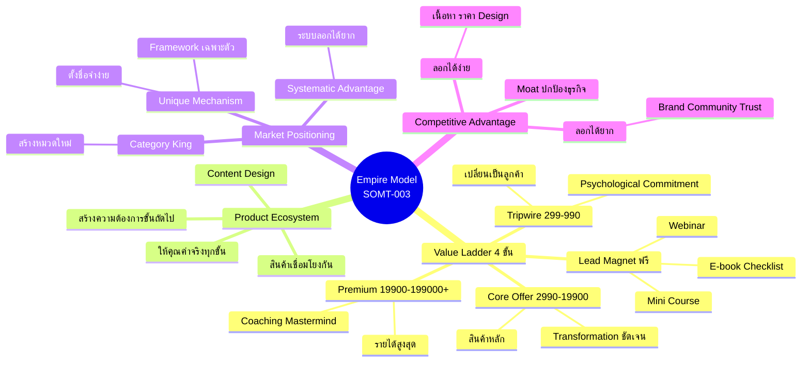
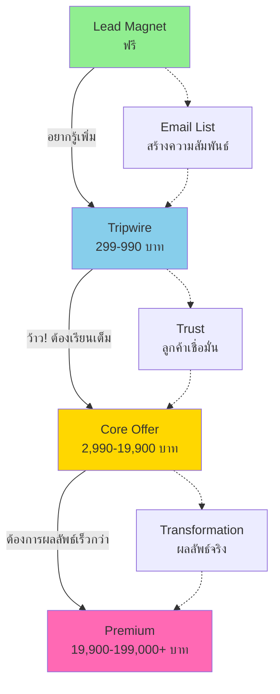
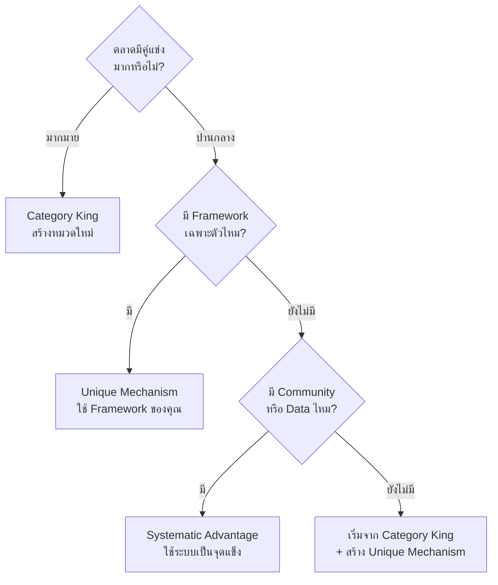

# วิธีคิดสร้างอาณาจักรคอร์สออนไลน์ — SOMT-003
> **Format:** Mind Map
> **Source:** SWP3 Ch30 The Secret Of Millionaire Trainer ตอนที่ 3
> **Production:** PinkCastle Academy | จูล่ง CTO
> **Date:** 2026-02-18

---

## Text Tree Mind Map

```
Empire Model — สร้างอาณาจักรคอร์สออนไลน์
│
├── 1. Value Ladder (บันไดแห่งคุณค่า 4 ขั้น)
│   ├── ขั้นที่ 1: Lead Magnet (ฟรี)
│   │   ├── จุดประสงค์: ดึงดูด + สร้างความสัมพันธ์
│   │   ├── แลกกับอีเมล/ข้อมูล
│   │   ├── E-book ฟรี
│   │   ├── Checklist / Cheat Sheet
│   │   ├── Mini Course (3-5 วิดีโอ)
│   │   └── Webinar ฟรี / PDF Guide
│   ├── ขั้นที่ 2: Tripwire (299-990 บาท)
│   │   ├── จุดประสงค์: เปลี่ยน "ผู้ติดตาม" → "ลูกค้า"
│   │   ├── Psychological Commitment
│   │   │   └── จ่ายครั้งแรกแล้ว ครั้งถัดไปง่ายขึ้น
│   │   ├── Mini Course เฉพาะทาง
│   │   ├── Template Pack
│   │   └── Workshop สั้น 2 ชม.
│   ├── ขั้นที่ 3: Core Offer (2,990-19,900 บาท)
│   │   ├── จุดประสงค์: เครื่องจักรสร้างรายได้หลัก
│   │   ├── ครอบคลุมเนื้อหาหลักทั้งหมด
│   │   ├── Transformation ที่ชัดเจน
│   │   └── Before → After ที่วัดได้
│   └── ขั้นที่ 4: Premium (19,900-199,000+ บาท)
│       ├── จุดประสงค์: รายได้สูงสุด + ผลลัพธ์สูงสุด
│       ├── Coaching / Mastermind
│       ├── Done-For-You Service
│       ├── Certification Program
│       └── 5-10% ของลูกค้าที่ขึ้นมาถึง
│
├── 2. Product Ecosystem Design
│   ├── หลักการ: แต่ละสินค้าสร้างความต้องการสินค้าถัดไป
│   ├── ให้คุณค่าจริงในทุกขั้น
│   ├── "เปิดประตู" ให้เห็นว่ายังมีอีกมาก
│   ├── Content Design = ศิลปะ
│   └── ตัวอย่าง FB Ads Empire
│       ├── Lead Magnet: "5 ข้อผิดพลาด FB Ads" (ฟรี)
│       ├── Tripwire: "Quick Start 2 ชม." (499)
│       ├── Core: "FB Ads Mastery" (7,990)
│       └── Premium: "VIP Coaching 3 เดือน" (59,000)
│
├── 3. Market Positioning (3 กลยุทธ์)
│   ├── Category King
│   │   ├── สร้างหมวดหมู่ใหม่
│   │   ├── เป็นอันดับ 1 โดยอัตโนมัติ
│   │   └── ไม่มีคู่แข่งโดยตรง
│   ├── Unique Mechanism
│   │   ├── สร้าง Framework เฉพาะตัว
│   │   ├── ตั้งชื่อให้จำง่าย
│   │   ├── "ระบบ 3A" / "สูตร 5 ขั้น"
│   │   └── ถูกมองว่าเป็นต้นตำรับ
│   └── Systematic Advantage
│       ├── สร้างระบบที่ลอกได้ยาก
│       ├── Community แข็งแรง
│       ├── ฐานข้อมูลลูกค้าจำนวนมาก
│       └── Partnership กับแบรนด์ใหญ่
│
└── 4. Competitive Advantage (คูน้ำ/Moat)
    ├── สิ่งที่ลอกได้ง่าย (อย่าพึ่งพา)
    │   ├── เนื้อหาคอร์ส
    │   ├── ราคา
    │   └── Design
    ├── สิ่งที่ลอกได้ยาก (ลงทุนที่นี่)
    │   ├── Personal Brand
    │   ├── Community
    │   ├── Trust / ความเชื่อถือ
    │   └── Systems & Processes
    ├── สะสมเวลาทำ ไม่สร้างข้ามคืนได้
    └── เมื่อมีแล้ว = "คูน้ำ" ปกป้องธุรกิจ
```

---

## Mermaid Mind Map



---

## Value Ladder Flow Diagram



---

## Positioning Strategy Decision Tree



---

*สิ้นสุด Mind Map — SOMT-003*
