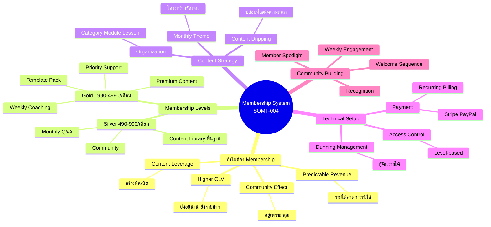
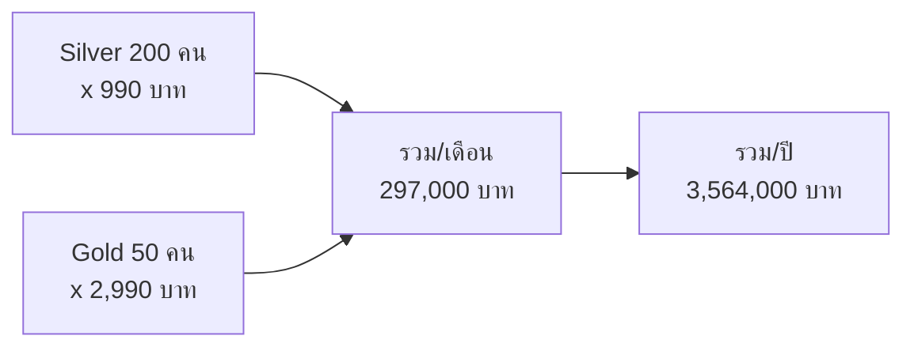
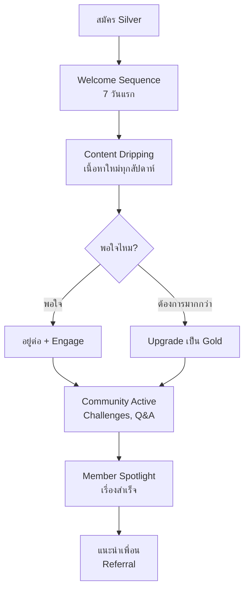

# วิธีสร้างระบบสมาชิก (Membership System) — SOMT-004
> **Format:** Mind Map
> **Source:** SWP3 Ch30 The Secret Of Millionaire Trainer ตอนที่ 4
> **Production:** PinkCastle Academy | จูล่ง CTO
> **Date:** 2026-02-18

---

## Text Tree Mind Map

```
Membership System บน Kartra
│
├── 1. ทำไมต้อง Membership? (4 เหตุผล)
│   ├── Predictable Revenue
│   │   ├── รายได้คาดการณ์ได้ล่วงหน้า
│   │   ├── 200 คน x 990 = 198,000 บาท/เดือน
│   │   └── วางแผนธุรกิจได้มั่นใจ
│   ├── Higher CLV (Customer Lifetime Value)
│   │   ├── 12 เดือน x 990 = 11,880 บาท
│   │   ├── สูงกว่าคอร์สเดียว 5,990 บาท = 2 เท่า
│   │   └── ยิ่งอยู่นาน ยิ่งจ่ายมาก
│   ├── Community Effect
│   │   ├── ลูกค้าอยู่เพราะ "กลุ่ม" ไม่ใช่แค่เนื้อหา
│   │   └── Social Belonging = Retention
│   └── Content Leverage
│       ├── สร้างเนื้อหาทีละนิด ทุกเดือน
│       └── ลดภาระสร้าง Content ก้อนใหญ่
│
├── 2. Membership Levels
│   ├── Silver (ระดับเริ่มต้น)
│   │   ├── ราคา: 490-990 บาท/เดือน
│   │   ├── Content Library พื้นฐาน
│   │   ├── Community access
│   │   ├── Content Dripping รายเดือน
│   │   └── Monthly Q&A Session
│   ├── Gold (ระดับพรีเมียม)
│   │   ├── ราคา: 1,990-4,990 บาท/เดือน
│   │   ├── ทุกอย่างที่ Silver ได้ +
│   │   ├── Premium Content ทั้งหมด
│   │   ├── Weekly Live Coaching
│   │   ├── Template & Resource Pack
│   │   ├── Priority Support
│   │   └── Exclusive Masterclass รายไตรมาส
│   └── Upgrade Path
│       └── Silver → Gold (Upsell ภายใน Membership)
│
├── 3. Content Organization
│   ├── โครงสร้าง 3 ระดับ
│   │   ├── Category (หมวดหมู่ใหญ่)
│   │   ├── Module (กลุ่มย่อย)
│   │   └── Lesson (เนื้อหาแต่ละชิ้น)
│   ├── Content Dripping
│   │   ├── ปล่อยเนื้อหาทีละนิดตามเวลา
│   │   ├── ลด Overwhelm
│   │   ├── เพิ่ม Retention
│   │   └── สร้าง Anticipation
│   └── Monthly Theme
│       ├── กำหนดธีมแต่ละเดือน
│       └── เนื้อหามีโครงสร้างชัดเจน
│
├── 4. Access Control & Payment
│   ├── Access Control
│   │   ├── Level-based access (Silver/Gold)
│   │   ├── Lock Content ที่ต้อง Upgrade
│   │   └── Time-based access (Dripping)
│   ├── Payment Integration
│   │   ├── Stripe (Credit/Debit Card)
│   │   ├── PayPal
│   │   └── Recurring Billing อัตโนมัติ
│   └── Dunning Management
│       ├── จัดการบัตรหมดอายุ
│       ├── Email เตือนอัตโนมัติ
│       ├── Retry charge อัตโนมัติ
│       └── กู้คืนรายได้ 10-30%
│
└── 5. Community Building
    ├── Welcome Sequence
    │   ├── ต้อนรับสมาชิกใหม่อบอุ่น
    │   ├── Onboarding Video
    │   └── แนะนำ Community
    ├── Weekly Engagement
    │   ├── Challenge ประจำสัปดาห์
    │   └── Q&A Session
    ├── Recognition
    │   ├── ยกย่องสมาชิก Active
    │   └── Member Spotlight
    ├── Sub-groups
    │   └── กลุ่มย่อยตามความสนใจ
    └── 7 วันแรก = Critical Period
        └── กำหนดว่าลูกค้าจะอยู่หรือไป
```

---

## Mermaid Mind Map



---

## Membership Revenue Calculator



---

## Member Journey Flow



---

*สิ้นสุด Mind Map — SOMT-004*
