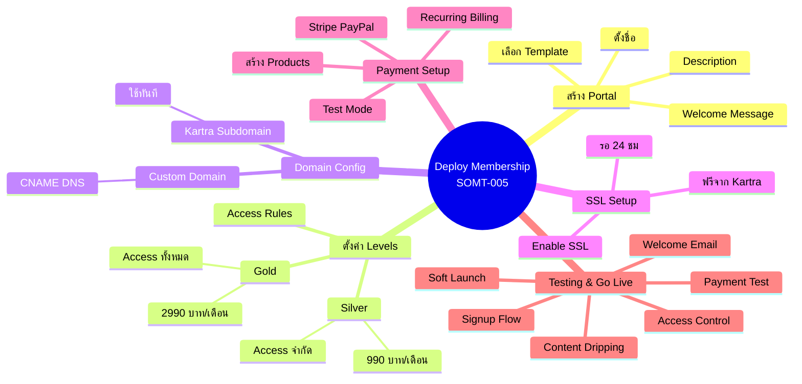
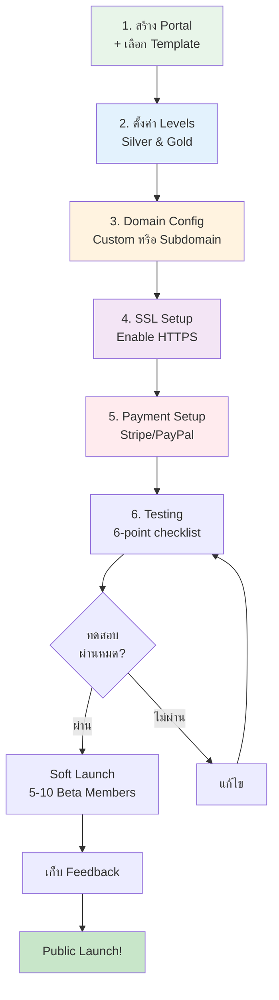
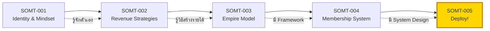

# วิธี Deploy Membership System — SOMT-005
> **Format:** Mind Map
> **Source:** SWP3 Ch30 The Secret Of Millionaire Trainer ตอนที่ 5
> **Production:** PinkCastle Academy | จูล่ง CTO
> **Date:** 2026-02-18

---

## Text Tree Mind Map

```
Deploy Membership System บน Kartra
│
├── 1. สร้าง Membership Portal
│   ├── เข้า Kartra Dashboard → Memberships → New
│   ├── ตั้งชื่อ Membership
│   ├── เลือก Template
│   │   ├── Modern
│   │   ├── Classic
│   │   └── Sidebar Navigation
│   ├── ใส่ Description
│   └── ใส่ Welcome Message
│
├── 2. ตั้งค่า Membership Levels
│   ├── Add Level: Silver
│   │   ├── Access: Category 1-5 เท่านั้น
│   │   ├── Content Dripping: สัปดาห์ละ 1 Module
│   │   └── ราคา: 990 บาท/เดือน
│   ├── Add Level: Gold
│   │   ├── Access: ทุก Category
│   │   ├── Content Dripping: สัปดาห์ละ 1 Module
│   │   └── ราคา: 2,990 บาท/เดือน
│   └── Access Rules
│       ├── Level-based access
│       ├── Time-based dripping
│       └── Locked Content → "Upgrade" page
│
├── 3. Domain Configuration
│   ├── Custom Domain (แนะนำ)
│   │   ├── เพิ่ม Domain ใน "My Domains"
│   │   ├── ตั้ง DNS: CNAME → Kartra
│   │   └── ตัวอย่าง: members.yourbrand.com
│   └── Kartra Subdomain (ง่าย)
│       ├── ใช้งานได้ทันที
│       └── ตัวอย่าง: yourbrand.kartra.com
│
├── 4. SSL Setup
│   ├── Kartra ให้ SSL ฟรี
│   ├── เข้า Domain Settings → Enable SSL
│   ├── รอ Provision ไม่เกิน 24 ชม.
│   └── ผลลัพธ์: HTTPS (กุญแจล็อค)
│       ├── ความปลอดภัย
│       ├── ความน่าเชื่อถือ
│       └── จำเป็นสำหรับ Payment
│
├── 5. Payment Setup
│   ├── เชื่อมต่อ Payment Gateway
│   │   ├── Stripe (Credit/Debit Card)
│   │   └── PayPal
│   ├── สร้าง Products
│   │   ├── Silver Product: 990 บาท/เดือน
│   │   └── Gold Product: 2,990 บาท/เดือน
│   ├── เชื่อม Product ↔ Membership Level
│   ├── ตั้ง Recurring Billing
│   └── ทดสอบด้วย Test Mode
│
├── 6. ทดสอบ & Go Live
│   ├── Testing Checklist
│   │   ├── Signup Flow ✓
│   │   ├── Payment (Test Card) ✓
│   │   ├── Access Control ✓
│   │   ├── Content Dripping ✓
│   │   ├── Welcome Email ✓
│   │   └── Cancellation Flow ✓
│   ├── Soft Launch (5-10 Beta Members)
│   ├── เก็บ Feedback + แก้ไข
│   └── Public Launch! 🚀
│
└── 7. สรุปซีรีส์ 5 ตอน
    ├── ตอน 1: Identity & Mindset
    ├── ตอน 2: Revenue Strategies
    ├── ตอน 3: Empire Model
    ├── ตอน 4: Membership System
    └── ตอน 5: Deploy (ตอนนี้)
```

---

## Mermaid Mind Map



---

## Deployment Flow Diagram



---

## Series Journey Map



---

*สิ้นสุด Mind Map — SOMT-005*
