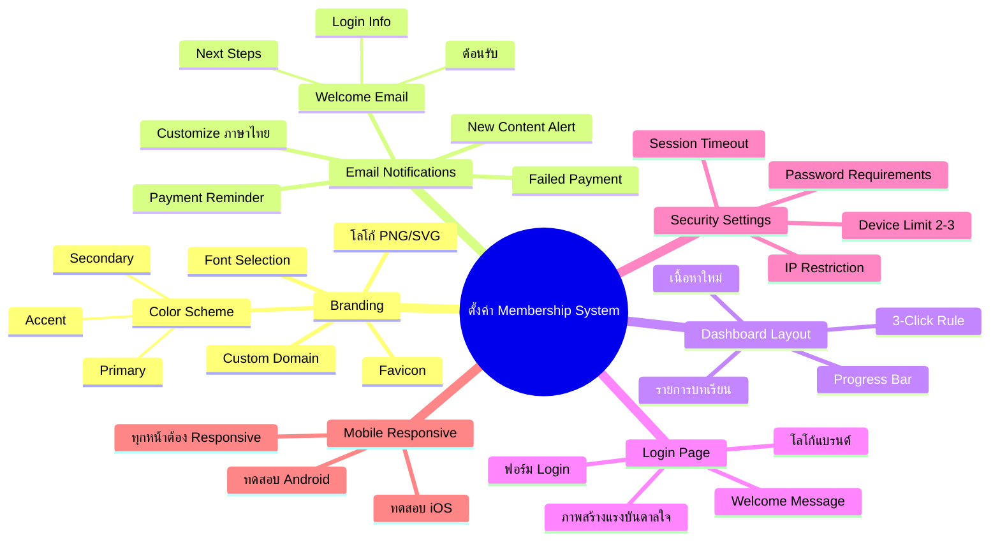
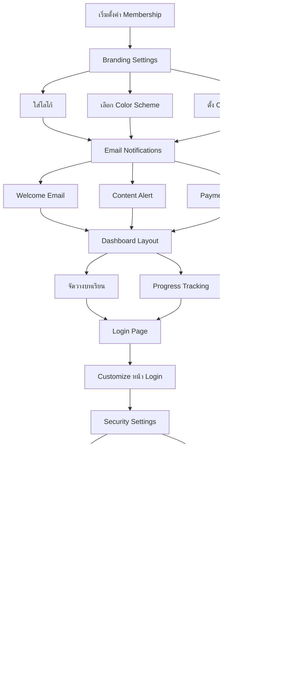

# วิธีตั้งค่า Membership System — SOMT-006
> **Format:** Mind Map (Text Tree + Mermaid)
> **Source:** SWP3 Ch30 The Secret Of Millionaire Trainer ตอนที่ 6
> **Production:** PinkCastle Academy | จูล่ง CTO
> **Date:** 2026-02-18 | **Duration:** 0:06:27

---

## Part 1: Text Tree Mind Map

```
วิธีตั้งค่า Membership System (SOMT-006)
├── 📌 Central Concept
│   └── Configuration ระบบสมาชิกให้พร้อมใช้งานบน Kartra
│
├── 🎨 Branding Settings
│   ├── โลโก้แบรนด์
│   │   ├── PNG สำหรับ Web
│   │   └── SVG สำหรับความคมชัด
│   ├── Color Scheme
│   │   ├── Primary Color
│   │   ├── Secondary Color
│   │   └── Accent Color
│   ├── Favicon
│   │   └── ไอคอนบน Browser Tab
│   ├── Custom Domain
│   │   └── members.yourbrand.com
│   └── Font Selection
│       └── สอดคล้องกับแบรนด์
│
├── 📧 Email Notifications
│   ├── Welcome Email
│   │   ├── ต้อนรับสมาชิกใหม่
│   │   ├── บอก Next Steps ชัดเจน
│   │   └── ข้อมูล Login
│   ├── New Content Alert
│   │   └── แจ้งเมื่อมีบทเรียนใหม่
│   ├── Payment Reminder
│   │   └── แจ้งก่อนเรียกเก็บเงิน
│   ├── Failed Payment
│   │   └── แจ้งเมื่อชำระไม่สำเร็จ
│   └── Customization
│       ├── ภาษาไทย (ถ้ากลุ่มเป้าหมายคนไทย)
│       └── Personalization (ใส่ชื่อสมาชิก)
│
├── 📊 Member Dashboard Layout
│   ├── บทเรียนทั้งหมด
│   │   └── แสดงรายการหลักสูตร
│   ├── ความก้าวหน้า (Progress)
│   │   └── แถบแสดง % สำเร็จ
│   ├── เนื้อหาใหม่ (New Content)
│   │   └── ไฮไลท์บทเรียนล่าสุด
│   └── 3-Click Rule
│       └── ทุกอย่างต้องหาเจอใน 3 คลิก
│
├── 🔐 Login Page Customization
│   ├── แสดงโลโก้แบรนด์
│   ├── Welcome Message
│   ├── ภาพสร้างแรงบันดาลใจ
│   └── ฟอร์ม Login ที่เรียบง่าย
│
├── 🛡️ Security Settings
│   ├── Password Requirements
│   │   ├── ความยาวขั้นต่ำ
│   │   └── ตัวอักษรพิเศษ
│   ├── Session Timeout
│   │   └── ตั้งเวลา Auto Logout
│   ├── Device Limit
│   │   └── จำนวนเครื่องพร้อมกัน (2-3)
│   └── IP Restriction
│       └── จำกัด IP (สำหรับคอร์สราคาสูง)
│
├── 📱 Mobile Responsiveness
│   ├── Login Page บนมือถือ
│   ├── Dashboard บนมือถือ
│   ├── บทเรียนบนมือถือ
│   └── ทดสอบทั้ง iOS และ Android
│
└── ✅ Configuration Checklist
    ├── 1. Branding ครบถ้วน
    ├── 2. Email Notifications Customize แล้ว
    ├── 3. Dashboard Layout ชัดเจน
    ├── 4. Login Page มีแบรนด์
    ├── 5. Security Settings เหมาะสม
    └── 6. ทดสอบบน Mobile แล้ว
```

---

## Part 2: Mermaid Mind Map



---

## Part 3: Mermaid Flowchart (Configuration Flow)



---

## Part 4: Summary Statistics

| Metric | Value |
|--------|-------|
| Total Nodes | 42 |
| Primary Branches | 7 |
| Average Sub-nodes per Branch | 6 |
| Key Concepts | Branding, Email, Dashboard, Security, Mobile |
| Platform | Kartra |
| Configuration Time Estimate | 2-3 ชั่วโมง |

---

*Mind Map nodes: 42 | Focus: Membership System Configuration*
