# วิธีสร้าง Product ใน Membership — SOMT-007
> **Format:** Mind Map (Text Tree + Mermaid)
> **Source:** SWP3 Ch30 The Secret Of Millionaire Trainer ตอนที่ 7
> **Production:** PinkCastle Academy | จูล่ง CTO
> **Date:** 2026-02-18 | **Duration:** 0:45:54

---

## Part 1: Text Tree Mind Map

```
วิธีสร้าง Product ใน Membership (SOMT-007)
├── 📌 Central Concept
│   └── สร้าง Product ที่ทั้งใช้งานได้จริงและขายได้จริงบน Kartra
│
├── 📦 Product Types (4 ประเภท)
│   ├── Digital Product
│   │   ├── คอร์สออนไลน์
│   │   ├── E-book / Template
│   │   ├── Video Series
│   │   ├── One-time Payment
│   │   └── Scalable ไม่จำกัด
│   ├── Membership Subscription
│   │   ├── จ่ายรายเดือน/รายปี
│   │   ├── เนื้อหาอัปเดตต่อเนื่อง
│   │   ├── Recurring Revenue
│   │   └── ต้องผลิต Content สม่ำเสมอ
│   ├── Bundle Product
│   │   ├── รวมหลาย Product เป็นชุด
│   │   ├── ราคาถูกกว่าซื้อทีละตัว
│   │   └── เพิ่ม Average Order Value
│   └── Coaching/Service
│       ├── 1-on-1 Coaching
│       ├── Group Coaching
│       ├── Done-for-you Service
│       ├── ราคาสูงที่สุด
│       └── ไม่ Scalable (ใช้เวลาเจ้าของ)
│
├── 💰 Pricing Tiers (กลยุทธ์ราคา)
│   ├── Price Anchoring
│   │   ├── แสดงราคาเต็มก่อน
│   │   ├── แล้วแสดงราคาจริง
│   │   └── +20-40% Conversion
│   ├── Tiered Pricing
│   │   ├── Silver (จำกัด)
│   │   ├── Gold (คุ้มค่าสุด — Sweet Spot)
│   │   └── Platinum (Premium)
│   ├── Payment Options
│   │   ├── One-time (ราคาถูกกว่า)
│   │   └── Monthly (ผ่อนจ่ายสบาย)
│   └── Trial Period
│       ├── ทดลอง 7-14 วัน
│       ├── ลดความกลัวผู้ซื้อ
│       └── ต้องให้เนื้อหาดีพอ
│
├── 🔐 Access Levels
│   ├── Free Level
│   │   └── ดู Preview เท่านั้น
│   ├── Silver Level
│   │   └── เข้าถึง Module 1-3
│   ├── Gold Level
│   │   └── เข้าถึง Module 1-6 + Bonus
│   ├── Content Drip Schedule
│   │   ├── Module 1 เปิดทันที
│   │   ├── Module 2 หลัง 1 สัปดาห์
│   │   └── Module 3 หลัง 2 สัปดาห์
│   ├── Prerequisite
│   │   └── ต้องเรียน Module ก่อนหน้าจบก่อน
│   └── Bonus Content
│       ├── Template / Cheat Sheet
│       ├── Workbook
│       └── Private Community Access
│
├── 💳 Payment Gateway Integration
│   ├── Stripe
│   │   └── บัตรเครดิต/เดบิต
│   ├── PayPal
│   │   └── PayPal Account
│   ├── Settings
│   │   ├── Currency (สกุลเงิน)
│   │   ├── Tax/VAT Settings
│   │   ├── Receipt Template
│   │   └── Refund Policy
│   ├── Checkout Page
│   │   ├── Trust Badges (SSL, Guarantee)
│   │   ├── Testimonials สั้น
│   │   ├── FAQ 2-3 ข้อ
│   │   └── One-Click Checkout
│   └── Order Bump
│       ├── สินค้าเสริมใน Checkout
│       ├── เลือกด้วย Checkbox
│       └── +15-30% Revenue/Transaction
│
└── ✅ Product Launch Checklist (8 ข้อ)
    ├── 1. Product Settings ครบ (ชื่อ, คำอธิบาย, ราคา, ภาพ)
    ├── 2. Access Levels ถูกต้อง
    ├── 3. Payment Gateway เชื่อมต่อแล้ว
    ├── 4. Checkout Page มี Trust Elements
    ├── 5. Email Sequences After-Purchase ตั้งค่าแล้ว
    ├── 6. End-to-End Testing (สำคัญที่สุด!)
    ├── 7. Pricing + Price Anchoring ถูกต้อง
    └── 8. Mobile Checkout ทำงานได้ดี
```

---

## Part 2: Mermaid Mind Map

```mermaid
mindmap
  root((สร้าง Product ใน Membership))
    Product Types
      Digital Product
        คอร์สออนไลน์
        E-book Template
        Scalable ไม่จำกัด
      Membership Subscription
        Recurring Revenue
        อัปเดตต่อเนื่อง
      Bundle Product
        รวมชุดราคาพิเศษ
        เพิ่ม AOV
      Coaching Service
        Premium High-ticket
        ไม่ Scalable
    Pricing Strategy
      Price Anchoring
        ราคาเต็มก่อน
        เพิ่ม Conversion 20-40%
      Tiered Pricing
        Silver จำกัด
        Gold คุ้มค่าสุด
        Platinum Premium
      Payment Options
        One-time
        Monthly
      Trial Period 7-14 วัน
    Access Levels
      Free Preview
      Silver Module 1-3
      Gold Module 1-6 Bonus
      Content Drip Schedule
      Prerequisite
    Payment Gateway
      Stripe บัตรเครดิต
      PayPal
      Checkout Page
        Trust Badges
        Order Bump +15-30%
    Launch Checklist
      8 ข้อตรวจสอบ
      End-to-End Testing
```



---

## Part 3: Mermaid Flowchart (Product Creation Flow)

```mermaid
flowchart TD
    A[เริ่มสร้าง Product] --> B{เลือก Product Type}
    B -->|Digital| C[ตั้งค่า Digital Product]
    B -->|Subscription| D[ตั้งค่า Membership]
    B -->|Bundle| E[เลือก Products รวม]
    B -->|Coaching| F[กำหนดเงื่อนไข]
    C & D & E & F --> G[ตั้ง Pricing Tiers]
    G --> G1[Price Anchoring]
    G --> G2[Silver / Gold / Platinum]
    G --> G3[Payment Options]
    G1 & G2 & G3 --> H[กำหนด Access Levels]
    H --> H1[Map Content to Product]
    H --> H2[ตั้ง Drip Schedule]
    H --> H3[ตั้ง Prerequisite]
    H1 & H2 & H3 --> I[เชื่อมต่อ Payment Gateway]
    I --> I1[Stripe / PayPal]
    I --> I2[สร้าง Checkout Page]
    I --> I3[ใส่ Order Bump]
    I1 & I2 & I3 --> J[End-to-End Testing]
    J --> K{ทุกอย่างทำงาน?}
    K -->|ใช่| L[Launch Product!]
    K -->|ไม่| M[แก้ไขปัญหา]
    M --> J
```



---

## Part 4: Summary Statistics

| Metric | Value |
|--------|-------|
| Total Nodes | 58 |
| Primary Branches | 5 |
| Average Sub-nodes per Branch | 12 |
| Key Concepts | Product Types, Pricing, Access Levels, Payment, Launch |
| Platform | Kartra (Stripe + PayPal) |
| Revenue Impact | +30-50% จาก Pricing Strategy |

---

*Mind Map nodes: 58 | Focus: Product Creation in Membership System*
