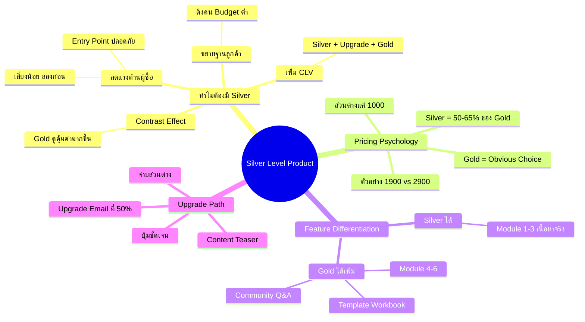
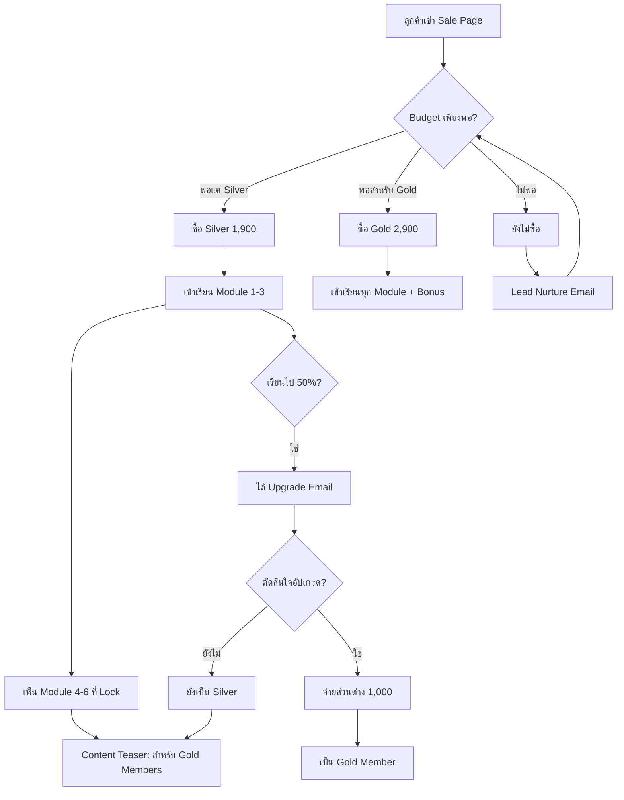

# วิธีสร้าง Product แบบ Silver Level — SOMT-008
> **Format:** Mind Map (Text Tree + Mermaid)
> **Source:** SWP3 Ch30 The Secret Of Millionaire Trainer ตอนที่ 8
> **Production:** PinkCastle Academy | จูล่ง CTO
> **Date:** 2026-02-18 | **Duration:** 0:06:36

---

## Part 1: Text Tree Mind Map

```
วิธีสร้าง Product แบบ Silver Level (SOMT-008)
├── 📌 Central Concept
│   └── สร้าง Silver Level ที่มีคุณค่าจริง + กระตุ้นให้อัปเกรดเป็น Gold
│
├── 🎯 ทำไมต้องมี Silver Level (4 เหตุผล)
│   ├── ลดแรงต้านผู้ซื้อ
│   │   ├── ไม่ใช่ทุกคนพร้อมจ่าย Gold
│   │   ├── Silver = Entry Point ที่ปลอดภัย
│   │   └── เสี่ยงน้อยกว่า ลองก่อนได้
│   ├── Contrast Effect
│   │   ├── Silver ทำให้ Gold ดูคุ้มค่ามากขึ้น
│   │   └── "เพิ่มอีกนิดก็ได้ Gold ดีกว่า"
│   ├── เพิ่ม Customer Lifetime Value
│   │   ├── Silver → Upgrade → Gold
│   │   └── Revenue = Silver + Gold (รวมมากกว่า)
│   └── ขยายฐานลูกค้า
│       ├── ดึงคน Budget ต่ำเข้ามา
│       ├── Email List ใหญ่ขึ้น
│       └── Community ใหญ่ขึ้น
│
├── 💰 Pricing Psychology
│   ├── Silver = 50-65% ของ Gold
│   │   ├── ตัวอย่าง: Silver 1,900 / Gold 2,900
│   │   └── ส่วนต่างแค่ 1,000 บาท
│   ├── ราคาห่างพอดี
│   │   ├── ไม่ห่างจน Silver ขายดีเกินไป
│   │   └── ไม่ใกล้จนไม่มีเหตุผลซื้อ Silver
│   └── Gold = Obvious Choice
│       └── เพิ่มราคานิดเดียวแต่ Value เพิ่มมาก
│
├── 🏗️ Feature Differentiation
│   ├── Silver ได้
│   │   ├── เนื้อหาหลัก Module 1-3
│   │   └── เนื้อหาที่มีคุณค่าจริง (ไม่ใช่เศษเนื้อหา)
│   ├── Gold ได้เพิ่ม
│   │   ├── เนื้อหาหลัก Module 4-6
│   │   ├── Template 10 ชิ้น
│   │   ├── Workbook
│   │   ├── Private Community
│   │   └── Q&A Session รายเดือน
│   └── หลักการ
│       └── "ให้คุณค่า แต่ไม่ให้ทั้งหมด"
│
├── ⬆️ Upgrade Path Design
│   ├── ปุ่มอัปเกรดชัดเจน
│   │   └── แสดงในทุกหน้า Dashboard
│   ├── จ่ายแค่ส่วนต่าง
│   │   └── Silver 1,900 → Gold จ่ายเพิ่ม 1,000
│   ├── Content Teaser
│   │   ├── เห็นหัวข้อ Module ที่ Lock
│   │   └── ข้อความ "สำหรับ Gold Members"
│   └── Upgrade Email
│       └── ส่งเมื่อเรียน Silver ไปได้ 50%
│
└── 📊 ตัวอย่าง: คอร์สการตลาดออนไลน์
    ├── Silver 1,900 บาท
    │   ├── Module 1: พื้นฐานการตลาด
    │   ├── Module 2: Social Media Marketing
    │   └── Module 3: Content Marketing
    └── Gold 2,900 บาท
        ├── Module 1-6 ทั้งหมด
        ├── + Module 4: Email Marketing
        ├── + Module 5: Paid Advertising
        ├── + Module 6: Analytics
        ├── + Template 10 ชิ้น
        ├── + Private Community
        └── + Q&A Session รายเดือน
```

---

## Part 2: Mermaid Mind Map



---

## Part 3: Mermaid Flowchart (Silver Upgrade Journey)



---

## Part 4: Summary Statistics

| Metric | Value |
|--------|-------|
| Total Nodes | 38 |
| Primary Branches | 5 |
| Average Sub-nodes per Branch | 8 |
| Key Concepts | Value Ladder, Pricing Psychology, Upgrade Path |
| Pricing Formula | Silver = 50-65% of Gold |
| Expected Upgrade Rate | 30-40% ของ Silver Members |

---

*Mind Map nodes: 38 | Focus: Silver Level Product Strategy*
