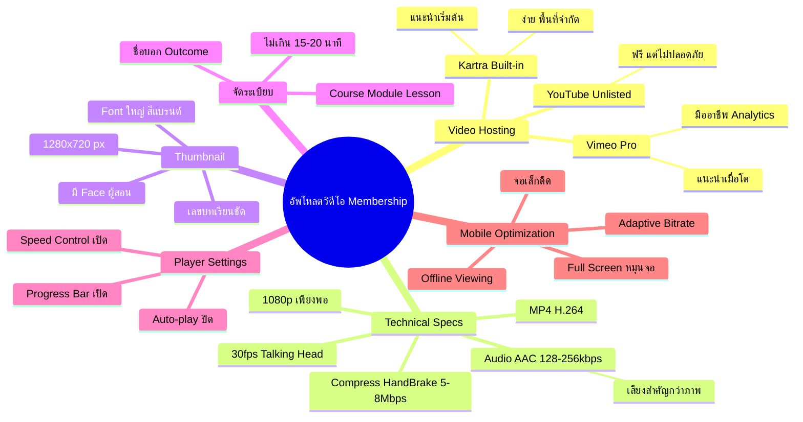
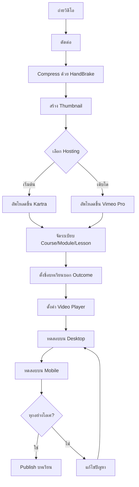

# วิธีอัพโหลดวิดีโอในระบบสมาชิก — SOMT-009
> **Format:** Mind Map (Text Tree + Mermaid)
> **Source:** SWP3 Ch30 The Secret Of Millionaire Trainer ตอนที่ 9
> **Production:** PinkCastle Academy | จูล่ง CTO
> **Date:** 2026-02-18 | **Duration:** 0:22:21

---

## Part 1: Text Tree Mind Map

```
วิธีอัพโหลดวิดีโอในระบบสมาชิก (SOMT-009)
├── 📌 Central Concept
│   └── อัพโหลด จัดระเบียบ และเพิ่มประสิทธิภาพวิดีโอใน Membership
│
├── 🎬 Video Hosting Options
│   ├── Kartra Built-in
│   │   ├── ข้อดี: จัดการง่าย ไม่ต้องใช้เครื่องมืออื่น
│   │   ├── ข้อเสีย: พื้นที่จำกัดตาม Plan
│   │   └── แนะนำ: ตอนเริ่มต้น
│   ├── Vimeo Pro
│   │   ├── ข้อดี: Player สวย Analytics ดี ไม่มีโฆษณา
│   │   ├── ข้อเสีย: มีค่าใช้จ่ายเพิ่ม (~$20/เดือน)
│   │   └── แนะนำ: เมื่อมีสมาชิกเยอะ
│   └── YouTube Unlisted
│       ├── ข้อดี: ฟรี Bandwidth ไม่จำกัด
│       ├── ข้อเสีย: Share Link ได้ มีโฆษณา ไม่มืออาชีพ
│       └── แนะนำ: ไม่แนะนำสำหรับ Membership
│
├── 🔧 Technical Specifications
│   ├── Video Format
│   │   ├── MP4 (H.264 Codec)
│   │   └── รองรับทุก Browser/Device
│   ├── Resolution
│   │   ├── 1080p (1920x1080) = เพียงพอ
│   │   └── ไม่จำเป็นต้อง 4K
│   ├── Compression
│   │   ├── เครื่องมือ: HandBrake (ฟรี)
│   │   ├── Video Bitrate: 5-8 Mbps
│   │   └── ลดขนาด 50-70% คุณภาพแทบไม่เปลี่ยน
│   ├── Audio
│   │   ├── Codec: AAC
│   │   ├── Bitrate: 128-256 kbps
│   │   ├── Stereo
│   │   └── เสียงสำคัญกว่าภาพ!
│   └── Framerate
│       ├── Talking Head: 30fps
│       └── Screen Recording: 24fps
│
├── 🖼️ Thumbnail Creation
│   ├── ขนาด: 1280x720 pixels
│   ├── มีใบหน้าผู้สอน (Face)
│   ├── Font ขนาดใหญ่ อ่านง่าย
│   ├── สีสอดคล้องกับแบรนด์
│   ├── แสดงหมายเลขบทเรียน
│   └── สร้าง Template ใช้ซ้ำ
│
├── 📚 การจัดระเบียบบทเรียน
│   ├── Hierarchy
│   │   ├── Course (หลักสูตร)
│   │   ├── Module (หมวด)
│   │   └── Lesson (บทเรียน)
│   ├── ชื่อบทเรียน
│   │   ├── บอก Outcome ที่ได้
│   │   └── ไม่ใช่แค่ "บทที่ 3"
│   └── Lesson Duration
│       ├── ไม่เกิน 15-20 นาที/ตอน
│       ├── Attention Span = 10-15 นาที
│       └── ยาวกว่านี้ให้แบ่ง Part
│
├── ⚙️ Video Player Settings
│   ├── Auto-play: ปิด (ไม่รบกวน)
│   ├── Progress Bar: เปิด
│   ├── Speed Control: เปิด (1x, 1.5x, 2x)
│   │   └── สมาชิกชอบดูเร็วขึ้น
│   └── Download Button: ตามเหมาะสม
│
└── 📱 Mobile Optimization
    ├── Player แสดงผลดีบนจอเล็ก
    ├── ปุ่มกดได้ง่ายด้วยนิ้ว
    ├── Landscape → Full Screen อัตโนมัติ
    ├── Adaptive Bitrate
    │   └── ปรับคุณภาพตามความเร็วเน็ต
    └── Offline Viewing
        └── ดาวน์โหลดไว้ดู Offline
```

---

## Part 2: Mermaid Mind Map



---

## Part 3: Mermaid Flowchart (Video Upload Workflow)



---

## Part 4: Summary Statistics

| Metric | Value |
|--------|-------|
| Total Nodes | 48 |
| Primary Branches | 6 |
| Average Sub-nodes per Branch | 8 |
| Key Concepts | Hosting, Specs, Thumbnail, Organization, Player, Mobile |
| Recommended Format | MP4 H.264, 1080p, 5-8 Mbps |
| Optimal Duration | 15-20 minutes per lesson |

---

*Mind Map nodes: 48 | Focus: Video Upload & Management in Membership*
