# แก้ไขหน้า Single Opt-in — SOMT-010
> **Format:** Mind Map (Text Tree + Mermaid)
> **Source:** SWP3 Ch30 The Secret Of Millionaire Trainer ตอนที่ 10
> **Production:** PinkCastle Academy | จูล่ง CTO
> **Date:** 2026-02-18 | **Duration:** 0:21:56

---

## Part 1: Text Tree Mind Map

```
แก้ไขหน้า Single Opt-in (SOMT-010)
├── 📌 Central Concept
│   └── สร้างและเพิ่มประสิทธิภาพหน้า Opt-in ให้ Conversion สูงสุด
│
├── 📝 Form Design
│   ├── กฎทอง: ยิ่งน้อยยิ่งดี
│   │   ├── ขอแค่อีเมลอย่างเดียว (+20% Conversion)
│   │   └── ทุก Field ที่เพิ่ม = -10-15% Conversion
│   ├── Form Layout
│   │   ├── Label อยู่ข้างบน (ไม่ใช่ข้างๆ)
│   │   ├── Input Field ขนาดใหญ่ (กดด้วยนิ้ว)
│   │   └── Placeholder Text เป็นตัวอย่าง
│   └── Form Styling
│       ├── สะอาด ไม่มี Border หนา
│       ├── Background อ่อนๆ
│       └── ปุ่ม Submit สีโดดเด่น
│
├── ✏️ Headline Writing (4 สูตร)
│   ├── How-to Formula
│   │   └── "วิธีสร้างรายได้ 100K/เดือน จากคอร์สออนไลน์"
│   ├── Number Formula
│   │   └── "7 เคล็ดลับสร้าง Passive Income ที่ใครก็ทำได้"
│   ├── Question Formula
│   │   └── "คุณอยากมีรายได้ที่ทำงานให้คุณ 24/7 ไหม?"
│   ├── Secret/Revealed Formula
│   │   └── "เผยความลับที่ Top 1% ใช้สร้างรายได้หลักล้าน"
│   ├── หลักการ: Promise ผลลัพธ์ ไม่ใช่แค่บอกว่ามีอะไร
│   └── Sub-headline
│       └── เสริมรายละเอียด: Lead Magnet คืออะไร เหมาะกับใคร
│
├── 🔴 CTA Buttons
│   ├── สีโดดเด่น ตัดกับ Background
│   ├── ขนาดใหญ่พอกดด้วยนิ้วโป้ง
│   ├── ข้อความ Action-oriented
│   │   ├── "รับ E-book ฟรี"
│   │   ├── "ดาวน์โหลดทันที"
│   │   └── ไม่ใช่ "Submit" หรือ "ส่ง"
│   └── Micro-copy ใต้ปุ่ม
│       ├── "ฟรี! ไม่มีค่าใช้จ่าย"
│       └── "เราไม่ส่ง Spam"
│
├── 📱 Mobile Responsiveness
│   ├── Layout: Single Column
│   ├── ภาพปรับขนาดตามจอ
│   ├── Above the Fold
│   │   ├── Headline + Form + CTA เห็นทันที
│   │   └── ถ้าต้อง Scroll = -20-30% Conversion
│   └── ออกแบบ Mobile First
│       └── ขยายสำหรับ Desktop ทีหลัง
│
├── 📧 Email List Integration
│   ├── กรอกแล้วเข้า List อัตโนมัติ
│   ├── Tag ผู้สมัคร
│   ├── Trigger Email Sequence
│   └── Single vs Double Opt-in
│       ├── Single: Conversion สูง, อาจได้ Email ปลอม
│       └── Double: Email คุณภาพดี, Conversion ต่ำกว่า 20-30%
│
├── 🧪 A/B Testing
│   ├── ทดสอบทีละ 1 อย่าง
│   │   ├── Headline A vs B
│   │   ├── ปุ่มสีแดง vs เขียว
│   │   └── อีเมลอย่างเดียว vs ชื่อ+อีเมล
│   ├── ใช้ Traffic เท่ากัน
│   └── ดู Conversion Rate ตัดสินใจ
│
└── ✅ Conversion Optimization Tips
    ├── Social Proof
    │   └── "สมัครแล้วกว่า 5,000 คน"
    ├── Urgency
    │   └── "เฉพาะวันนี้ ดาวน์โหลดฟรี"
    └── ลด Distraction
        ├── เอา Navigation Bar ออก
        ├── เอา Footer ออก
        ├── เอา Links อื่นออก
        └── เหลือแค่ฟอร์มอย่างเดียว
```

---

## Part 2: Mermaid Mind Map

```mermaid
mindmap
  root((Single Opt-in Page))
    Form Design
      ขอแค่อีเมล +20% Conv
      ทุก Field เพิ่ม ลด 10-15%
      Label ข้างบน
      Input ใหญ่ กดนิ้วได้
      สะอาด ไม่หนา
    Headline Writing
      How-to Formula
      Number Formula
      Question Formula
      Secret Revealed
      Promise ผลลัพธ์
      Sub-headline เสริม
    CTA Buttons
      สีโดดเด่น
      ขนาดใหญ่
      Action Text
        รับ E-book ฟรี
        ดาวน์โหลดทันที
      Micro-copy ใต้ปุ่ม
    Mobile Responsive
      Single Column
      Above the Fold
      Mobile First Design
      ไม่ต้อง Scroll
    Email Integration
      Auto Add to List
      Tag + Sequence
      Single vs Double Opt-in
    A/B Testing
      ทดสอบทีละ 1 อย่าง
      Traffic เท่ากัน
      ดู Conversion Rate
    Conversion Tips
      Social Proof
      Urgency
      ลด Distraction
        ไม่มี Nav Footer
```



---

## Part 3: Mermaid Flowchart (Opt-in Page Optimization)

```mermaid
flowchart TD
    A[Visitor มาถึง Opt-in Page] --> B{เห็น Headline}
    B -->|สนใจ 3 วินาที| C[อ่าน Sub-headline]
    B -->|ไม่สนใจ| Z[ปิดหน้า]
    C --> D[เห็นฟอร์ม Above the Fold]
    D --> E{กรอกอีเมล?}
    E -->|กรอก| F[กดปุ่ม CTA]
    E -->|ไม่กรอก| Z
    F --> G[เข้า Email List อัตโนมัติ]
    G --> H[ได้รับ Welcome Email]
    H --> I[ดาวน์โหลด Lead Magnet]
    I --> J[เข้าสู่ Nurture Sequence]
    J --> K[Sale Page]

    style B fill:#f9f,stroke:#333,stroke-width:2px
    style F fill:#9f9,stroke:#333,stroke-width:2px
```



---

## Part 4: Summary Statistics

| Metric | Value |
|--------|-------|
| Total Nodes | 50 |
| Primary Branches | 7 |
| Average Sub-nodes per Branch | 7 |
| Key Concepts | Form Design, Headline, CTA, Mobile, A/B Testing |
| Headline Formulas | 4 (How-to, Number, Question, Secret) |
| Conversion Impact | +20-50% จากการ Optimize |

---

*Mind Map nodes: 50 | Focus: Single Opt-in Page Optimization*
