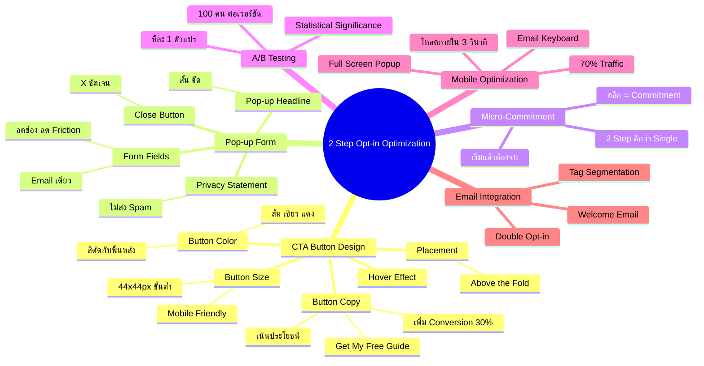
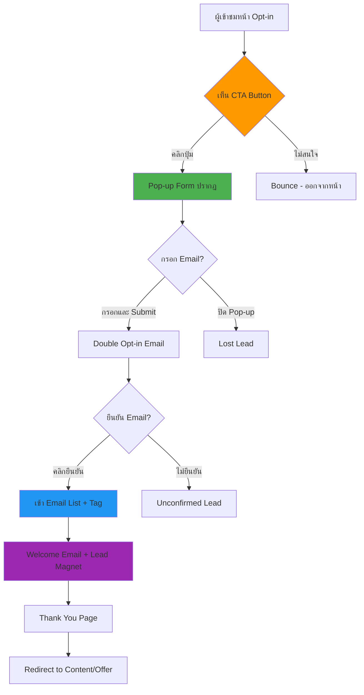

# แก้ไขหน้า 2 Step Opt-in — SOMT-011
> **Format:** Mind Map (Text Tree + Mermaid)
> **Source:** SWP3 Ch30 The Secret Of Millionaire Trainer ตอนที่ 11
> **Production:** PinkCastle Academy | จูล่ง CTO
> **Date:** 2026-02-18

---

## Part 1: Text Tree Mind Map

```
แก้ไขหน้า 2 Step Opt-in (SOMT-011)
├── 📌 Central Concept
│   └── ปรับแต่งหน้า 2-Step Opt-in เพื่อ Conversion Rate สูงสุด
│
├── 🔘 Step 1: CTA Button Design
│   ├── สีปุ่ม (Button Color)
│   │   ├── สีที่ตัดกับพื้นหลัง
│   │   ├── สีส้ม / เขียว / แดง = High Conversion
│   │   └── หลีกเลี่ยงสีกลมกลืน
│   ├── ขนาดปุ่ม (Button Size)
│   │   ├── ใหญ่พอบน Desktop
│   │   ├── อย่างน้อย 44x44px สำหรับ Mobile
│   │   └── ไม่ใหญ่จนดูหลอก
│   ├── Button Copy (ข้อความบนปุ่ม)
│   │   ├── เน้นประโยชน์ ไม่ใช่คำสั่ง
│   │   ├── "รับ Ebook ฟรีเลย!" ดีกว่า "สมัคร"
│   │   ├── "เริ่มต้นสร้างรายได้วันนี้"
│   │   └── เปลี่ยนจาก "Submit" เพิ่ม Conversion 30%
│   ├── ตำแหน่ง (Placement)
│   │   ├── Above the Fold
│   │   └── เห็นได้โดยไม่ต้อง Scroll
│   └── Hover Effect
│       ├── เปลี่ยนสีเมื่อ Hover
│       └── Animation เล็กน้อย
│
├── 📝 Step 2: Pop-up Form Optimization
│   ├── จำนวนช่องกรอก
│   │   ├── ยิ่งน้อยยิ่งดี
│   │   ├── Email เพียงช่องเดียว = Conversion สูงสุด
│   │   ├── ทุกช่องที่เพิ่ม = -7-10% Conversion
│   │   └── First Name + Email (ถ้าจำเป็น)
│   ├── Pop-up Headline
│   │   ├── สั้นกระชับ
│   │   └── บอกประโยชน์ชัดเจน
│   ├── ปุ่ม Submit
│   │   ├── สีเดียวกับ CTA Button หลัก
│   │   └── ข้อความเน้นผลลัพธ์
│   ├── Privacy Statement
│   │   ├── "ไม่ส่ง Spam"
│   │   └── "ยกเลิกได้ทุกเมื่อ"
│   └── ปุ่มปิด (Close Button)
│       ├── ต้องมี X ชัดเจน
│       └── ไม่บังคับให้กรอก
│
├── 🧠 Micro-Commitment Psychology
│   ├── คลิกปุ่ม = Commitment เล็กๆ
│   ├── "เริ่มแล้วต้องทำให้จบ"
│   ├── 2-Step > Single Step 10-30%
│   └── Consistency Principle
│
├── 🧪 A/B Testing
│   ├── หลักการ
│   │   ├── ทดสอบทีละ 1 ตัวแปร
│   │   ├── Traffic อย่างน้อย 100/เวอร์ชัน
│   │   └── Statistical Significance
│   ├── สิ่งที่ควรทดสอบ
│   │   ├── Button Copy (Priority 1)
│   │   ├── Button Color (Priority 2)
│   │   ├── Form Fields (Priority 3)
│   │   ├── Pop-up Headline
│   │   └── Page Layout
│   └── การวัดผล
│       ├── Click-through Rate (Step 1)
│       ├── Form Completion Rate (Step 2)
│       └── Overall Opt-in Rate
│
├── 📱 Mobile Optimization
│   ├── ปุ่มใหญ่พอสำหรับนิ้วหัวแม่มือ
│   ├── Pop-up Full-screen บน Mobile
│   ├── Email Keyboard อัตโนมัติ
│   ├── โหลดเร็ว < 3 วินาที
│   └── 70%+ Traffic มาจาก Mobile
│
└── 🔗 Integration กับ Email Automation
    ├── Double Opt-in (ยืนยัน Email)
    ├── Welcome Email (ส่ง Lead Magnet)
    ├── Tag Segmentation
    ├── Redirect to Thank You Page
    └── Auto-add to Email List
```

---

## Part 2: Mermaid Mind Map



---

## Part 3: Mermaid Flowchart (2-Step Opt-in Flow)



---

## Part 4: Summary Statistics

| Metric | Value |
|--------|-------|
| Total Nodes | 48 |
| Primary Branches | 6 |
| Average Sub-nodes per Branch | 8 |
| Key Concepts | CTA Button, Pop-up Form, Micro-Commitment, A/B Testing |
| Optimization Focus | Conversion Rate |
| Target Improvement | 2-5x จากค่าเดิม |

---

*Mind Map nodes: 48 | Focus: 2-Step Opt-in Optimization*
