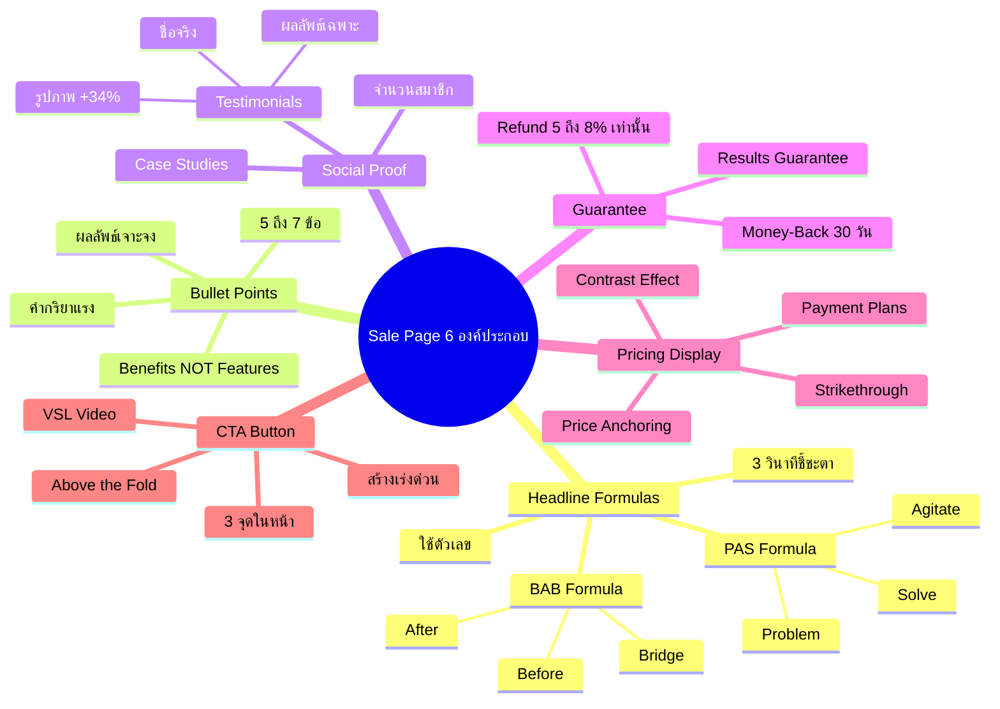
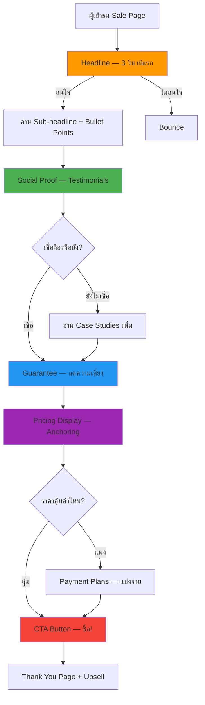

# สร้างหน้า Sale Page — SOMT-012
> **Format:** Mind Map (Text Tree + Mermaid)
> **Source:** SWP3 Ch30 The Secret Of Millionaire Trainer ตอนที่ 12
> **Production:** PinkCastle Academy | จูล่ง CTO
> **Date:** 2026-02-18

---

## Part 1: Text Tree Mind Map

```
สร้างหน้า Sale Page (SOMT-012)
├── 📌 Central Concept
│   └── สร้างหน้า Sale Page ที่เป็น "เครื่องจักรปิดการขาย" ครบ 6 องค์ประกอบ
│
├── 🎯 Headline Formulas
│   ├── PAS (Problem-Agitate-Solve)
│   │   ├── Problem: ระบุปัญหากลุ่มเป้าหมาย
│   │   ├── Agitate: กระตุ้นอารมณ์ให้รู้สึกร้ายแรง
│   │   └── Solve: เสนอทางออก (สินค้า)
│   ├── BAB (Before-After-Bridge)
│   │   ├── Before: สถานะปัจจุบัน
│   │   ├── After: สถานะที่อยากไปถึง
│   │   └── Bridge: สินค้าที่เชื่อม
│   ├── เทคนิคเสริม
│   │   ├── ใช้ตัวเลขเพิ่มความน่าเชื่อถือ
│   │   ├── Headline ต้องจับใจภายใน 3 วินาที
│   │   └── 80% คนอ่านแค่ Headline
│   └── Sub-headline
│       └── อธิบายเพิ่มจาก Headline
│
├── ✅ Bullet Points ที่ขายได้
│   ├── Benefits vs Features
│   │   ├── Feature: "คอร์สมี 30 บทเรียน"
│   │   └── Benefit: "สร้าง Funnel ที่ขาย 24/7"
│   ├── จำนวน 5-7 ข้อ
│   ├── เริ่มด้วยคำกริยาแรง
│   │   ├── ค้นพบ
│   │   ├── เรียนรู้
│   │   ├── สร้าง
│   │   └── เปลี่ยน
│   └── ผลลัพธ์เฉพาะเจาะจง
│
├── 👥 Social Proof
│   ├── ประเภท
│   │   ├── Testimonials จากลูกค้าจริง
│   │   ├── Case Studies แสดงผลลัพธ์
│   │   ├── จำนวนสมาชิก/นักเรียน
│   │   └── Media Mentions
│   ├── Testimonials ที่ดี (3 องค์ประกอบ)
│   │   ├── ชื่อจริง (ไม่ใช่นามแฝง)
│   │   ├── รูปภาพ (+34% Trust)
│   │   └── ผลลัพธ์เฉพาะเจาะจง
│   └── ตำแหน่ง
│       └── หลัง Bullet Points ก่อน Pricing
│
├── 🛡️ Guarantee Section
│   ├── Money-Back Guarantee
│   │   └── คืนเงิน 100% ภายใน 30 วัน
│   ├── Results Guarantee
│   │   └── ไม่เห็นผลภายใน 90 วัน คืนเงิน
│   └── สถิติ
│       ├── อัตราคืนเงินจริง 5-8%
│       └── Sale เพิ่มมากกว่า Refund หลายเท่า
│
├── 💰 Pricing Display Strategies
│   ├── Price Anchoring
│   │   └── มูลค่า 29,900 → วันนี้ 4,990 บาท
│   ├── Strikethrough Price
│   │   └── ขีดฆ่าราคาเดิม แสดงราคาใหม่
│   ├── Payment Plans
│   │   ├── แบ่งงวด (1,997 x 3 งวด)
│   │   └── ต่อวัน (166 บาท/วัน = กาแฟ 1 แก้ว)
│   └── Contrast Effect
│       └── ราคาใหม่ดูถูกเมื่อเทียบราคาเดิม
│
└── 🔴 CTA Button Design
    ├── ข้อความสร้างเร่งด่วน + ความปลอดภัย
    │   ├── "สมัครเลย รับประกัน 30 วัน"
    │   └── "เริ่มเรียนวันนี้ — ไม่เสี่ยง"
    ├── สีเดียวกันทั้งหน้า (Consistency)
    ├── วาง 3 จุดในหน้า
    │   ├── หลัง Headline (คนพร้อมซื้อ)
    │   ├── หลัง Social Proof (คนต้องการหลักฐาน)
    │   └── หลัง Pricing (คนอ่านจนจบ)
    └── Above-the-Fold Optimization
        ├── Headline + Sub-headline + CTA
        └── Video Sales Letter (VSL) 3-5 นาที
```

---

## Part 2: Mermaid Mind Map



---

## Part 3: Mermaid Flowchart (Sale Page Journey)



---

## Part 4: Summary Statistics

| Metric | Value |
|--------|-------|
| Total Nodes | 55 |
| Primary Branches | 6 |
| Average Sub-nodes per Branch | 9 |
| Key Concepts | Headline, Social Proof, Pricing, CTA |
| Headline Formulas | PAS, BAB |
| Pricing Techniques | Anchoring, Strikethrough, Payment Plans |

---

*Mind Map nodes: 55 | Focus: Sale Page 6 Components*
