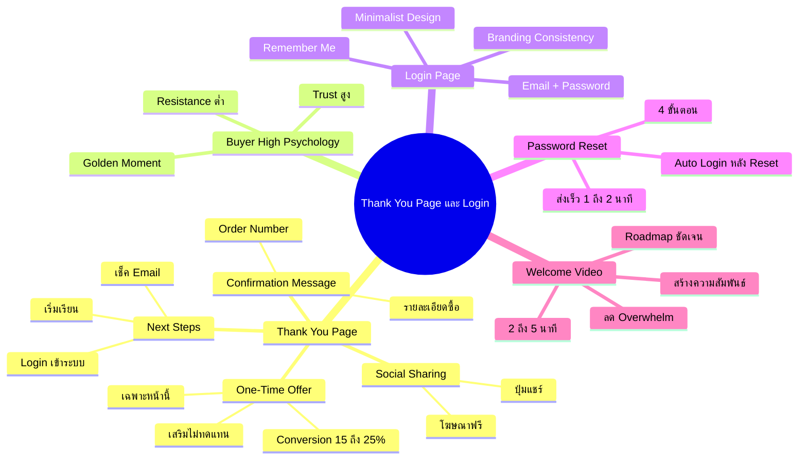
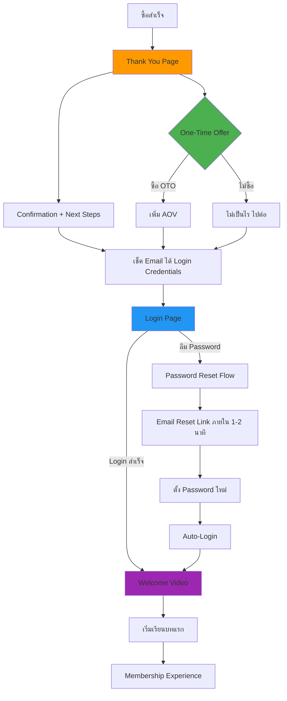

# สร้างหน้า Thank You Page และ Login — SOMT-013
> **Format:** Mind Map (Text Tree + Mermaid)
> **Source:** SWP3 Ch30 The Secret Of Millionaire Trainer ตอนที่ 13
> **Production:** PinkCastle Academy | จูล่ง CTO
> **Date:** 2026-02-18

---

## Part 1: Text Tree Mind Map

```
สร้างหน้า Thank You Page และ Login (SOMT-013)
├── 📌 Central Concept
│   └── สร้าง Post-Purchase Experience ที่เปลี่ยน "ขอบคุณ" เป็น "โอกาสทอง"
│
├── 🙏 Thank You Page
│   ├── Confirmation Message
│   │   ├── ยืนยันการสั่งซื้อสำเร็จ
│   │   ├── Order Number
│   │   └── รายละเอียดสิ่งที่ซื้อ
│   ├── Next Steps (3 ขั้นตอน)
│   │   ├── ขั้นที่ 1: เช็ค Email
│   │   ├── ขั้นที่ 2: คลิกลิงก์ Login
│   │   └── ขั้นที่ 3: เริ่มเรียนบทแรก
│   ├── Social Sharing
│   │   ├── ปุ่มแชร์ Facebook/LINE
│   │   ├── ข้อความชวนแชร์สำเร็จรูป
│   │   └── โฆษณาฟรี Word-of-Mouth
│   └── One-Time Offer (OTO)
│       ├── เสนอเฉพาะบนหน้านี้เท่านั้น
│       ├── ปิดหน้าไปแล้วไม่เห็นอีก
│       ├── Conversion Rate 15-25%
│       ├── ต้อง "เสริม" ไม่ใช่ "ทดแทน"
│       └── ตัวอย่าง: Template, Workbook, Coaching
│
├── 🧠 Buyer's High Psychology
│   ├── Trust สูงหลังซื้อ
│   ├── Buying Resistance ต่ำ
│   ├── "เปิดกระเป๋า" แล้ว
│   └── Golden Moment สำหรับ Upsell
│
├── 🔐 Login Page Design
│   ├── หลักการ Minimalist
│   │   ├── ไม่ต้อง Sidebar
│   │   ├── ไม่ต้อง Navigation
│   │   └── Focus เดียว = Login สำเร็จ
│   ├── องค์ประกอบที่ต้องมี
│   │   ├── Logo ของ Brand
│   │   ├── ช่อง Email + Password
│   │   ├── ปุ่ม Login สีโดดเด่น
│   │   ├── ลิงก์ "ลืมรหัสผ่าน"
│   │   ├── Remember Me Checkbox
│   │   └── Welcome Message สั้นๆ
│   └── Branding Consistency
│       ├── สีเดียวกับ Sale Page
│       ├── Logo เดียวกัน
│       └── Tone of Voice เดียวกัน
│
├── 🔑 Password Reset Flow
│   ├── 4 ขั้นตอน
│   │   ├── คลิก "ลืมรหัสผ่าน"
│   │   ├── กรอก Email
│   │   ├── เช็ค Email ได้ลิงก์ Reset
│   │   └── ตั้ง Password ใหม่ + Auto-Login
│   ├── สาเหตุอันดับ 1 ของ Support
│   ├── Email ต้องส่งภายใน 1-2 นาที
│   └── Subject Line ชัดเจน
│
└── 🎬 Welcome Video (First Login)
    ├── ทำหน้าที่ 3 อย่าง
    │   ├── สร้างความสัมพันธ์ส่วนตัว
    │   ├── ให้ Roadmap ชัดเจน
    │   └── ลด Overwhelm
    ├── ความยาว 2-5 นาที
    └── เนื้อหา
        ├── ขอบคุณที่เลือกเรียน
        ├── แนะนำตัวสั้นๆ
        ├── Roadmap: เริ่มจากบท 1
        └── CTA: เริ่มเรียนเลย
```

---

## Part 2: Mermaid Mind Map



---

## Part 3: Mermaid Flowchart (Post-Purchase Journey)



---

## Part 4: Summary Statistics

| Metric | Value |
|--------|-------|
| Total Nodes | 42 |
| Primary Branches | 5 |
| Average Sub-nodes per Branch | 8 |
| Key Concepts | OTO, Buyer's High, Minimalist Login, Welcome Video |
| OTO Conversion Rate | 15-25% |
| Welcome Video Duration | 2-5 minutes |

---

*Mind Map nodes: 42 | Focus: Post-Purchase Experience*
