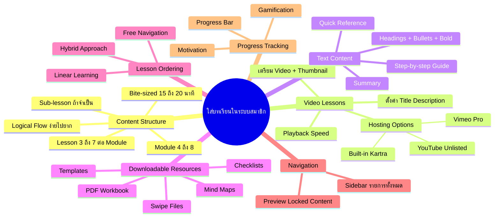
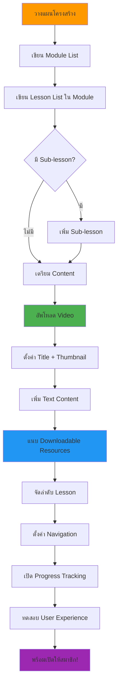

# วิธีใส่บทเรียนในระบบสมาชิก — SOMT-014
> **Format:** Mind Map (Text Tree + Mermaid)
> **Source:** SWP3 Ch30 The Secret Of Millionaire Trainer ตอนที่ 14
> **Production:** PinkCastle Academy | จูล่ง CTO
> **Date:** 2026-02-18

---

## Part 1: Text Tree Mind Map

```
วิธีใส่บทเรียนในระบบสมาชิก (SOMT-014)
├── 📌 Central Concept
│   └── เปลี่ยนระบบสมาชิกจาก "บ้านเปล่า" เป็น "คอร์สเต็มรูปแบบ"
│
├── 📐 Content Structure Planning
│   ├── โครงสร้าง 3 ระดับ
│   │   ├── Module (หัวข้อใหญ่ = บท)
│   │   │   └── 4-8 Modules ต่อคอร์ส
│   │   ├── Lesson (บทเรียนย่อย)
│   │   │   └── 3-7 Lessons ต่อ Module
│   │   └── Sub-lesson (เนื้อหาเจาะลึก)
│   │       └── 2-4 Sub-lessons ต่อ Lesson
│   ├── หลักการวางโครงสร้าง 4 ข้อ
│   │   ├── Logical Flow (ง่าย → ยาก)
│   │   ├── Bite-sized (ไม่เกิน 15-20 นาที)
│   │   ├── Complete (จบในตัว + Action Item)
│   │   └── Consistent Format (รูปแบบเดียวกัน)
│   └── ตัวอย่าง
│       ├── Module 1: พื้นฐาน Marketing
│       │   ├── Lesson 1.1: Funnel คืออะไร
│       │   ├── Lesson 1.2: Customer Journey
│       │   └── Lesson 1.3: เลือก Platform
│       └── Module 2: Facebook Ads
│
├── 🎬 Video Lesson Setup
│   ├── สิ่งที่ต้องเตรียม
│   │   ├── ไฟล์วิดีโอ (ตัดต่อแล้ว)
│   │   ├── Thumbnail รูปปก
│   │   ├── ชื่อ Lesson ชัดเจน
│   │   └── Description 2-3 ประโยค
│   ├── Video Hosting
│   │   ├── Built-in (Kartra) — สะดวกแต่จำกัด
│   │   ├── Vimeo Pro — ซ่อน Controls + Analytics
│   │   ├── YouTube Unlisted — ฟรีแต่แชร์ได้
│   │   └── Wistia — Analytics ละเอียด
│   └── การตั้งค่า
│       ├── Video Title ตรง Lesson Name
│       ├── Auto-play ปิด
│       ├── Playback Speed เร่ง/ชะลอได้
│       └── Closed Captions (ถ้ามี)
│
├── 📝 Text Content Formatting
│   ├── ทำหน้าที่ 3 อย่าง
│   │   ├── Summary ของวิดีโอ
│   │   ├── Step-by-step Guide
│   │   └── Quick Reference
│   └── การจัดรูปแบบ
│       ├── Heading H2 H3 แบ่งส่วน
│       ├── Bullet Points สำหรับรายการ
│       ├── Bold สำหรับคำสำคัญ
│       ├── Screenshots ประกอบ
│       └── Links ไปยัง Resources
│
├── 📎 Downloadable Resources
│   ├── ประเภท
│   │   ├── PDF Workbook (Assignment)
│   │   ├── Template Files (Spreadsheet/Canva)
│   │   ├── Checklist สรุปขั้นตอน
│   │   ├── Mind Map สรุปเนื้อหา
│   │   └── Swipe Files ตัวอย่าง
│   ├── คุณค่า
│   │   ├── สมาชิกรู้สึก "ได้ของจริง"
│   │   └── เหตุผลต่ออายุสมาชิก
│   └── ตั้งชื่อไฟล์ชัดเจน
│       └── "Module1-Lesson3-Funnel-Template.xlsx"
│
├── 🔢 Lesson Ordering
│   ├── Linear Learning
│   │   └── ต้องจบ Lesson 1 ก่อนปลด Lesson 2
│   ├── Free Navigation
│   │   └── เลือกเรียน Lesson ไหนก็ได้
│   └── Hybrid Approach (แนะนำ)
│       ├── บังคับ Module ตามลำดับ
│       └── Lesson ภายใน Module อิสระ
│
├── 🧭 Navigation
│   ├── Sidebar แสดงรายการทั้งหมด
│   ├── เห็นภาพรวม Module + Lesson
│   └── Preview/Locked Content Display
│       ├── แสดงชื่อ + Description
│       └── ไอคอนกุญแจ + "Locked"
│
└── 📊 Progress Tracking
    ├── Progress Bar ทั้งคอร์ส
    ├── เพิ่มขึ้นทุกครั้งที่จบ Lesson
    ├── Gamification = Motivation
    └── "คุณเรียนจบ 40% แล้ว"
```

---

## Part 2: Mermaid Mind Map



---

## Part 3: Mermaid Flowchart (Content Setup Process)



---

## Part 4: Summary Statistics

| Metric | Value |
|--------|-------|
| Total Nodes | 55 |
| Primary Branches | 7 |
| Average Sub-nodes per Branch | 8 |
| Key Concepts | Structure, Video, Resources, Navigation, Progress |
| Recommended Modules | 4-8 per course |
| Recommended Lesson Length | 15-20 minutes |

---

*Mind Map nodes: 55 | Focus: Lesson Setup in Membership System*
