# วิธีใส่บทเรียนในระบบสมาชิก — SOMT-014
> **Format:** Mind Map (Text Tree + Mermaid)
> **Source:** SWP3 Ch30 The Secret Of Millionaire Trainer ตอนที่ 14
> **Production:** PinkCastle Academy | จูล่ง CTO
> **Date:** 2026-02-18

---

## Part 1: Text Tree Mind Map

```
วิธีใส่บทเรียนในระบบสมาชิก (SOMT-014)
├── 📌 Central Concept
│   └── เปลี่ยนระบบสมาชิกจาก "บ้านเปล่า" เป็น "คอร์สเต็มรูปแบบ"
│
├── 📐 Content Structure Planning
│   ├── โครงสร้าง 3 ระดับ
│   │   ├── Module (หัวข้อใหญ่ = บท)
│   │   │   └── 4-8 Modules ต่อคอร์ส
│   │   ├── Lesson (บทเรียนย่อย)
│   │   │   └── 3-7 Lessons ต่อ Module
│   │   └── Sub-lesson (เนื้อหาเจาะลึก)
│   │       └── 2-4 Sub-lessons ต่อ Lesson
│   ├── หลักการวางโครงสร้าง 4 ข้อ
│   │   ├── Logical Flow (ง่าย → ยาก)
│   │   ├── Bite-sized (ไม่เกิน 15-20 นาที)
│   │   ├── Complete (จบในตัว + Action Item)
│   │   └── Consistent Format (รูปแบบเดียวกัน)
│   └── ตัวอย่าง
│       ├── Module 1: พื้นฐาน Marketing
│       │   ├── Lesson 1.1: Funnel คืออะไร
│       │   ├── Lesson 1.2: Customer Journey
│       │   └── Lesson 1.3: เลือก Platform
│       └── Module 2: Facebook Ads
│
├── 🎬 Video Lesson Setup
│   ├── สิ่งที่ต้องเตรียม
│   │   ├── ไฟล์วิดีโอ (ตัดต่อแล้ว)
│   │   ├── Thumbnail รูปปก
│   │   ├── ชื่อ Lesson ชัดเจน
│   │   └── Description 2-3 ประโยค
│   ├── Video Hosting
│   │   ├── Built-in (Kartra) — สะดวกแต่จำกัด
│   │   ├── Vimeo Pro — ซ่อน Controls + Analytics
│   │   ├── YouTube Unlisted — ฟรีแต่แชร์ได้
│   │   └── Wistia — Analytics ละเอียด
│   └── การตั้งค่า
│       ├── Video Title ตรง Lesson Name
│       ├── Auto-play ปิด
│       ├── Playback Speed เร่ง/ชะลอได้
│       └── Closed Captions (ถ้ามี)
│
├── 📝 Text Content Formatting
│   ├── ทำหน้าที่ 3 อย่าง
│   │   ├── Summary ของวิดีโอ
│   │   ├── Step-by-step Guide
│   │   └── Quick Reference
│   └── การจัดรูปแบบ
│       ├── Heading H2 H3 แบ่งส่วน
│       ├── Bullet Points สำหรับรายการ
│       ├── Bold สำหรับคำสำคัญ
│       ├── Screenshots ประกอบ
│       └── Links ไปยัง Resources
│
├── 📎 Downloadable Resources
│   ├── ประเภท
│   │   ├── PDF Workbook (Assignment)
│   │   ├── Template Files (Spreadsheet/Canva)
│   │   ├── Checklist สรุปขั้นตอน
│   │   ├── Mind Map สรุปเนื้อหา
│   │   └── Swipe Files ตัวอย่าง
│   ├── คุณค่า
│   │   ├── สมาชิกรู้สึก "ได้ของจริง"
│   │   └── เหตุผลต่ออายุสมาชิก
│   └── ตั้งชื่อไฟล์ชัดเจน
│       └── "Module1-Lesson3-Funnel-Template.xlsx"
│
├── 🔢 Lesson Ordering
│   ├── Linear Learning
│   │   └── ต้องจบ Lesson 1 ก่อนปลด Lesson 2
│   ├── Free Navigation
│   │   └── เลือกเรียน Lesson ไหนก็ได้
│   └── Hybrid Approach (แนะนำ)
│       ├── บังคับ Module ตามลำดับ
│       └── Lesson ภายใน Module อิสระ
│
├── 🧭 Navigation
│   ├── Sidebar แสดงรายการทั้งหมด
│   ├── เห็นภาพรวม Module + Lesson
│   └── Preview/Locked Content Display
│       ├── แสดงชื่อ + Description
│       └── ไอคอนกุญแจ + "Locked"
│
└── 📊 Progress Tracking
    ├── Progress Bar ทั้งคอร์ส
    ├── เพิ่มขึ้นทุกครั้งที่จบ Lesson
    ├── Gamification = Motivation
    └── "คุณเรียนจบ 40% แล้ว"
```

---

## Part 2: Mermaid Mind Map

```mermaid
mindmap
  root((ใส่บทเรียนในระบบสมาชิก))
    Content Structure
      Module 4 ถึง 8
      Lesson 3 ถึง 7 ต่อ Module
      Sub-lesson ถ้าจำเป็น
      Logical Flow ง่ายไปยาก
      Bite-sized 15 ถึง 20 นาที
    Video Lessons
      เตรียม Video + Thumbnail
      Hosting Options
        Built-in Kartra
        Vimeo Pro
        YouTube Unlisted
      ตั้งค่า Title Description
      Playback Speed
    Text Content
      Summary
      Step-by-step Guide
      Quick Reference
      Headings + Bullets + Bold
    Downloadable Resources
      PDF Workbook
      Templates
      Checklists
      Mind Maps
      Swipe Files
    Lesson Ordering
      Linear Learning
      Free Navigation
      Hybrid Approach
    Navigation
      Sidebar รายการทั้งหมด
      Preview Locked Content
    Progress Tracking
      Progress Bar
      Gamification
      Motivation
```



---

## Part 3: Mermaid Flowchart (Content Setup Process)

```mermaid
flowchart TD
    A[วางแผนโครงสร้าง] --> B[เขียน Module List]
    B --> C[เขียน Lesson List ใน Module]
    C --> D{มี Sub-lesson?}
    D -->|มี| E[เพิ่ม Sub-lesson]
    D -->|ไม่มี| F[เตรียม Content]
    E --> F
    F --> G[อัพโหลด Video]
    G --> H[ตั้งค่า Title + Thumbnail]
    H --> I[เพิ่ม Text Content]
    I --> J[แนบ Downloadable Resources]
    J --> K[จัดลำดับ Lesson]
    K --> L[ตั้งค่า Navigation]
    L --> M[เปิด Progress Tracking]
    M --> N[ทดสอบ User Experience]
    N --> O[พร้อมเปิดให้สมาชิก!]

    style A fill:#ff9900
    style G fill:#4CAF50
    style J fill:#2196F3
    style O fill:#9C27B0
```



---

## Part 4: Summary Statistics

| Metric | Value |
|--------|-------|
| Total Nodes | 55 |
| Primary Branches | 7 |
| Average Sub-nodes per Branch | 8 |
| Key Concepts | Structure, Video, Resources, Navigation, Progress |
| Recommended Modules | 4-8 per course |
| Recommended Lesson Length | 15-20 minutes |

---

*Mind Map nodes: 55 | Focus: Lesson Setup in Membership System*
