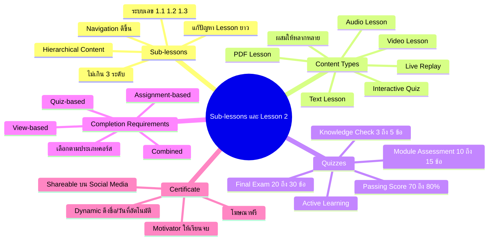
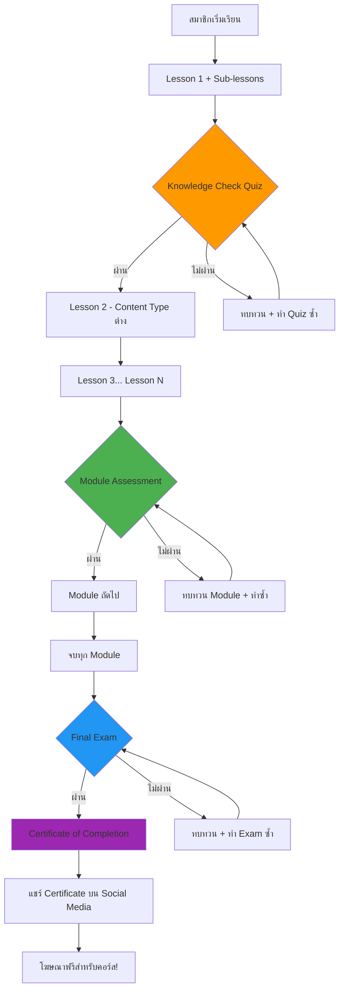

# วิธีใส่บทเรียนย่อย และบทเรียนที่ 2 — SOMT-015
> **Format:** Mind Map (Text Tree + Mermaid)
> **Source:** SWP3 Ch30 The Secret Of Millionaire Trainer ตอนที่ 15
> **Production:** PinkCastle Academy | จูล่ง CTO
> **Date:** 2026-02-18

---

## Part 1: Text Tree Mind Map

```
วิธีใส่บทเรียนย่อย และบทเรียนที่ 2 (SOMT-015)
├── 📌 Central Concept
│   └── สร้าง Depth (Sub-lessons) + Breadth (Lesson 2+) + Active Learning (Quiz) + Completion System
│
├── 📂 Sub-lessons (Hierarchical Content)
│   ├── คืออะไร
│   │   ├── บทเรียนภายในบทเรียน (Lesson ลูก)
│   │   ├── ระดับ 3 ในโครงสร้าง
│   │   └── ไม่ควรเกิน 3 ระดับ
│   ├── ทำไมต้องมี
│   │   ├── แก้ปัญหา Lesson ยาวเกินไป
│   │   ├── Navigation ที่ดีขึ้น
│   │   └── ข้ามไปยังส่วนที่ต้องการได้
│   ├── วิธีสร้าง
│   │   ├── Indent Method (ลากให้อยู่ภายใต้)
│   │   └── Child Lesson Method (กำหนด Parent)
│   └── การตั้งชื่อ
│       ├── ระบบเลข: 1.1, 1.2, 1.3
│       └── ชื่อบอกเนื้อหาเฉพาะเจาะจง
│
├── 📚 บทเรียนที่ 2 (Content Types ต่างกัน)
│   ├── Content Types 6 ประเภท
│   │   ├── Video Lesson (บรรยาย/Screen Record)
│   │   ├── Text Lesson (เนื้อหาข้อความ)
│   │   ├── Audio Lesson (Podcast-style)
│   │   ├── PDF Lesson (Workbook/Case Study)
│   │   ├── Interactive (Quiz/Assignment/Discussion)
│   │   └── Live Session Replay (Q&A)
│   ├── การผสม Content Types
│   │   ├── สลับประเภทเพื่อความหลากหลาย
│   │   └── ไม่ใช่ทุก Lesson เป็นวิดีโอ
│   ├── Transition ระหว่าง Lessons
│   │   ├── จบ Lesson 1: "ตอนต่อไปจะเรียน..."
│   │   └── เริ่ม Lesson 2: "จากตอนที่แล้ว..."
│   └── Lesson Duration
│       └── ไม่ต้องยาวเท่ากัน ขึ้นกับเนื้อหา
│
├── ❓ Quizzes ภายใน Lessons
│   ├── 3 ประเภท
│   │   ├── Knowledge Check (3-5 ข้อ ท้าย Lesson)
│   │   ├── Module Assessment (10-15 ข้อ ท้าย Module)
│   │   └── Final Exam (20-30 ข้อ ท้ายคอร์ส)
│   ├── รูปแบบคำถาม
│   │   ├── Multiple Choice (4 ตัวเลือก)
│   │   ├── True/False (ถูก-ผิด)
│   │   ├── Fill-in-the-blank (เติมคำ)
│   │   ├── Matching (จับคู่)
│   │   └── Short Answer (คำตอบสั้น)
│   ├── การตั้งค่า
│   │   ├── Passing Score (70-80%)
│   │   ├── Retry Policy (ทำซ้ำกี่ครั้ง)
│   │   ├── Feedback (คำอธิบายเมื่อตอบผิด)
│   │   └── Timer (optional)
│   └── เคล็ดลับ
│       ├── เน้น Key Takeaways
│       ├── Plausible Distractors
│       └── Feedback ให้ความรู้เพิ่ม
│
├── ✅ Completion Requirements
│   ├── 4 ระดับ
│   │   ├── View-based (ดูวิดีโอจบ)
│   │   ├── Quiz-based (ผ่าน Quiz)
│   │   ├── Assignment-based (ส่ง Assignment)
│   │   └── Combined (ดู + Quiz + Assignment)
│   └── เลือกตามประเภทคอร์ส
│       ├── Casual → View-based
│       ├── Skill Development → Quiz-based
│       └── Certification → Combined
│
└── 🏆 Certificate of Completion
    ├── องค์ประกอบ
    │   ├── ชื่อคอร์ส
    │   ├── ชื่อสมาชิก (Dynamic)
    │   ├── วันที่จบ (Dynamic)
    │   ├── ลายเซ็นผู้สอน
    │   ├── Logo Brand
    │   └── Certificate Number
    ├── Dynamic Certificate
    │   └── ดึงข้อมูลอัตโนมัติ
    ├── Shareable
    │   ├── แชร์ Social Media ง่าย
    │   └── ทุกการแชร์ = โฆษณาฟรี
    └── Trigger
        └── จบคอร์สครบ + ผ่าน Quiz → Generate
```

---

## Part 2: Mermaid Mind Map



---

## Part 3: Mermaid Flowchart (Course Completion Journey)



---

## Part 4: Summary Statistics

| Metric | Value |
|--------|-------|
| Total Nodes | 60 |
| Primary Branches | 5 |
| Average Sub-nodes per Branch | 12 |
| Key Concepts | Sub-lessons, Content Types, Quizzes, Certificate |
| Content Types | 6 |
| Quiz Types | 3 |
| Completion Levels | 4 |

---

*Mind Map nodes: 60 | Focus: Sub-lessons, Lesson 2, Quizzes, Certificate*
