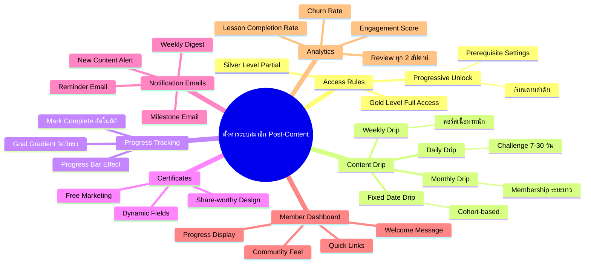
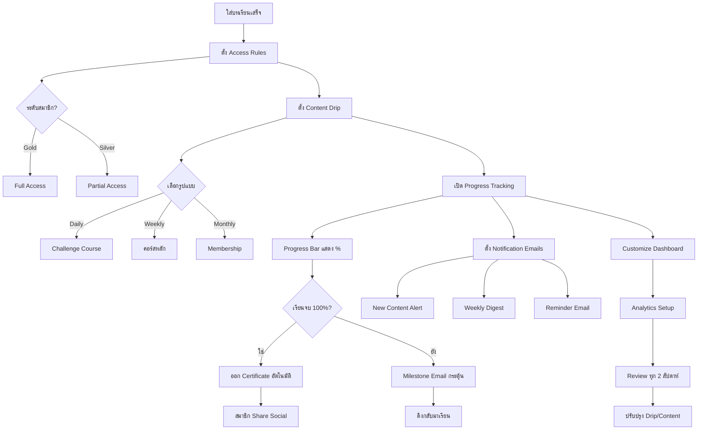

# วิธีตั้งค่าระบบสมาชิกหลังใส่บทเรียน — SOMT-016 Mind Map
> **Format:** Mind Map (Text Tree + Mermaid)
> **Source:** SWP3 Ch30 The Secret Of Millionaire Trainer ตอนที่ 16
> **Production:** PinkCastle Academy | จูล่ง CTO
> **Date:** 2026-02-18 | **Duration:** 0:36:27

---

## Part 1: Text Tree Mind Map

```
วิธีตั้งค่าระบบสมาชิกหลังใส่บทเรียน (SOMT-016)
├── 📌 Central Concept
│   └── ตั้งค่าให้ระบบสมาชิก "มีชีวิต" ทำงานอัตโนมัติหลังใส่เนื้อหาเสร็จ
│
├── 🔐 Access Rules (กำหนดสิทธิ์เข้าถึง)
│   ├── ระดับสมาชิก
│   │   ├── Gold Level — Full Access
│   │   ├── Silver Level — Partial Access
│   │   └── Free Level — ตัวอย่างเท่านั้น
│   ├── Progressive Unlock
│   │   ├── ต้องจบ Module ก่อนหน้า
│   │   ├── Prerequisite Settings
│   │   └── เรียนตามลำดับ = ผลลัพธ์ดี
│   └── การตั้งค่าใน Kartra
│       ├── Membership > Module > Access Settings
│       └── เลือก Level ที่เข้าถึงได้
│
├── ⏰ Content Drip Scheduling (ปล่อยเนื้อหาอัตโนมัติ)
│   ├── Daily Drip
│   │   ├── ปล่อยทุกวัน
│   │   ├── เหมาะกับ Challenge 7-30 วัน
│   │   └── Engagement สูงมาก
│   ├── Weekly Drip
│   │   ├── ปล่อยทุกสัปดาห์
│   │   ├── เหมาะกับคอร์สเนื้อหาหนัก
│   │   └── Sweet Spot ปลอดภัย
│   ├── Monthly Drip
│   │   ├── ปล่อยทุกเดือน
│   │   ├── เหมาะกับ Membership ระยะยาว
│   │   └── ต้องมี Community เสริม
│   └── Fixed Date Drip
│       ├── ปล่อยตามวันกำหนด
│       └── เหมาะกับ Cohort-based Course
│
├── 📊 Progress Tracking (ติดตามความก้าวหน้า)
│   ├── Progress Bar Effect
│   │   ├── แสดง % ที่เรียนไปแล้ว
│   │   ├── จิตวิทยา Goal Gradient
│   │   └── เหมือน Stamp Card กาแฟ
│   ├── การคำนวณ
│   │   ├── จำนวน Lessons ที่ Mark Complete
│   │   └── คำนวณ % อัตโนมัติ
│   └── การเปิดใช้งาน
│       └── Membership > Settings > Enable Progress Tracking
│
├── 🏆 Completion Certificates (ใบประกาศนียบัตร)
│   ├── Dynamic Fields
│   │   ├── ชื่อสมาชิก
│   │   ├── วันที่จบ
│   │   └── ชื่อคอร์ส
│   ├── ประโยชน์
│   │   ├── สมาชิกรู้สึกได้ของจับต้องได้
│   │   ├── Share บน Social = Free Marketing
│   │   └── สร้างความรู้สึกคุ้มค่า
│   └── การตั้งค่า
│       ├── อัพโหลด Template
│       ├── ใส่ Dynamic Fields
│       └── ตั้ง Trigger (เมื่อเรียนจบ 100%)
│
├── 📧 Notification Emails (อีเมลแจ้งเตือน)
│   ├── New Content Alert
│   │   └── แจ้งเมื่อมีเนื้อหาใหม่
│   ├── Weekly Digest
│   │   └── สรุปรายสัปดาห์
│   ├── Reminder Email
│   │   └── Re-engage สมาชิกที่ห่างหาย
│   └── Milestone Email
│       ├── ยินดีเมื่อผ่านจุดสำคัญ
│       └── Social Comparison กระตุ้น Motivation
│
├── 🖥️ Member Dashboard (หน้าหลักสมาชิก)
│   ├── องค์ประกอบ
│   │   ├── Welcome Message
│   │   ├── Progress Bar
│   │   ├── เนื้อหาล่าสุด
│   │   ├── เนื้อหาใหม่
│   │   └── Quick Links
│   └── หลักการออกแบบ
│       ├── ลด Friction
│       ├── บอก Next Step ชัดเจน
│       └── รู้สึกเหมือนอยู่ใน Community
│
└── 📈 Analytics Setup (วิเคราะห์ข้อมูล)
    ├── 5 Metrics หลัก
    │   ├── Lesson Completion Rate
    │   ├── Average Time Per Lesson
    │   ├── Login Frequency
    │   ├── Churn Rate
    │   └── Engagement Score
    └── การใช้ประโยชน์
        ├── ปรับ Drip Schedule
        ├── แก้ไข Module ที่ Drop Off สูง
        └── Review ทุก 2 สัปดาห์
```

---

## Part 2: Mermaid Mind Map



---

## Part 3: Mermaid Flowchart (Post-Content Setup Flow)



---

## Part 4: Summary Statistics

| Metric | Value |
|--------|-------|
| Total Nodes | 55 |
| Primary Branches | 7 |
| Average Sub-nodes per Branch | 8 |
| Key Concepts | Access Rules, Drip, Progress, Certificates |
| Platform | Kartra |
| Setup Type | One-time configuration |

---

*Mind Map nodes: 55 | Focus: Post-Content Membership Configuration*
