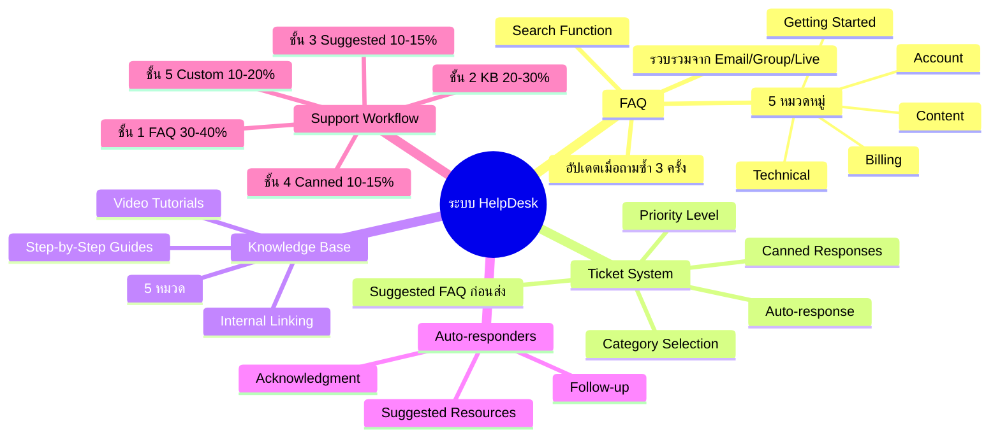
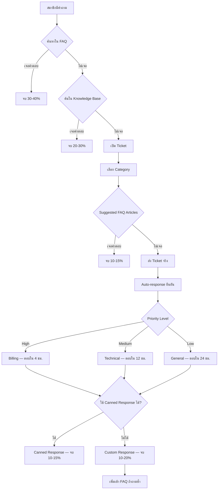

# วิธีสร้างระบบ HelpDesk — SOMT-017 Mind Map
> **Format:** Mind Map (Text Tree + Mermaid)
> **Source:** SWP3 Ch30 The Secret Of Millionaire Trainer ตอนที่ 17
> **Production:** PinkCastle Academy | จูล่ง CTO
> **Date:** 2026-02-18 | **Duration:** 0:31:13

---

## Part 1: Text Tree Mind Map

```
วิธีสร้างระบบ HelpDesk (SOMT-017)
├── 📌 Central Concept
│   └── สร้างระบบ Support ที่ลดภาระ 60-80% และเพิ่ม Member Satisfaction
│
├── ❓ FAQ (Frequently Asked Questions)
│   ├── วิธีรวบรวมคำถาม
│   │   ├── จาก Email ที่เคยได้รับ
│   │   ├── จาก Facebook Group
│   │   ├── จาก Live Session Q&A
│   │   └── จินตนาการเป็นสมาชิกใหม่
│   ├── การจัดหมวดหมู่
│   │   ├── Getting Started
│   │   ├── Technical Issues
│   │   ├── Billing & Payments
│   │   ├── Course Content
│   │   └── Account Management
│   ├── เทคนิคเขียนคำตอบ
│   │   ├── ภาษาง่าย ไม่ใช้ศัพท์เทคนิค
│   │   ├── ใส่ Screenshot ทุกขั้นตอน
│   │   └── ลิงก์ไปหน้าที่เกี่ยวข้อง
│   └── Search Function
│       └── ให้พิมพ์คำค้นหาได้
│
├── 🎫 Ticket System
│   ├── ข้อดีเหนือ Email ตรง
│   │   ├── จัดลำดับ Priority
│   │   ├── ติดตามสถานะได้
│   │   └── ไม่หลุดหาย
│   ├── Category Selection
│   │   ├── Technical
│   │   ├── Billing
│   │   └── Content
│   ├── Suggested FAQ Articles
│   │   └── แสดงก่อนส่ง Ticket — ลด 40-50%
│   ├── Auto-response
│   │   └── "ได้รับแล้ว ตอบภายใน 24 ชม."
│   ├── Priority Level
│   │   ├── High: Billing Issues
│   │   ├── Medium: Technical Issues
│   │   └── Low: General Questions
│   └── Canned Responses
│       ├── คำตอบสำเร็จรูป 20-30 แบบ
│       └── ลดเวลาตอบ 50%
│
├── 📚 Knowledge Base
│   ├── โครงสร้าง
│   │   ├── Getting Started Guide
│   │   ├── Platform Tutorials
│   │   ├── Course Navigation
│   │   ├── Troubleshooting
│   │   └── Best Practices
│   ├── รูปแบบเนื้อหา
│   │   ├── Text Articles + Screenshots
│   │   ├── Video Tutorials
│   │   └── Step-by-Step Guides
│   └── Internal Linking
│       └── ลิงก์บทความเกี่ยวข้องเพื่อ Self-Navigation
│
├── 🤖 Auto-responders
│   ├── Ticket Acknowledgment
│   │   └── ยืนยันว่าได้รับคำถาม
│   ├── Suggested Resources
│   │   └── ส่ง FAQ/KB Links อัตโนมัติตาม Category
│   └── Follow-up
│       └── ถามว่าปัญหาแก้ได้หรือยัง
│
├── 🔄 Support Workflow
│   ├── ชั้น 1: FAQ → จบ 30-40%
│   ├── ชั้น 2: Knowledge Base → จบ 20-30%
│   ├── ชั้น 3: Suggested Articles → จบ 10-15%
│   ├── ชั้น 4: Canned Responses → จบ 10-15%
│   └── ชั้น 5: Custom Response → จบ 10-20%
│
└── 💡 เหตุผลที่ต้องมี HelpDesk
    ├── ลดภาระงาน Support 60-80%
    ├── เพิ่ม Member Satisfaction
    ├── Scalable ไม่ว่าสมาชิกกี่คน
    └── แสดง Professionalism
```

---

## Part 2: Mermaid Mind Map



---

## Part 3: Mermaid Flowchart (Support Workflow)



---

## Part 4: Summary Statistics

| Metric | Value |
|--------|-------|
| Total Nodes | 50 |
| Primary Branches | 6 |
| Average Sub-nodes per Branch | 8 |
| Key Concepts | FAQ, Ticket System, Knowledge Base, Workflow |
| Target Reduction | 60-80% ลดภาระ Support |
| Platform | Kartra HelpDesk |

---

*Mind Map nodes: 50 | Focus: HelpDesk System for Course Members*
