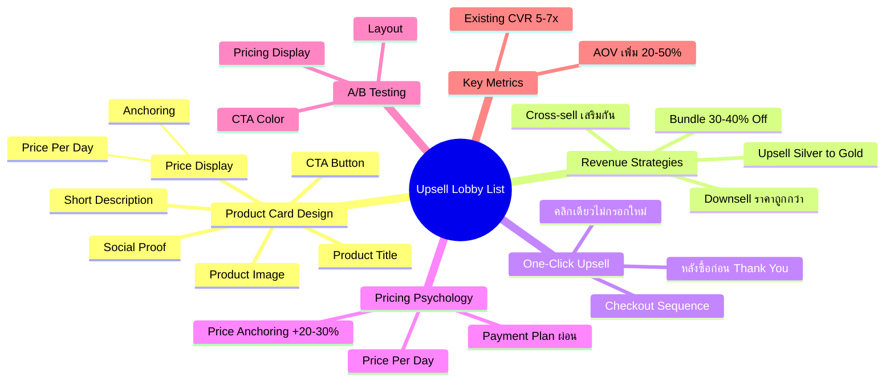
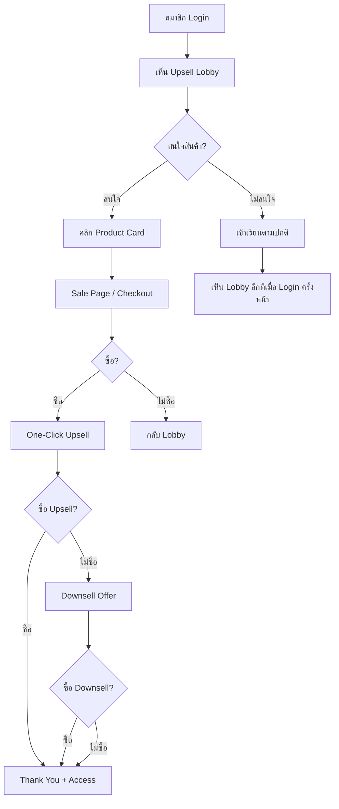

# วิธีสร้างหน้า Upsell Lobby List — SOMT-018 Mind Map
> **Format:** Mind Map (Text Tree + Mermaid)
> **Source:** SWP3 Ch30 The Secret Of Millionaire Trainer ตอนที่ 18
> **Production:** PinkCastle Academy | จูล่ง CTO
> **Date:** 2026-02-18 | **Duration:** 0:48:50

---

## Part 1: Text Tree Mind Map

```
วิธีสร้างหน้า Upsell Lobby List (SOMT-018)
├── 📌 Central Concept
│   └── เพิ่ม Average Order Value (AOV) ด้วยหน้ารวมสินค้าหลัง Login
│
├── 🏪 Upsell Lobby List คืออะไร?
│   ├── หน้ารวมสินค้าทั้งหมดใน Membership Area
│   ├── แสดง Enrolled (ซื้อแล้ว) + Available (ยังไม่ซื้อ)
│   ├── Passive Revenue — ไม่ต้อง Hard Sell
│   └── สมาชิกเห็นทุกครั้งที่ Login
│
├── 🃏 Product Card Design (6 องค์ประกอบ)
│   ├── Product Image
│   │   └── Mockup เป็นมืออาชีพ
│   ├── Product Title
│   │   └── ชัดเจน บอกว่าได้อะไร
│   ├── Short Description
│   │   └── 1-2 ประโยค แก้ปัญหาอะไร
│   ├── Price Display
│   │   ├── Price Anchoring (ขีดราคาเดิม)
│   │   ├── Price Per Day (วันละ 8 บาท)
│   │   └── Payment Plan (ผ่อน 3 งวด)
│   ├── Social Proof
│   │   ├── จำนวนสมาชิก (250+ คน)
│   │   └── Rating (4.8/5 ดาว)
│   └── CTA Button
│       ├── สีโดดเด่น
│       └── ข้อความกระตุ้น (เข้าเรียนเลย)
│
├── 📐 Layout Best Practices
│   ├── แสดง 4-8 สินค้า
│   ├── แบ่ง Category ถ้ามีมาก
│   │   ├── คอร์สแนะนำ
│   │   ├── Premium Collection
│   │   └── เครื่องมือเสริม
│   └── Responsive Design
│
├── 🔄 กลยุทธ์ Revenue Optimization
│   ├── Upsell
│   │   └── เสนอสินค้าดีกว่า/แพงกว่า (Silver → Gold)
│   ├── Cross-sell
│   │   └── เสนอสินค้าเสริม (Marketing + Copywriting)
│   ├── Downsell
│   │   └── เสนอราคาถูกกว่าเมื่อปฏิเสธ Upsell
│   └── Bundle Offer
│       ├── รวม 2-3 สินค้า
│       └── ส่วนลด 30-40%
│
├── ⚡ One-Click Upsell
│   ├── แสดงหลังซื้อ ก่อน Thank You
│   ├── คลิกเดียว ไม่ต้องกรอกบัตรใหม่
│   ├── Conversion สูงเพราะ
│   │   ├── อยู่ในอารมณ์ซื้อ
│   │   ├── Friction ต่ำ
│   │   └── สินค้าเสริมกัน
│   └── Checkout Sequence ใน Kartra
│       ├── Product A → Upsell B
│       ├── ซื้อ → Thank You
│       └── ไม่ซื้อ → Downsell C
│
├── 💰 Pricing Psychology
│   ├── Price Anchoring (+20-30% Conversion)
│   │   └── แสดงราคาปกติขีดทิ้ง
│   ├── Price Per Day
│   │   └── "แค่วันละ 8 บาท" แทน "2,997 บาท"
│   └── Payment Plan
│       └── ผ่อน 3 งวด x 1,099 บาท
│
├── 🧪 A/B Testing
│   ├── Product Card Layout (3 vs 4 ต่อแถว)
│   ├── CTA Button Color (แดง vs เขียว)
│   ├── Pricing Display (ราคาเดียว vs Anchoring)
│   └── ทดสอบทีละองค์ประกอบ 2 สัปดาห์
│
└── 📊 ตัวเลขสำคัญ
    ├── Existing Customer CVR สูงกว่า 5-7x
    ├── Price Anchoring +20-30% CVR
    ├── Bundle Discount 30-40%
    └── AOV เพิ่ม 20-50%
```

---

## Part 2: Mermaid Mind Map



---

## Part 3: Mermaid Flowchart (Upsell Journey)



---

## Part 4: Summary Statistics

| Metric | Value |
|--------|-------|
| Total Nodes | 52 |
| Primary Branches | 8 |
| Average Sub-nodes per Branch | 7 |
| Key Concepts | Product Card, Cross-sell, One-Click, A/B Test |
| Platform | Kartra |
| Revenue Goal | เพิ่ม AOV 20-50% |

---

*Mind Map nodes: 52 | Focus: Upsell Lobby List & Revenue Optimization*
