# วิธีสร้างหน้า Upsell Lobby List — SOMT-018 Mind Map
> **Format:** Mind Map (Text Tree + Mermaid)
> **Source:** SWP3 Ch30 The Secret Of Millionaire Trainer ตอนที่ 18
> **Production:** PinkCastle Academy | จูล่ง CTO
> **Date:** 2026-02-18 | **Duration:** 0:48:50

---

## Part 1: Text Tree Mind Map

```
วิธีสร้างหน้า Upsell Lobby List (SOMT-018)
├── 📌 Central Concept
│   └── เพิ่ม Average Order Value (AOV) ด้วยหน้ารวมสินค้าหลัง Login
│
├── 🏪 Upsell Lobby List คืออะไร?
│   ├── หน้ารวมสินค้าทั้งหมดใน Membership Area
│   ├── แสดง Enrolled (ซื้อแล้ว) + Available (ยังไม่ซื้อ)
│   ├── Passive Revenue — ไม่ต้อง Hard Sell
│   └── สมาชิกเห็นทุกครั้งที่ Login
│
├── 🃏 Product Card Design (6 องค์ประกอบ)
│   ├── Product Image
│   │   └── Mockup เป็นมืออาชีพ
│   ├── Product Title
│   │   └── ชัดเจน บอกว่าได้อะไร
│   ├── Short Description
│   │   └── 1-2 ประโยค แก้ปัญหาอะไร
│   ├── Price Display
│   │   ├── Price Anchoring (ขีดราคาเดิม)
│   │   ├── Price Per Day (วันละ 8 บาท)
│   │   └── Payment Plan (ผ่อน 3 งวด)
│   ├── Social Proof
│   │   ├── จำนวนสมาชิก (250+ คน)
│   │   └── Rating (4.8/5 ดาว)
│   └── CTA Button
│       ├── สีโดดเด่น
│       └── ข้อความกระตุ้น (เข้าเรียนเลย)
│
├── 📐 Layout Best Practices
│   ├── แสดง 4-8 สินค้า
│   ├── แบ่ง Category ถ้ามีมาก
│   │   ├── คอร์สแนะนำ
│   │   ├── Premium Collection
│   │   └── เครื่องมือเสริม
│   └── Responsive Design
│
├── 🔄 กลยุทธ์ Revenue Optimization
│   ├── Upsell
│   │   └── เสนอสินค้าดีกว่า/แพงกว่า (Silver → Gold)
│   ├── Cross-sell
│   │   └── เสนอสินค้าเสริม (Marketing + Copywriting)
│   ├── Downsell
│   │   └── เสนอราคาถูกกว่าเมื่อปฏิเสธ Upsell
│   └── Bundle Offer
│       ├── รวม 2-3 สินค้า
│       └── ส่วนลด 30-40%
│
├── ⚡ One-Click Upsell
│   ├── แสดงหลังซื้อ ก่อน Thank You
│   ├── คลิกเดียว ไม่ต้องกรอกบัตรใหม่
│   ├── Conversion สูงเพราะ
│   │   ├── อยู่ในอารมณ์ซื้อ
│   │   ├── Friction ต่ำ
│   │   └── สินค้าเสริมกัน
│   └── Checkout Sequence ใน Kartra
│       ├── Product A → Upsell B
│       ├── ซื้อ → Thank You
│       └── ไม่ซื้อ → Downsell C
│
├── 💰 Pricing Psychology
│   ├── Price Anchoring (+20-30% Conversion)
│   │   └── แสดงราคาปกติขีดทิ้ง
│   ├── Price Per Day
│   │   └── "แค่วันละ 8 บาท" แทน "2,997 บาท"
│   └── Payment Plan
│       └── ผ่อน 3 งวด x 1,099 บาท
│
├── 🧪 A/B Testing
│   ├── Product Card Layout (3 vs 4 ต่อแถว)
│   ├── CTA Button Color (แดง vs เขียว)
│   ├── Pricing Display (ราคาเดียว vs Anchoring)
│   └── ทดสอบทีละองค์ประกอบ 2 สัปดาห์
│
└── 📊 ตัวเลขสำคัญ
    ├── Existing Customer CVR สูงกว่า 5-7x
    ├── Price Anchoring +20-30% CVR
    ├── Bundle Discount 30-40%
    └── AOV เพิ่ม 20-50%
```

---

## Part 2: Mermaid Mind Map

```mermaid
mindmap
  root((Upsell Lobby List))
    Product Card Design
      Product Image
      Product Title
      Short Description
      Price Display
        Anchoring
        Price Per Day
      Social Proof
      CTA Button
    Revenue Strategies
      Upsell Silver to Gold
      Cross-sell เสริมกัน
      Downsell ราคาถูกกว่า
      Bundle 30-40% Off
    One-Click Upsell
      หลังซื้อก่อน Thank You
      คลิกเดียวไม่กรอกใหม่
      Checkout Sequence
    Pricing Psychology
      Price Anchoring +20-30%
      Price Per Day
      Payment Plan ผ่อน
    A/B Testing
      Layout
      CTA Color
      Pricing Display
    Key Metrics
      Existing CVR 5-7x
      AOV เพิ่ม 20-50%
```



---

## Part 3: Mermaid Flowchart (Upsell Journey)

```mermaid
flowchart TD
    A[สมาชิก Login] --> B[เห็น Upsell Lobby]
    B --> C{สนใจสินค้า?}
    C -->|ไม่สนใจ| D[เข้าเรียนตามปกติ]
    C -->|สนใจ| E[คลิก Product Card]
    E --> F[Sale Page / Checkout]
    F --> G{ซื้อ?}
    G -->|ซื้อ| H[One-Click Upsell]
    G -->|ไม่ซื้อ| I[กลับ Lobby]
    H --> J{ซื้อ Upsell?}
    J -->|ซื้อ| K[Thank You + Access]
    J -->|ไม่ซื้อ| L[Downsell Offer]
    L --> M{ซื้อ Downsell?}
    M -->|ซื้อ| K
    M -->|ไม่ซื้อ| K
    D --> N[เห็น Lobby อีกทีเมื่อ Login ครั้งหน้า]
```



---

## Part 4: Summary Statistics

| Metric | Value |
|--------|-------|
| Total Nodes | 52 |
| Primary Branches | 8 |
| Average Sub-nodes per Branch | 7 |
| Key Concepts | Product Card, Cross-sell, One-Click, A/B Test |
| Platform | Kartra |
| Revenue Goal | เพิ่ม AOV 20-50% |

---

*Mind Map nodes: 52 | Focus: Upsell Lobby List & Revenue Optimization*
