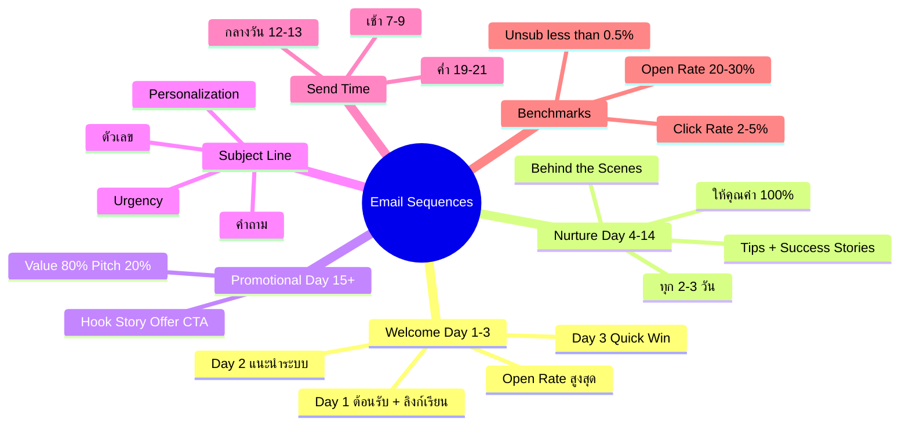

# วิธีปรับแต่ง Sequences จดหมาย — SOMT-019 Mind Map
> **Format:** Mind Map (Text Tree + Mermaid)
> **Source:** SWP3 Ch30 The Secret Of Millionaire Trainer ตอนที่ 19
> **Production:** PinkCastle Academy | จูล่ง CTO
> **Date:** 2026-02-18 | **Duration:** 0:14:42

---

## Part 1: Text Tree Mind Map

```
วิธีปรับแต่ง Sequences จดหมาย (SOMT-019)
├── 📌 Central Concept
│   └── Email Automation 3 Sequences ทำครั้งเดียว ทำงาน 24/7
│
├── 📨 Welcome Sequence (Day 1-3)
│   ├── Day 1 — ส่งทันที
│   │   ├── ต้อนรับ + แนะนำตัว
│   │   ├── บอกว่าจะได้อะไร
│   │   ├── ลิงก์เข้าเรียนทันที
│   │   └── Open Rate สูงสุด (Golden Period)
│   ├── Day 2 — แนะนำระบบ
│   │   ├── วิธีใช้งาน Membership
│   │   ├── ฟีเจอร์ที่ควรรู้
│   │   └── ลิงก์ HelpDesk/FAQ
│   └── Day 3 — แนะนำเนื้อหา
│       ├── Module ที่ควรเริ่ม
│       └── Quick Win สร้างผลลัพธ์เร็ว
│
├── 💝 Nurture Sequence (Day 4-14)
│   ├── เป้าหมาย
│   │   ├── สร้างความสัมพันธ์
│   │   ├── ให้คุณค่า 100% ไม่ขาย
│   │   └── วางรากฐานก่อน Promotional
│   ├── เนื้อหา
│   │   ├── Tips ที่ใช้ได้จริง
│   │   ├── Success Stories
│   │   ├── Behind the Scenes
│   │   └── Bonus Content
│   └── ความถี่
│       └── ทุก 2-3 วัน (4-5 ฉบับ)
│
├── 💰 Promotional Sequence (Day 15+)
│   ├── โครงสร้าง Email
│   │   ├── Hook — ดึงดูดความสนใจ
│   │   ├── Story — เล่าเรื่องเกี่ยวข้อง
│   │   ├── Offer — เสนอสินค้า/โปรโมชัน
│   │   └── CTA — บอกว่าต้องทำอะไร
│   └── สัดส่วน
│       └── Value 80% + Pitch 20%
│
├── ✍️ Subject Line Optimization
│   ├── ใช้ตัวเลข ("5 เทคนิค...")
│   ├── ใช้คำถาม ("คุณเคย...ไหม?")
│   ├── สร้าง Urgency ("วันสุดท้าย!")
│   └── Personalization ("[ชื่อ], สิ่งนี้เพื่อคุณ")
│
├── 🎯 Personalization Tokens
│   ├── ชื่อสมาชิก
│   ├── Module ที่กำลังเรียน
│   ├── Progress ปัจจุบัน
│   └── Interest ที่เลือกตอนสมัคร
│
├── ⏰ Send Time Optimization
│   ├── เช้า 7-9 น. (ระหว่างเดินทาง)
│   ├── กลางวัน 12-13 น. (พักเที่ยง)
│   ├── ค่ำ 19-21 น. (หลังเลิกงาน)
│   └── ทดลองหลายช่วง → ดู Data
│
└── 📊 Benchmarks
    ├── Open Rate: 20-30%
    ├── Click Rate: 2-5%
    └── Unsubscribe Rate: < 0.5%
```

---

## Part 2: Mermaid Mind Map



---

## Part 3: Mermaid Flowchart (Email Sequence Timeline)

```mermaid
flowchart LR
    A[สมัครสมาชิก] --> B[Day 1: Welcome]
    B --> C[Day 2: แนะนำระบบ]
    C --> D[Day 3: Quick Win]
    D --> E[Day 5: Nurture 1 - Tips]
    E --> F[Day 7: Nurture 2 - Success Story]
    F --> G[Day 10: Nurture 3 - Behind Scenes]
    G --> H[Day 13: Nurture 4 - Bonus Content]
    H --> I[Day 15: Promo 1 - Soft Sell]
    I --> J[Day 18: Promo 2 - Value + Offer]
    J --> K[Day 21: Promo 3 - Urgency]
    K --> L[ต่อ Ongoing Emails]
```



---

## Part 4: Summary Statistics

| Metric | Value |
|--------|-------|
| Total Nodes | 38 |
| Primary Branches | 7 |
| Average Sub-nodes per Branch | 5 |
| Key Concepts | Welcome, Nurture, Promotional, Subject Line |
| Total Emails | 10-13 ฉบับ |
| Setup Time | 1-2 วัน |

---

*Mind Map nodes: 38 | Focus: Email Sequence Customization*
