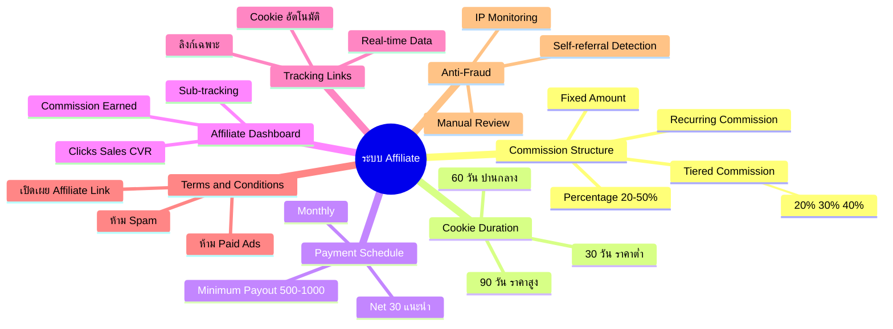
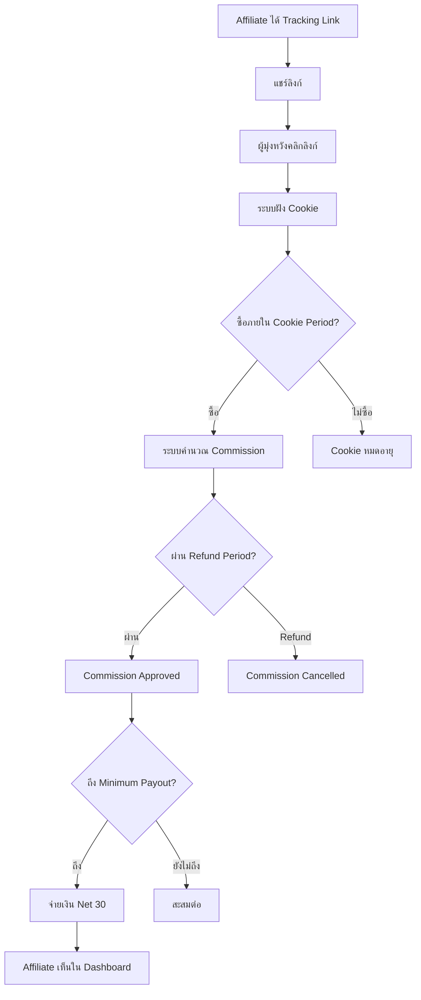

# ตั้งค่าระบบ Affiliate — SOMT-020 Mind Map
> **Format:** Mind Map (Text Tree + Mermaid)
> **Source:** SWP3 Ch30 The Secret Of Millionaire Trainer ตอนที่ 20
> **Production:** PinkCastle Academy | จูล่ง CTO
> **Date:** 2026-02-18 | **Duration:** 0:27:08

---

## Part 1: Text Tree Mind Map

```
ตั้งค่าระบบ Affiliate (SOMT-020)
├── 📌 Central Concept
│   └── สร้างระบบ Affiliate ที่ Win-Win — จ่ายเมื่อขายได้จริง
│
├── 💰 Commission Structure
│   ├── Percentage Based
│   │   ├── 20-50% ของราคาสินค้า
│   │   └── เหมาะกับ Digital Product
│   ├── Fixed Amount
│   │   ├── จำนวนคงที่ต่อการขาย
│   │   └── เหมาะกับ Physical Product
│   ├── Tiered Commission
│   │   ├── ใหม่: 20%
│   │   ├── 10+ ชิ้น: 30%
│   │   └── 50+ ชิ้น: 40%
│   └── Recurring Commission
│       ├── จ่ายทุกเดือนตลอดที่สมาชิกอยู่
│       └── Affiliate มี Incentive รักษาสมาชิก
│
├── 🍪 Cookie Duration
│   ├── 30 วัน — สินค้าราคาต่ำ
│   ├── 60 วัน — สินค้าราคาปานกลาง (แนะนำ)
│   ├── 90 วัน — สินค้าราคาสูง
│   └── สั้นเกินไป = Affiliate ไม่ Happy
│
├── 💳 Payment Schedule
│   ├── Monthly Payment — ทุกสิ้นเดือน
│   ├── Bi-weekly — ทุก 2 สัปดาห์
│   ├── Net 30 — 30 วันหลัง Refund Period (แนะนำ)
│   └── Minimum Payout Threshold
│       ├── 500-1,000 บาท
│       └── ลดค่าธรรมเนียมโอน
│
├── 📊 Affiliate Dashboard
│   ├── Total Clicks
│   ├── Total Sales
│   ├── Conversion Rate
│   ├── Commission Earned
│   ├── Pending Payout
│   └── Sub-tracking (แยก Campaign)
│
├── 🔗 Tracking Links
│   ├── ลิงก์เฉพาะแต่ละ Affiliate
│   ├── Cookie ตามระยะที่ตั้ง
│   ├── คำนวณ Commission อัตโนมัติ
│   └── Real-time Data ใน Kartra
│
├── 📜 Terms & Conditions
│   ├── ห้ามทำ
│   │   ├── Paid Ads บนชื่อแบรนด์
│   │   ├── ส่ง Spam Email
│   │   ├── Cookie Stuffing
│   │   └── Misleading Claims
│   ├── ต้องทำ
│   │   └── เปิดเผยว่าเป็น Affiliate Link
│   └── บทลงโทษ
│       └── ยกเลิก Affiliate ทันที
│
└── 🛡️ Anti-Fraud Measures
    ├── Self-referral Detection
    │   └── บล็อค Cookie จาก Affiliate IP
    ├── IP Monitoring
    │   └── Alert เมื่อ Clicks ผิดปกติ
    ├── Manual Review
    │   └── ตรวจ Commission ก่อนจ่ายยอดใหญ่
    └── Minimum Payout
        └── ลด Incentive สำหรับ Small-scale Fraud
```

---

## Part 2: Mermaid Mind Map



---

## Part 3: Mermaid Flowchart (Affiliate Sales Flow)



---

## Part 4: Summary Statistics

| Metric | Value |
|--------|-------|
| Total Nodes | 48 |
| Primary Branches | 7 |
| Average Sub-nodes per Branch | 7 |
| Key Concepts | Commission, Cookie, Payment, Anti-Fraud |
| Platform | Kartra |
| Commission Range | 20-50% |

---

*Mind Map nodes: 48 | Focus: Affiliate System Setup on Kartra*
