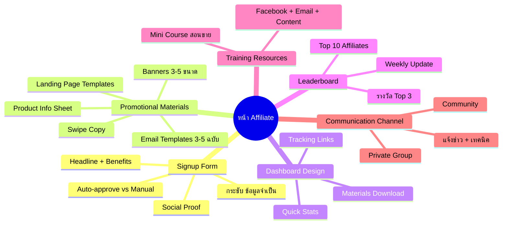
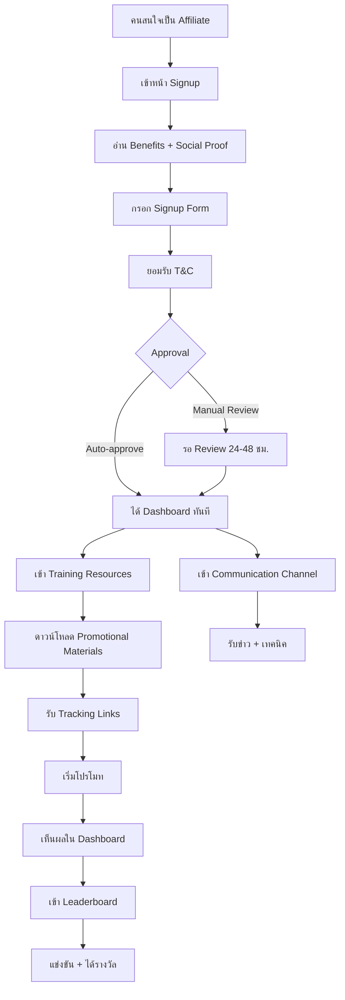

# สร้างหน้า Affiliate สำหรับระบบสมาชิก — SOMT-021 Mind Map
> **Format:** Mind Map (Text Tree + Mermaid)
> **Source:** SWP3 Ch30 The Secret Of Millionaire Trainer ตอนที่ 21
> **Production:** PinkCastle Academy | จูล่ง CTO
> **Date:** 2026-02-18 | **Duration:** 0:31:47

---

## Part 1: Text Tree Mind Map

```
สร้างหน้า Affiliate สำหรับระบบสมาชิก (SOMT-021)
├── 📌 Central Concept
│   └── ทำให้ Affiliate ขายง่ายที่สุด ด้วยเครื่องมือและ Training ที่พร้อม
│
├── 📝 Affiliate Signup Form
│   ├── องค์ประกอบ
│   │   ├── Headline ดึงดูด ("รับ Commission 30%")
│   │   ├── Benefits ที่จะได้
│   │   ├── Social Proof / Testimonial
│   │   ├── Signup Form กระชับ (ชื่อ/อีเมล/ช่องทาง/เหตุผล)
│   │   └── T&C Checkbox
│   └── Approval Method
│       ├── Auto-approve (เริ่มต้น — เร็ว)
│       └── Manual Review (แบรนด์แข็ง — กรองคน)
│
├── 🎨 Promotional Materials (5 ประเภท)
│   ├── Banners
│   │   ├── Square (Instagram)
│   │   ├── Wide (Facebook Cover)
│   │   └── Standard (Website)
│   ├── Swipe Copy
│   │   ├── Social Media Posts
│   │   ├── Blog Post Outlines
│   │   └── Video Script Ideas
│   ├── Email Templates
│   │   ├── 3-5 ฉบับสำเร็จรูป
│   │   └── เปลี่ยนแค่ชื่อ + Affiliate Link
│   ├── Landing Page Templates
│   │   ├── หน้า Pre-sell / Review
│   │   └── Warm Up ก่อนส่งไปหน้าขาย
│   └── Product Info Sheet
│       ├── Features & Benefits
│       ├── FAQ
│       └── Pricing
│
├── 📊 Affiliate Dashboard Design
│   ├── Quick Stats (Clicks/Sales/Commission/Pending)
│   ├── Tracking Links (Copy ได้เลย)
│   ├── Promotional Materials (ดาวน์โหลดง่าย)
│   └── Sub-tracking (แยก Campaign)
│
├── 🏆 Leaderboard
│   ├── Top 10 Affiliates ยอดขายสูงสุด
│   ├── อัปเดตทุกสัปดาห์
│   ├── Healthy Competition
│   └── รางวัล Top 3
│       ├── Bonus Commission
│       └── Exclusive Access
│
├── 📚 Training Resources
│   ├── Mini Course สอนขาย
│   │   ├── วิธีโปรโมทผ่าน Facebook
│   │   ├── วิธีเขียน Email ขาย
│   │   └── วิธีสร้าง Content Review
│   └── Affiliate ที่รู้วิธีขาย > Affiliate ที่มีแค่ลิงก์
│
└── 💬 Communication Channel
    ├── Private Facebook Group
    ├── LINE Group / Telegram
    ├── แจ้งข่าว + โปรโมชันใหม่
    ├── เทคนิคการขาย
    └── ตอบคำถาม + สร้าง Community
```

---

## Part 2: Mermaid Mind Map



---

## Part 3: Mermaid Flowchart (Affiliate Onboarding Journey)



---

## Part 4: Summary Statistics

| Metric | Value |
|--------|-------|
| Total Nodes | 45 |
| Primary Branches | 6 |
| Average Sub-nodes per Branch | 8 |
| Key Concepts | Signup, Materials, Training, Leaderboard |
| Materials Types | 5 |
| Platform | Kartra |

---

*Mind Map nodes: 45 | Focus: Affiliate Page Creation & Onboarding*
