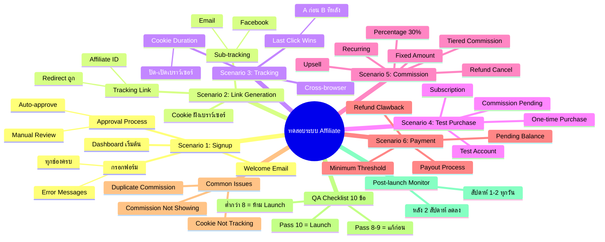
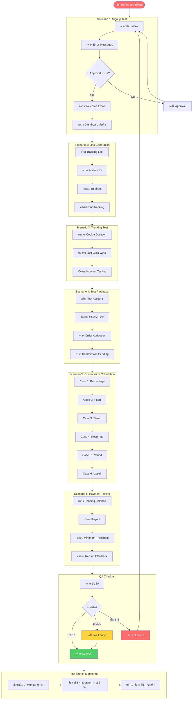

# ทดสอบระบบ Affiliate — SOMT-022
> **Format:** Mind Map (Text + Mermaid)
> **Source:** SWP3 Ch30 The Secret Of Millionaire Trainer ตอนที่ 22
> **Production:** PinkCastle Academy | จูล่ง CTO
> **Date:** 2026-02-18
> **Duration:** 0:46:41

---

## Text Mind Map (30+ Nodes)

```
ทดสอบระบบ Affiliate (End-to-End Testing)
│
├── 1. Scenario 1: Signup Test
│   ├── กรอกฟอร์มสมัคร
│   │   ├── ทุกช่องกรอกได้ครบ
│   │   ├── Error Messages แสดงเมื่อกรอกผิด
│   │   └── T&C Checkbox ทำงาน
│   ├── Approval Process
│   │   ├── Auto-approve ทำงานตามที่ตั้ง
│   │   └── Manual Review ทำงานตามที่ตั้ง
│   ├── Welcome Email
│   │   ├── ส่งอัตโนมัติ
│   │   └── เนื้อหาถูกต้อง
│   └── Dashboard เริ่มต้น
│       └── แสดงข้อมูล 0 ทั้งหมด
│
├── 2. Scenario 2: Link Generation Test
│   ├── สร้าง Tracking Link
│   │   ├── ลิงก์มี Affiliate ID
│   │   └── Redirect ไปหน้าสินค้าถูก
│   ├── Sub-tracking
│   │   ├── ลิงก์สำหรับ Facebook
│   │   ├── ลิงก์สำหรับ Email
│   │   └── Dashboard แยกข้อมูลได้
│   └── Cookie ฝังเบราว์เซอร์
│       └── ตรวจสอบ Cookie Parameters
│
├── 3. Scenario 3: Tracking Test
│   ├── Cookie Duration
│   │   ├── คลิกวันนี้ → ปิดเบราว์เซอร์
│   │   ├── เปิดใหม่อีก 1 วัน
│   │   └── Cookie ยังอยู่ไหม?
│   ├── Last Click Wins
│   │   ├── คลิก Affiliate A ก่อน
│   │   ├── คลิก Affiliate B ทีหลัง
│   │   └── Commission ไปหา B ถูกต้อง
│   └── Cross-browser Testing
│       ├── Chrome
│       ├── Safari
│       └── Firefox
│
├── 4. Scenario 4: Test Purchase
│   ├── สร้าง Test Account
│   ├── ใช้บัตรเครดิตทดสอบ / Coupon 100%
│   ├── One-time Purchase
│   │   ├── Order สร้างถูก
│   │   └── ระบุ Affiliate ถูก
│   ├── Subscription Purchase
│   │   ├── Order สร้างถูก
│   │   └── Recurring Attribution
│   └── Commission แสดงใน Dashboard
│       └── สถานะ "Pending"
│
├── 5. Scenario 5: Commission Calculation
│   ├── Case 1: Percentage
│   │   └── 30% x 5,000 = 1,500
│   ├── Case 2: Fixed Amount
│   │   └── 500 บาท/ขาย
│   ├── Case 3: Tiered Commission
│   │   └── ชิ้นที่ 11 → 20% เป็น 30%
│   ├── Case 4: Recurring
│   │   └── เดือนที่ 2+ ได้ Commission
│   ├── Case 5: Refund
│   │   └── Commission ยกเลิกอัตโนมัติ
│   └── Case 6: Upsell
│       └── Main + Upsell คำนวณถูก
│
├── 6. Scenario 6: Payment Testing
│   ├── Pending Commission ยอดสะสมถูก
│   ├── Payout Process
│   │   ├── Payout Amount ถูก
│   │   └── หักค่าธรรมเนียมถูก
│   ├── Minimum Payout Threshold
│   │   └── ยังไม่ถึงเกณฑ์ = ไม่ให้ถอน
│   └── Refund Clawback
│       └── หัก Commission คืนจาก Pending งวดถัดไป
│
├── 7. Common Issues
│   ├── Cookie Not Tracking
│   │   ├── Ad Blocker
│   │   └── Privacy Settings
│   ├── Commission Not Showing
│   │   ├── ลิงก์ไม่มี Parameter
│   │   └── Cookie หมดอายุ
│   └── Duplicate Commission
│       └── ใช้ Last Click Attribution
│
├── 8. QA Checklist (10 ข้อ)
│   ├── 1. Signup Flow ✓
│   ├── 2. Link Generation ✓
│   ├── 3. Cookie Tracking ✓
│   ├── 4. Purchase Tracking ✓
│   ├── 5. Commission Calculation ✓
│   ├── 6. Dashboard Display ✓
│   ├── 7. Payment Process ✓
│   ├── 8. Refund Clawback ✓
│   ├── 9. Anti-Fraud Detection ✓
│   └── 10. Email Notifications ✓
│
└── 9. Launch Readiness & Monitoring
    ├── Pass 10/10 → พร้อม Launch
    ├── Pass 8-9/10 → แก้ก่อน Launch
    ├── ต่ำกว่า 8/10 → อย่าเพิ่ง Launch
    └── Post-launch Monitor
        ├── สัปดาห์ที่ 1: ดูทุกวัน
        ├── สัปดาห์ที่ 2: ดูทุกวัน
        └── หลัง 2 สัปดาห์: สัปดาห์ละครั้ง
```

---

## Mermaid Mind Map



---

## Mermaid Flowchart — End-to-End Testing Process



---

*Node count: 65+ | Diagrams: 3 (Text Tree + Mermaid Mind Map + Flowchart)*
