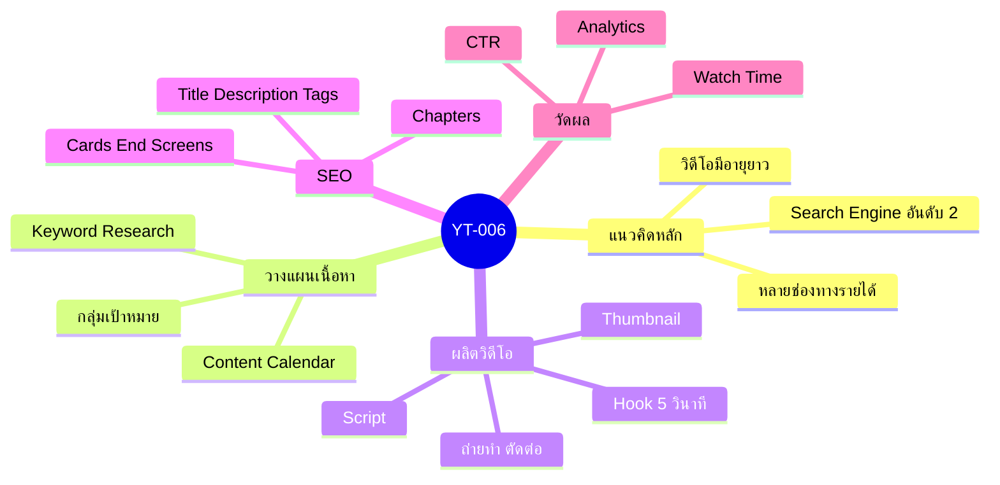
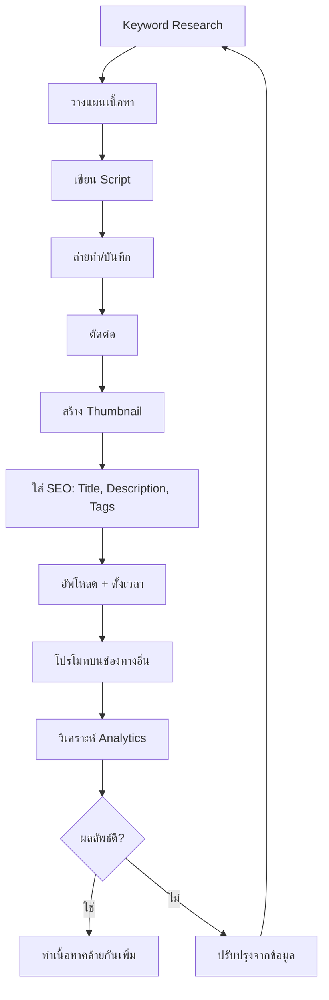

# Source Summary: Youtube Marketing ตอนที่ 5 — YT-006 Mind Map
> Format: Mind Map (7 Parts)
> Source: SWP3 Ch15 Youtube Marketing
> Production: PinkCastle Academy | จูล่ง CTO
> Date: 2026-02-18

---

## Part 1: Text-based Mind Map

```
Source Summary: Youtube Marketing ตอนที่ 5
│
├── แนวคิดหลัก
│   ├── Youtube = Search Engine อันดับ 2
│   ├── วิดีโอมีอายุยาวกว่าโพสต์โซเชียล
│   └── สร้างรายได้ได้หลายช่องทาง
│
├── การวางแผนเนื้อหา
│   ├── กำหนดกลุ่มเป้าหมาย
│   ├── Keyword Research
│   ├── Content Calendar
│   └── สร้างเนื้อหาที่แก้ปัญหา
│
├── การผลิตวิดีโอ
│   ├── Script + Storyboard
│   ├── ถ่ายทำ + ตัดต่อ
│   ├── Thumbnail ที่ดึงดูด
│   └── Hook ใน 5 วินาทีแรก
│
├── SEO บน Youtube
│   ├── Title + Description + Tags
│   ├── Chapters + Timestamps
│   ├── Cards + End Screens
│   └── Playlist จัดกลุ่มเนื้อหา
│
└── วัดผล + ปรับปรุง
    ├── Watch Time
    ├── CTR + Average View Duration
    ├── Subscriber Growth
    └── Traffic Sources
```

---

## Part 2: Mermaid Mind Map



---

## Part 3: Flowchart — กระบวนการสร้างวิดีโอ



---

## Part 4-7: สรุป

```
╔══════════════════════════════════════════════════╗
║                                                  ║
║  YT-006: Source Summary: Youtube Marketing ตอนที่ 5
║                                                  ║
║  สูตรสำเร็จ Youtube Marketing:                    ║
║  Keyword + Content Plan + SEO + สม่ำเสมอ         ║
║  = ช่อง Youtube ที่เติบโตอย่างยั่งยืน              ║
║                                                  ║
╚══════════════════════════════════════════════════╝
```

---

> Series: SWP3 Ch15 Youtube Marketing
> PinkCastle Academy © 2026
