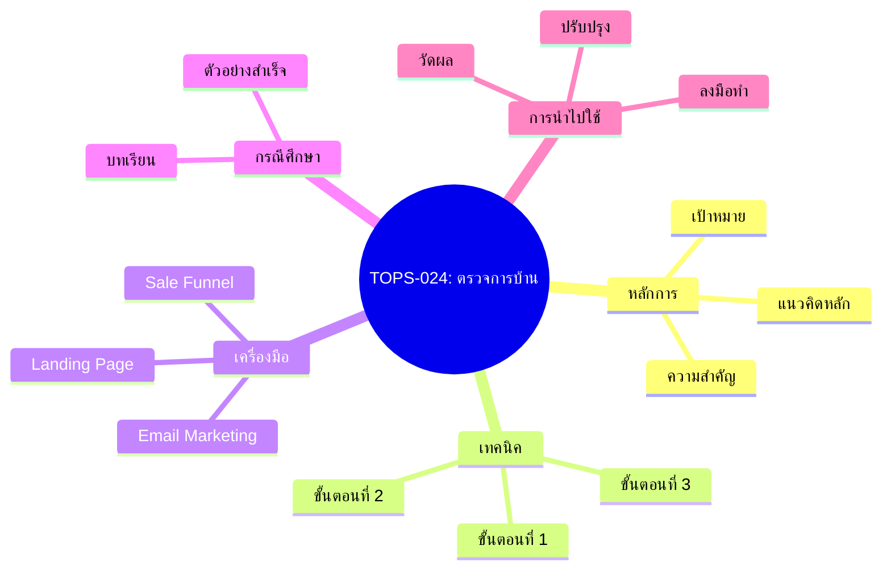
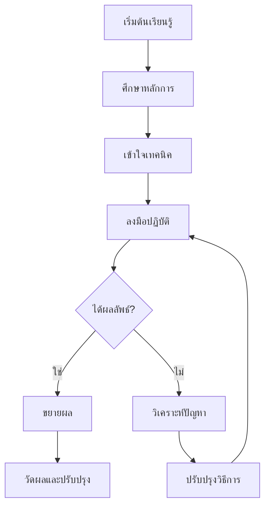
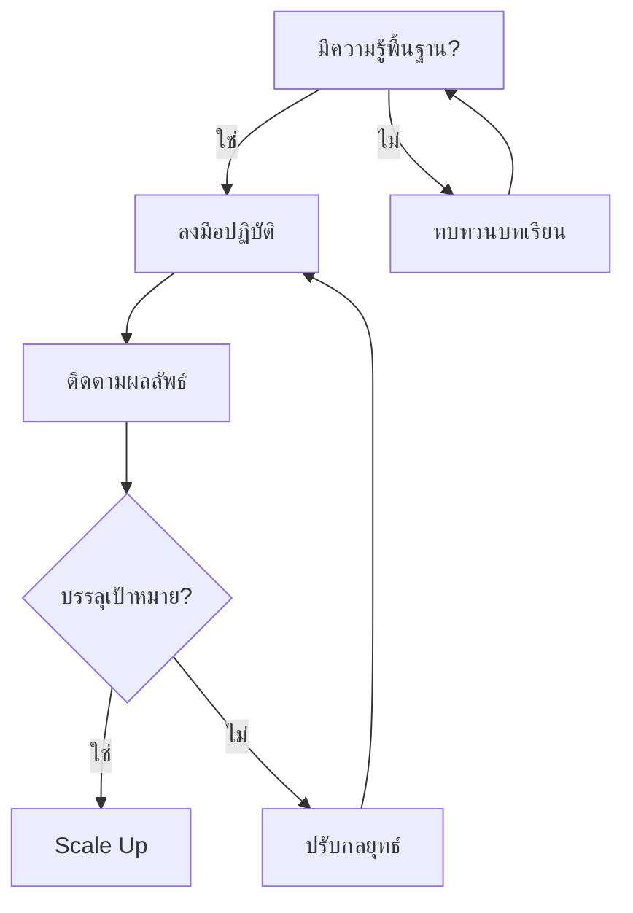
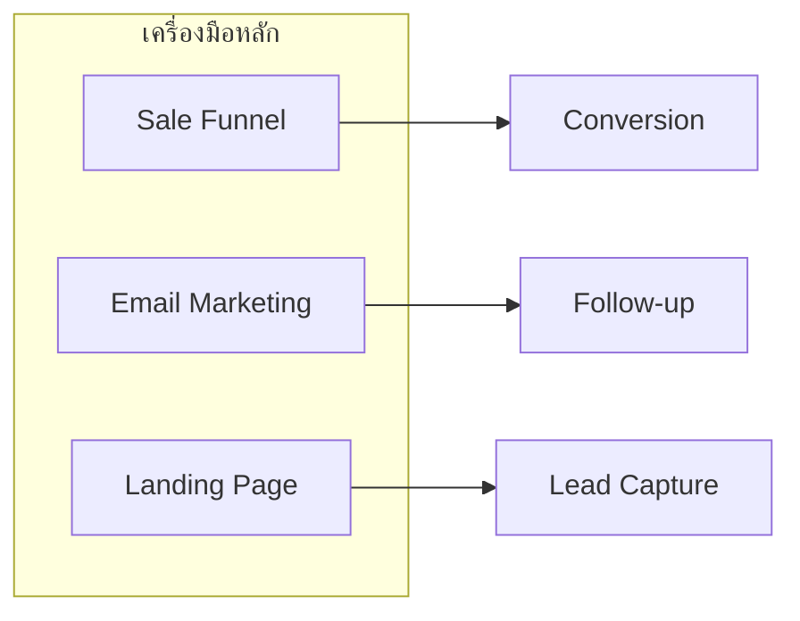
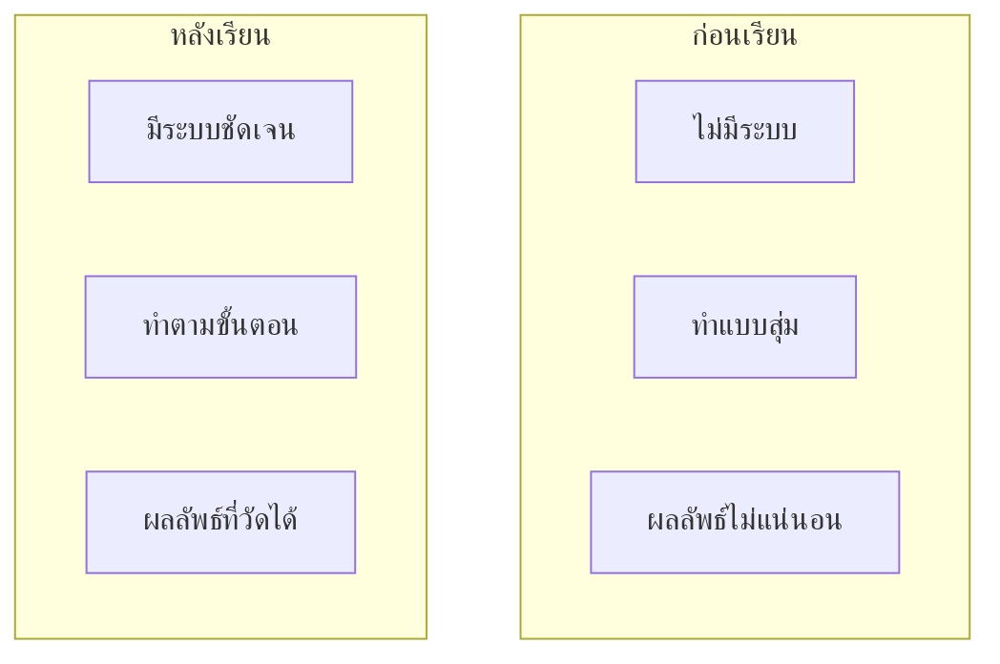

# ตรวจการบ้าน — TOPS-024 Mind Map
> Format: Mind Map (7 Parts)
> Source: SWP3 Ch23 วิธีเป็น Top Sponsor ตอนที่ 024
> Production: PinkCastle Academy | จูล่ง CTO
> Date: 2026-02-18

---

## Part 1: Text-based Mind Map

```
ตรวจการบ้าน
│
├── หลักการพื้นฐาน
│   ├── แนวคิดหลัก
│   ├── ความสำคัญ
│   └── เป้าหมาย
│
├── เทคนิคสำคัญ
│   ├── วิธีการขั้นตอนที่ 1
│   ├── วิธีการขั้นตอนที่ 2
│   └── วิธีการขั้นตอนที่ 3
│
├── เครื่องมือที่ใช้
│   ├── Sale Funnel
│   ├── Email Marketing
│   └── Landing Page
│
├── กรณีศึกษา
│   ├── ตัวอย่างที่สำเร็จ
│   ├── บทเรียนที่ได้
│   └── สิ่งที่ต้องระวัง
│
└── การนำไปใช้
    ├── ลงมือทำทันที
    ├── วัดผลด้วยข้อมูล
    └── ปรับปรุงอย่างต่อเนื่อง
```

---

## Part 2: Mermaid Mind Map



---

## Part 3: Flowchart — กระบวนการหลัก



---

## Part 4: Flowchart — การตัดสินใจ



---

## Part 5: Flowchart — เครื่องมือ



---

## Part 6: Comparison



---

## Part 7: สรุป

```
╔══════════════════════════════════════════════════╗
║                                                  ║
║  ตรวจการบ้าน                                        ║
║                                                  ║
╠══════════════════════════════════════════════════╣
║                                                  ║
║  1. เข้าใจหลักการพื้นฐาน                         ║
║  2. ฝึกปฏิบัติอย่างสม่ำเสมอ                      ║
║  3. วัดผลด้วยข้อมูลจริง                          ║
║  4. ปรับปรุงอย่างต่อเนื่อง                       ║
║                                                  ║
║  สูตร: เรียนรู้ + ปฏิบัติ + วัดผล = สำเร็จ       ║
║                                                  ║
╚══════════════════════════════════════════════════╝
```

---

> Series: SWP3 Ch23 วิธีเป็น Top Sponsor
> PinkCastle Academy © 2026
