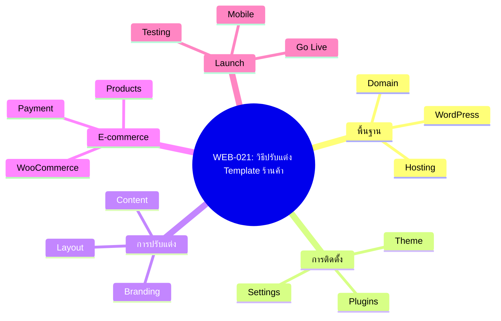
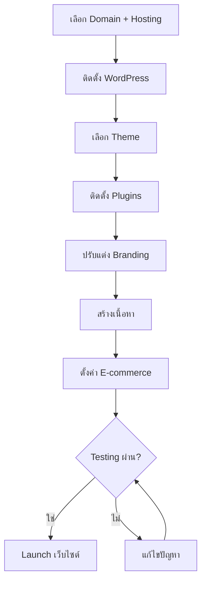
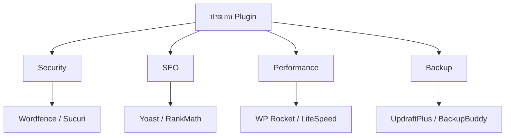
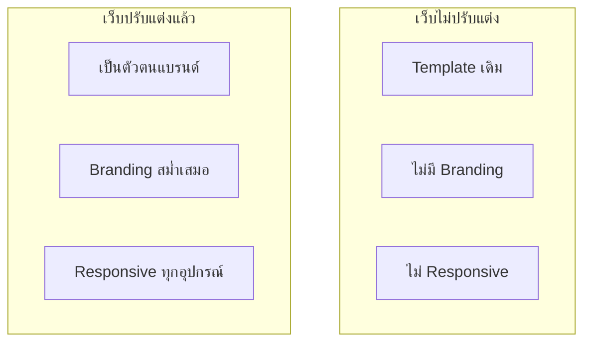

# วิธีปรับแต่ง Template ร้านค้า — WEB-021 Mind Map
> Format: Mind Map (7 Parts)
> Source: SWP3 Ch27 Grow Your Website Mastery ตอนที่ 021
> Production: PinkCastle Academy | จูล่ง CTO
> Date: 2026-02-18

---

## Part 1: Text-based Mind Map

```
วิธีปรับแต่ง Template ร้านค้า
│
├── พื้นฐาน
│   ├── WordPress
│   ├── Hosting
│   └── Domain
│
├── การติดตั้ง
│   ├── Theme
│   ├── Plugins
│   └── Settings
│
├── การปรับแต่ง
│   ├── Branding
│   ├── Layout
│   └── Content
│
├── E-commerce
│   ├── WooCommerce
│   ├── Products
│   └── Payment
│
└── การเปิดใช้
    ├── Testing
    ├── Mobile Check
    └── Launch
```

---

## Part 2: Mermaid Mind Map



---

## Part 3: Flowchart — กระบวนการสร้างเว็บ



---

## Part 4: Flowchart — การเลือก Plugin



---

## Part 5: Flowchart — E-commerce Flow


---

## Part 6: Comparison



---

## Part 7: สรุป

```
╔══════════════════════════════════════════════════╗
║                                                  ║
║  วิธีปรับแต่ง Template ร้านค้า                                        ║
║                                                  ║
╠══════════════════════════════════════════════════╣
║                                                  ║
║  1. วางแผนโครงสร้างก่อนสร้าง                     ║
║  2. ติดตั้งเครื่องมือที่จำเป็น                    ║
║  3. ปรับแต่ง Branding ให้สม่ำเสมอ                ║
║  4. ทดสอบทุกอุปกรณ์ก่อน Launch                   ║
║                                                  ║
║  สูตร: วางแผน + สร้าง + ทดสอบ = เว็บที่ใช้งานได้  ║
║                                                  ║
╚══════════════════════════════════════════════════╝
```

---

> Series: SWP3 Ch27 Grow Your Website Mastery
> PinkCastle Academy © 2026
